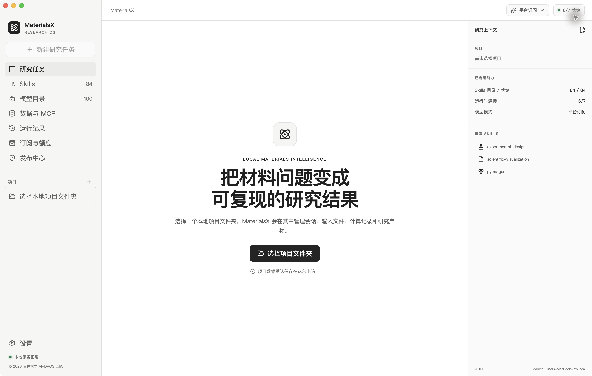
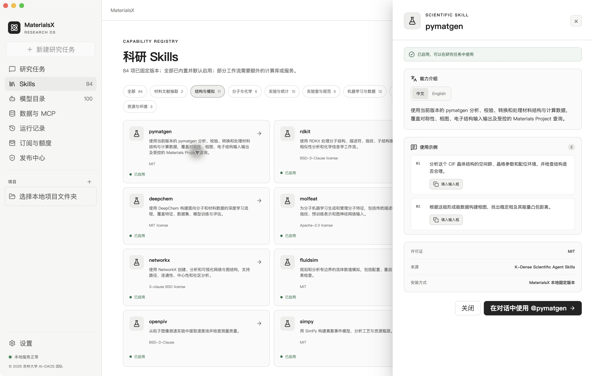

# MaterialsX

© 2026 吉林大学 AI-DAOS 团队

面向材料研究与研发工程师的本地 AI 工作台。默认以 [Pi](https://github.com/earendil-works/pi) 为 Agent 内核，本地/平台模型可分别选择公开 Codex 原生引擎（当前 macOS，按具体协议验收），连接材料 Skills、科学工具与数据服务，生成带证据的数据、图表、结构文件和研究报告。覆盖文献/通用分析、计算材料、高分子/复合材料三个方向。

**0.0.1 开发构建：M4 发布工程进行中，M5.0 探针与合同已交付、核心 Responses/Pi 实测通过，采购对账待确认；M5.1 身份与 PostgreSQL、M5.2 受限网关与 Pi、M5.3 事务额度与材料流程已实现并完成本机技术验收，M5.4 测试订单/订阅/退款和微信适配已实现，真实支付待商户与正式计量/产品政策；M5.5 桌面云服务中心与独立运营后台已实现并完成本机测试；M6.0 注册表/合同/几何样本及 M6.1 本地双核心 CPU 单点已实现，macOS 实测通过，M6.2 静态 3D 与产物及 M6.3 本地 FIRE 优化/前后对比已实现并通过 macOS 验收，M6.8/M6.9 下载挂载与授权自动分析及 M6.10 SevenNet 新家族、M6.11 新势发现/可信目录更新及 M6.12 离线分发/空间管理及 M6.13 ANI-2x 分子单点/优化、M6.14 纯硅 NEP 原生 CPU 引擎及 M6.15 首个 MACE+D3 组合势已实现并通过 macOS 工程验收；Windows 与正式安装包待验收，平台正式付费云模型暂未开放。** 自有代码采用 [AGPL-3.0-only](LICENSE)；第三方保留各自许可，发布前待核实事项见 [许可清单](THIRD_PARTY_LICENSES.md)。

研究工作台：UA.4 内部预览已提供项目输入/MOOS、版本化计划和真实表格/概览图/报告。固定本地模型的完整研究资格仍待通过，详见 [UA.4 实现与验收边界](docs/agent/ua-4.md)。

## 界面





截图来自当前代码的隔离演示环境，不含用户真实研究文件、会话或凭据。界面支持深色与 Codex 浅色配色，可在设置中切换。

## Agent 引擎与研究计划

设置中可分别选择模型来源与 Pi / Codex 引擎。本地 Codex 当前要求 macOS、原生 Responses 流式与工具调用支持，可先检测兼容性；失败不会切到云端。安装包自带固定版本公开 Codex 运行时，无需另装 Codex，配置与会话由 MaterialsX 独立保存。复杂研究请求先保存并校验目标、约束、缺项、步骤、调整与验收要求，运行记录可查看研究计划及实际引擎。原材料 Skills、科学桥和平台计费继续复用；受管 PDF/RPSME 已由 UA.6 改为两引擎共享入口。真实模型解释和多步执行仍有失败项，UA.3/UA.4 已有共同监督，UA.7 科学检查保留专家复核边界。详见 [UA.1 本地双引擎扩展](docs/agent/ua-1-extension.md)、[基础实现](docs/agent/ua-1.md) 及 [统一开发计划](docs/UNIFIED_AGENT_DEVELOPMENT_PLAN.md)。

MOOS 只读 MCP 已完成 UA.2：八工具覆盖实验、配方、工艺、性能、图片和模拟记录，提供中英文说明、版本与证据核对。服务独立运行，聊天研究入口已在 UA.4 内部预览接入；详见 [部署与验收](docs/agent/ua-2.md)。

UA.5 已接入本地两种 API 协议、两种执行引擎及 M5 网关，新增模型能力矩阵、MOOS MCP 设置与 Skill 草稿导入；页面使用全局主题。真实多步工具测试通过，固定本地模型的研究目标合同为 26/30，科学结论仍需复核。见 [UA.5 使用与验收](docs/agent/ua-5.md)。

UA.6 已新增“研究数据与交付 → 论文库”和“数据与 MCP → 论文解析环境”：支持 MOOS 优先/arXiv 查询、固定版本 PDF 下载、真实分页阅读与文献导出，Pi/Codex 共用工具和 RPSME 管线。真实联网与文件链通过；gpt-oss-20b 多步调用稳定性和 Windows 执行资格仍待验收。见 [UA.6 使用与限制](docs/agent/ua-6.md)。

UA.7 已新增“研究数据与交付 → 科学检查与方法”：核对字段/结论证据、原单位、条件、重复与不确定性；支持固定统计、线性拟合、分组留出和基线对照。来源更正或撤回会标出受影响步骤及失效产物；结构试算沿用 M6 资格。科学结论保持待复核，详见 [UA.7 使用与验收](docs/agent/ua-7.md)。

UA.10 新增「研究数据与交付 → 方法包」：双语详情与示例、版本/许可/Schema/资源、NIST 参考实算、社区候选审核和签名升级/撤回。Pi/Codex 共用原工具与冻结方法版本，首批支持原值统计和线性拟合；参考通过不代表材料领域验证。详见 [UA.10 使用及发布](docs/agent/ua-10.md)。

UA.8/UA.9 已加入「研究数据与交付 → 原始实验分析 / 下一轮实验」：原始曲线可编辑处理、真实图表与复算；研究假设、完整随机区组 DOE、来源绑定的反馈及带固定验证门槛的候选推荐共用研究项目和两引擎。详见 [UA.8 使用](docs/agent/ua-8.md) 与 [UA.9 使用及验收边界](docs/agent/ua-9.md)。候选尚未执行实体实验，结论需要科研复核。


## 当前能力

- 本地项目、研究会话、SQLite 持久化、Pi 工具调用、流式回答与取消。
- 安全 Markdown、代码、表格和 KaTeX 数学公式显示。
- 默认内置 92 项 Skills：82 项固定版本的 [K-Dense Scientific Agent Skills](https://github.com/k-dense-ai/scientific-agent-skills) 、两项材料抽取 Skills 、七项原子模拟任务 Skills 及一项 Skill 创建指导。支持分类、中英文介绍、一至两条双语例子、输入框 `@` 选择。内置 Skill 定义不代表其所有可选科学依赖都已安装。
- `materials-literature-rpsme-json` 与 `materials-xyz-extraction` 随安装包携带 Python 3.12、JSON Schema、PDF 与图像依赖。RPSME 支持逐页证据、断点缓存、真实 JSON、中文摘要与校验报告。
- 100 项材料模型/评测条目的双语目录与例子；这是元数据，权重尚未预装，也不是使用量排行榜。
- LM Studio 本地模型接入、运行时诊断、发布中心和脱敏诊断导出。

## 安装与首次使用

GitHub 归属为 [materialsx-jlu](https://github.com/materialsx-jlu)，计划仓库为 `materialsx-jlu/MaterialsX`，公开下载地址待建立后补充，目前不提供已发布的下载链接。本地构建位于 `release/dist/`，或从源码打包。

| 系统 | 安装产物 | 验证情况 |
| --- | --- | --- |
| macOS Apple Silicon | `MaterialsX-0.0.1-mac-arm64.dmg` | 已构建并在 macOS arm64 启动；未签名、公证 |
| Windows 10/11 x64 | `MaterialsX-0.0.1-win-x64.exe` | 已交叉构建；Windows 实机安装/运行与签名待完成 |

macOS 打开 DMG，将应用拖入 Applications；Windows 使用 NSIS 安装向导选择目录。开发包可能受操作系统签名检查限制，优先从源码启动验证。当前没有已验证的 Intel macOS、Linux、Windows ARM 安装版。

首次运行：

1. 添加本地研究项目，创建研究任务。
2. 在 LM Studio 加载对话模型并启动本地 API 服务。
3. 打开 MaterialsX 设置，选择本地模型，填写 `http://localhost:1234/v1`，检测并选择模型。仅支持 loopback 端点。
4. 键入 `@` 选择 Skill，或从 Skills 详情复制例子到输入框，编辑后发送。

将下例路径替换为自己的合法本地文件：

```text
@materials-literature-rpsme-json 提取 /absolute/path/paper.pdf，输出带证据的 RPSME JSON、中文摘要和校验报告。
```

存储说明见 [M1](docs/m1/README.md)，抽取规则见 [本地 RPSME 流程](docs/m4/local-rpsme-workflow.md)。研究输出不要提交到仓库。

## 开发启动

建议 Node.js 24、npm、Python 3.12/uv；控制面另需 Go 1.25。在项目根目录执行：

```bash
npm ci
uv sync --project python --frozen
npm run dev
```

`dev` 打开 Electron 并启动 renderer 热更新。检查构建界面可运行：

```bash
npm run desktop:start
```

可选订阅/额度开发服务，在另一个终端启动：

```bash
npm run control-plane:dev
```

服务默认只监听 `127.0.0.1:8787`，要求显式开发模式，开发账本和测试价格不是生产支付服务。

平台账户服务使用独立 PostgreSQL 数据库和 `127.0.0.1:8788`。仅本机开发可运行 `npm run identity:local`（macOS 使用 launchd 常驻并在异常退出后自动重启），自动创建独立、持久的开发账户服务；密码只写到忽略的本机私有文件，云生成与支付禁用，见 [本机登录指南](docs/m5/identity-local.md)。已有部署按 [M5.1 启动指南](docs/m5/identity.md) 配置私有数据库/master key、迁移并创建受邀账户，平台网关的私有配置和授权见 [平台网关指南](docs/m5/gateway.md)，再运行 `npm run identity:dev`。桌面通过“云服务中心 → 登录”或“设置 → 平台账户”使用系统浏览器授权。

[`.env.example`](.env.example) 只有变量名和占位值，不能原样执行或作为可用配置。当前 Electron/Go 入口不自动加载根 `.env`，请通过进程环境设置所需变量。`ROOTFLOWAI_*` 目前仅用于 [M5.0 服务端接入探针](docs/m5/README.md)，桌面尚无云模型消费者；`MP_API_KEY` 是可选数据源凭据。`MATERIALSX_PYTHON` 由受管工具流程设置，用户不能依靠它任意覆盖安装包解释器。真实云模型 Key 仅服务端保管，不进入 renderer、安装包或公开仓库；产品不提供云模型 BYOK。

## 检查与打包

```bash
npm run check
npm run test
npm run build
npm run control-plane:test
uv run --project python pytest
npm run skills:audit
npm run skills:accept
python3 scripts/check-public-secrets.py
```

完整开发验证为 `npm run verify`。运行时/求解器预检可能需要额外环境，见 [贡献指南](CONTRIBUTING.md)。正式发布必须另过 `npm run m4:release-gate`；当前阻断项尚未关闭，构建成功不能代替发布门槛。

```bash
npm run package:mac
npm run package:win
npm run skills:verify-bundle
```

macOS arm64 应在同架构 macOS 主机构建；Windows x64 须在 Windows 测试机完成最终验证。装配会联网下载 Python 和依赖，安装包不含 LM Studio 或聊天模型权重。发行前重新生成第三方清单、核查运行时版本、保留许可和对应源码、记录版本及哈希，见 [M4](docs/m4/README.md)。

## 当前限制

- 正式账号、云网关、真实支付、生产账本和自动续费尚未完成；订阅页为开发测试值。
- Skill 资源验收不能代表 92 项科学任务全部通过领域效果验证；复杂 PDF/OCR/表格与较弱模型仍可能失败。质量未过的产物须人工复核。
- 工具可读写文件、执行脚本；路径授权、子进程策略与提示注入防护仍需加固。renderer sandbox 不等于科学子进程已全面隔离。
- 双平台签名、Windows 实机、升级回退、三领域保留集和性能/故障验证仍阻断正式 v1。
- M6.1 已支持 CHGNet 0.3.0 / MACE-MP-0b3 medium 的本地 CPU 单点。Windows 实机、完整安装包与独立 DFT 科学质量仍待验收；M6.2 已支持静态交互式 3D、晶胞/显示超胞、测量、产物卡片和导出；M6.3 已支持固定/显式变胞 FIRE 优化、真实收敛报告、双 3D 位移对比；M6.4 已支持硬性选势、七项任务 Skills 与本地/平台科学调度；M6.5 已支持受限 NVE/NVT、真实轨迹、播放/导出与模型对比。M6.6 已支持审核扩展包、科学保留集评测/质量矩阵与默认模型离线测试包；独立 DFT 科学验收仍待完成。

## M5 / M6 路线图

| 阶段 | 计划交付 | 验收重点 | 状态 |
| --- | --- | --- | --- |
| M5：Token 与外部 API | 供应商卡片、服务端 RootFlowAI `gpt-5.6-sol` 测试适配、流式网关、路由/取消、用量与额度结算、付费链路及 Web 运营中心 | 真实模型与多步工具调用；断流补偿；收退款/usage 对账；后台授权与审计；供应商 Key 仅服务端 | M5.0 离线交付完成，核心接入实测通过，采购对账待确认；M5.1 身份/设备/PG 本机验收完成，M5.2 受限网关/Pi闭环本机验收完成，M5.3 test-credit账本/材料流程已验收，正式收费关闭；M5.4 测试业务闭环/微信适配已实现，真实商业验收待完成；M5.5 六导航/后台/任务账单与发布目录本机技术验收完成，Windows/生产/正式发行待验收；M5.6 生命周期代码与工程验收已补齐，生产 Beta 仍待外部门槛 |
| M6：机器学习势与 3D | 模型注册表、兼容性硬门槛、可解释选势、ASE 本地任务、单点/优化/短程 MD、结构/轨迹 3D | 权重许可/哈希；元素/周期性/单位；真实产物；科学质量/资源预算 | M6.0 已交付；M6.1 双核心 CPU 单点/导入/取消已实现并在 macOS 实测，Windows 待验收；M6.2 静态 3D/产物及 M6.3 FIRE 优化/前后对比 macOS 验收完成，M6.4 选势/任务 Skills/平台受控调度已实现；M6.5 短程 MD/轨迹及 M6.6 扩展包/科学评测/macOS 离线测试包已完成工程验收；Windows 实机、完整安装器、签名与独立科学验证待完成 |

M6.0 已交付 16 个 checkpoint 注册表、任务合同、13 个几何/反例样本和默认双语目录入口，见 [交付与验收](docs/m6/README.md)。开发版在“模型目录 → 机器学习势 · Checkpoints”查看；`npm run m6:verify` 复验。M6.1 本地 CPU 推理已接入，使用与验收见 [运行时文档](docs/m6/runtime.md)；开发安装 `npm run m6:runtime:dev`，不依赖 M5 付费网关；共有事件、产物和权限合同保持兼容。后续按 [M5 开发计划](docs/M5_TOKEN_API_DEVELOPMENT_PLAN.md) 和 [M6 开发计划](docs/M6_ML_POTENTIALS_3D_DEVELOPMENT_PLAN.md) 的工作包与验收实施。

M6.2 从同页点击「查看结构 3D」，或从完成的任务/聊天产物卡片打开；可旋转、测距/测角、显示超胞与真实力着色、导出 PNG/源文件，共用系统主题。见 [使用及限制](docs/m6/viewer.md)、[验收与截图](docs/m6/viewer-acceptance.md)，`npm run m6:ui:viewer` 复验。

M5 配套 [运营中心计划](docs/M5_OPERATIONS_CENTER_DEVELOPMENT_PLAN.md)：首版一名管理员，面向中国大陆接微信或支付宝其中一个渠道，覆盖用户、订单、退款、用量成本和版本发布。后台发布安装包与桌面自动更新分别验收。

[M5.0 交付说明](docs/m5/README.md) 包含无费用验证命令、供应商实测准备、核心 OpenAPI、预算规范和可交互界面草图；`npm run m5:verify` 默认不调用供应商。

## 文档与参与

- [完整开发计划](docs/DEVELOPMENT_PLAN.md)、[开发状态](docs/STATUS.md)、[任务与验收清单](docs/BACKLOG.md)。
- [Skills 与 API/MCP](docs/INTEGRATIONS.md)、[模型目录来源](docs/MODEL_CATALOG.md)。
- [M0](docs/m0/README.md)、[M1](docs/m1/README.md)、[M2](docs/m2/README.md)、[M3](docs/m3/README.md)、[M4](docs/m4/README.md)。
- [贡献与测试](CONTRIBUTING.md)、[安全报告](SECURITY.md)、[许可证](LICENSE)、[第三方许可](THIRD_PARTY_LICENSES.md)。

安全问题请私下发送至 [huzhangyou@jlu.edu.cn](mailto:huzhangyou@jlu.edu.cn)，报告要求见 [SECURITY.md](SECURITY.md)。团队代码和自研 Skills 已确认获开源授权；示例数据公开权利仍待确认。开源程序和自有文档不授予用户研究数据、供应商服务或模型权重的访问权。

### M5.3 任务额度与材料流程

平台已接入 PostgreSQL test-credit 事务账本、预算与恢复 worker、管理员 MFA 用量核对页面，以及受管 RPSME 逐页证据抽取。桌面「订阅与额度」显示真实登录账户余额，旧 M3 示例折叠为开发演示。正式订阅收费和收退款未开启。[M5.3 启动与验收](docs/m5/metering.md)。

### M5.4 订单、订阅与退款

桌面「订阅与额度」已加入独立平台套餐、订单分页、手动续费账期、退款申请和 CSV 导出；管理员 `/ops` 核算/审批，Worker 按原编号查询恢复，积分冻结与回收追加账本。微信 Native 官方适配器已接入，指定开发账户已完成微信小额实付与订阅联调；通用正式售卖仍关闭。已支持复用私有微信商户 YAML/PEM 并完成本机配置检查；公网入口、正式计量/费率与退款条款补齐后才开放真实付款二维码并验收实付。[启动与验收](docs/m5/payments.md)、[商户配置与离线预检](docs/m5/wechat-merchant-setup.md)。


### M5.5 云服务中心与运营后台

桌面左侧「云服务中心」提供 Agent、供应商、网关、路由、用量、资源库六导航，支持中英文及浅/深色；包含 92 Skills / 100 条模型目录、例子填入输入框、真实钱包、近 7 日调用趋势、任务账单/明细/CSV，以及套餐/退款和手动版本下载。


运营中心独立于桌面，构建 `npm run build:admin`，执行全部迁移至 010 并重新 grant-runtime，在身份服务配置 `MATERIALSX_ADMIN_ASSET_DIR` 后打开 `/ops`。管理员 MFA 登录后管理用户、财务、用量核对、暂停准入、双语公告、审计和经过门禁的版本目录。详见 [M5.5 启动与验收](docs/m5/workspace.md)。


本机已通过购买测试额度 → 实际 Pi/网关合成模型调用 → 账单 → 退款申请/人工审批 → 积分回收。该合成验收不发生真实收款；指定账户的另一次真实微信订阅见后文 M5.3B。尚未生产部署或发布新安装包。公开 stable 仍须补齐 M4 签名、Windows 实机和示例数据权利等证据。


### M5.3B 真实积分调用

已完成指定本机账户的 RootFlowAI `gpt-5.6-sol` 真实积分消费联调：普通输入 / 缓存输入 / 输出每万 Token 收取 10 / 1 / 100 积分，按 0.0001 积分结算。付款积分与测试额度分别记账，可靠终态用量后结算，未知保留待核对。

显式本机启动：`npm run identity:local -- --paid-cloud`，需要 Git 忽略目录中的服务端私有配置和有效的实付订阅。桌面设置选择平台模型后使用；默认启动仍关闭云生成和收款。当前是有限账户联调，生产输入上界、采购对账和 M5.6 付费 Beta 尚待完成。见 [实施与验收](docs/m5/paid-credit-consumption.md)。

### M5.6 生命周期与工程验收

已实现完全未使用订单全额退款、桌面/后台客服工单、主动授权加密文本附件、邮箱验证开户/找回、事务邮件通知、实际采购账单与成本告警、受控 Beta 名单、正式付费准入、输入计量器适配，以及部署/健康检查/备份恢复工具。工程测试与实际 Electron 合成闭环通过；包含真实消费的备份已在独立克隆中恢复并校验，原账本保持不变。

正式域名、邮件、采购资料和签名证书均待定；可信输入计量器与真实生产/科研/Windows 验收仍未完成，因此不能标为已上线付费 Beta。入口、退款规则与限制见 [M5 生命周期交付](docs/m5/lifecycle-delivery.md)，部署模板见 [deployment/m5](deployment/m5/README.md)。

M6.3 在同页选择「结构优化 · FIRE」运行本地优化；默认固定晶胞。产物卡片的「优化前后对比」提供双 3D、同步视角、真实位移/力着色、每步能量与最终结构导出。见 [使用](docs/m6/relaxation.md)、[验收](docs/m6/relaxation-acceptance.md)；`npm run m6:relaxation:test` 与 `npm run m6:ui:relaxation` 复验。

M6.4 在势目录中选择适用域和用途，点击“筛选兼容势与证据”；正式计算因缺少独立 DFT 参考被拦截，明确选择探索试算后可运行合格核心势。七项原子模拟 Skills 支持中英文、双语示例、`@` 和势目录跳转，MD Skill 由 M6.5 启用为受限 NVE/NVT 执行能力。平台会话先选结构/任务范围，再逐轮确认摘要外发；本机计算不扣云积分。见 [使用与合同](docs/m6/selection.md)、[验收](docs/m6/selection-acceptance.md)。

M6.5 在势目录选择“短程分子动力学 · NVE/NVT”，明确探索用途和参数后运行。支持真实逐步温度/能量曲线、按帧 3D 播放、完整或部分 extxyz 导出、同输入/同初速度的双势对比与几何新轨迹段。默认 200 ×0.5 fs 仅 100 fs，不能通过要求至少 1000 fs 的 NVE 漂移诊断；科学质量保持需复核。见 [使用](docs/m6/dynamics.md)、[工程验收](docs/m6/dynamics-acceptance.md)。

M6.6 在势目录展开“模型包与科学验收”，可管理官方 CHGNet r2SCAN 小型扩展、导入本机科学保留集并执行真实模型误差评测。默认离线包包含两核心和 r2SCAN，无需全局 Python；格式演示数据必须 blocked，全部模型科学质量仍需复核。见 [使用](docs/m6/validation.md)、[工程验收与发布门槛](docs/m6/validation-acceptance.md)。

M6.7 新增“模型目录 → 机器学习势 · 全部目录”：176 条现行分类资源、194 条历史名称映射、双语检索/详情与两条使用例子，沿用 Skills 样式与全局主题。本地 Pi 可使用 `potential_search` 和 `skill_search` 按需检索；目录收录不等于可运行。M6.8/M6.9 已接入五种 checkpoint 并通过本机实算，支持审核包按需下载/共享环境挂载、两阶段选势、冻结计划与授权、真实优化/3D/双语报告和用户 Skill 预览/登记。M6.10 新增独立环境 SevenNet-0，累计六接口实算，四个 Nano 候选补齐官方权重身份；Windows/GPU 与表面仍待验收；分子支持现由 M6.13 限定开放。M6.11 已接入 12 个公开来源、双语发现与审核队列、默认发现 Skill（总计 93 Skills）和签名目录更新/回退/轮换；新元数据不授予运行权限，公网发行源待发布。M6.12 新增离线扩展权重包、跨密钥轮换签名目录包、空间清理预览与复现回执，见 [离线分发与发布验收](docs/m6/distribution-release.md)。M6.13 新增 ANI-2x 独立 CPU 环境、显式电荷/自旋与非周期边界检查、真实分子单点/优化及双语报告/3D，累计 7 个计算接口；带电/开壳层和显式长程计算未开放，见 [分子势使用与验收](docs/m6/molecular-potentials.md)。M6.14 新增纯硅 NEP4 审核参数文件、固定 NEP_CPU C++ 引擎、Si type 0 与 virial/应力转换、真实单点/FIRE、双语 3D/报告及离线资源，M6.14 当时 175 条资源 / 22 checkpoint / 8 接口；复用现有 Python 环境。见 [原生势使用与验收](docs/m6/native-potentials.md)。见 [新势发现与目录更新](docs/m6/discovery-updates.md)。见 [SevenNet 使用与验收](docs/m6/sevennet-adapter.md)。详见 [下载与自动分析](docs/m6/automatic-analysis.md)。见 [使用与扩展](docs/m6/potential-hub.md)、[工程验收](docs/m6/potential-hub-acceptance.md)。

M6.15 首个高级物理组合工作流已交付：共享 MACE-MP-0b3 medium 基线 + PBE-D3(BJ) 两体修正，仅纯硅周期 CPU 单点/固定 FIRE。AI 按色散需求匹配，双语分项表/真实 3D/报告与离线资源已接入；当前 176 条资源、22 个 checkpoint、9 个计算接口、93 Skills。长程静电、自旋、外场、Δ-learning 与未明确多头仍阻止运行，见 [组合势使用和逐类扩展](docs/m6/advanced-physics.md)。

长期本地计算：在「研究数据与交付 → 长期计算」批准配置，通过 `@materials-long-compute` 提交；等待期间暂停模型，重启后查询原任务再恢复。当前 macOS/自包含 Node 工程预览，SSH/Slurm、Python 与付费等待未开放，详见 [UA.11 使用与验收边界](docs/agent/ua-11.md)。

研究分工与浏览器：在「研究数据与交付 → 研究分工与浏览器」按项目开启只读子任务或允许的网站。本地 Pi/Codex 共用父任务预算、来源及截止时间，子任务交付真实报告和回执；浏览器支持手动登录、截图、受限下载和文件预览。真实图片输入需要已加载的视觉模型，gpt-oss-20b 不支持读图；视觉语义、付费分工与跨平台资格待验收。见 [UA.12 使用与验收边界](docs/agent/ua-12.md)。

### UA.13 团队研究

「研究数据与交付 → 团队研究」支持沿用 M5 登录的项目成员授权、共享研究条件、远程 MOOS 只读分析与独立纠错审核。私有数据默认仅使用本地模型；审核包交接 MOOS，核验真实新版本后才标记已更新。正式公网部署与官方自动写回接口仍待确认，见 [UA.13 使用及部署](docs/agent/ua-13.md)。

### UA.14 验收与发行

`0.1.0-preview.1` 提供 macOS arm64、Windows x64、Linux x64 开发预览构建；不同平台的科学环境与原生隔离支持不同。下载、安装、对应源码及限制见 [开发预览发行说明](docs/agent/preview-release.md)。未闭环项统一按 [主计划第 8.1 节](docs/UNIFIED_AGENT_DEVELOPMENT_PLAN.md#81-未闭环项的统一收敛顺序2026-10-06) 推进。

已提供 60 个成对双语合成工程任务的真实执行评测、科学/技术分离报告、当前源码与安装包绑定的发行门禁。`npm run ua14:verify` 执行常规检查；真实本地生成需要显式 `--live`。Windows 实机、正式签名、科学专家与完整模型资格仍待验收，详见 [UA.14 使用和限制](docs/agent/ua-14.md)。部分工程测试通过不代表正式发行可用。
