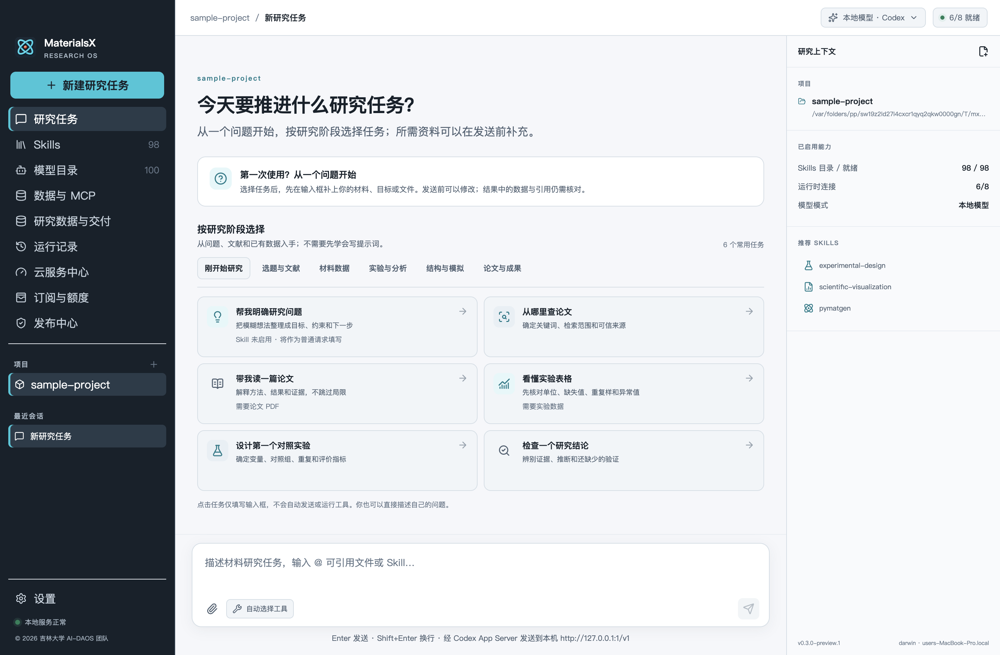
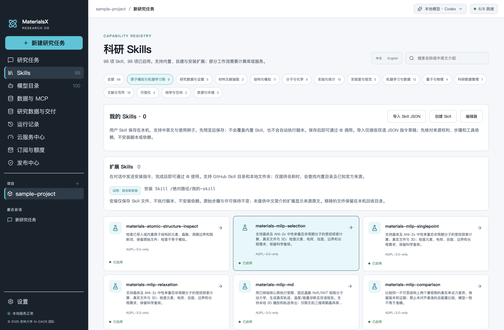
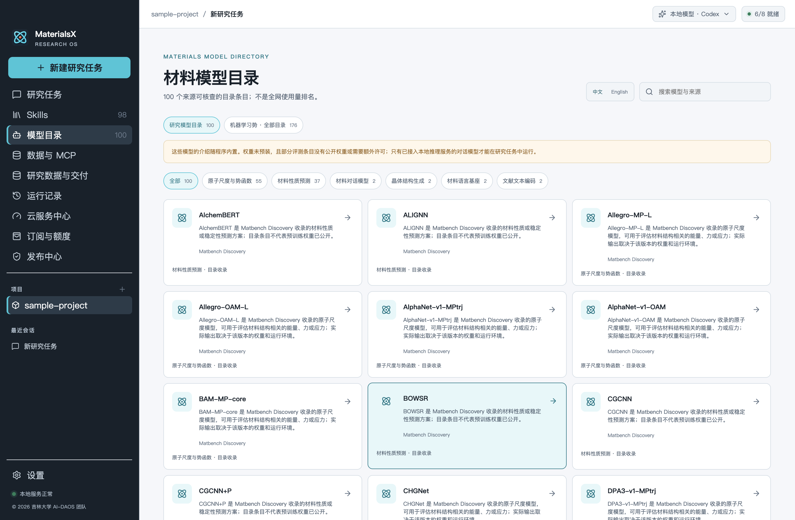
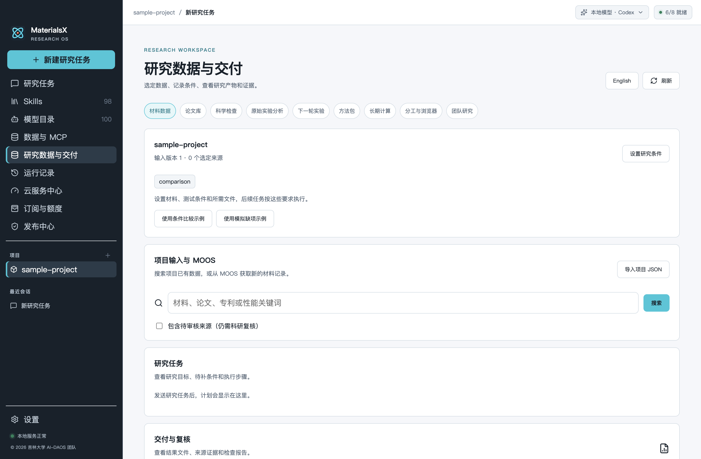
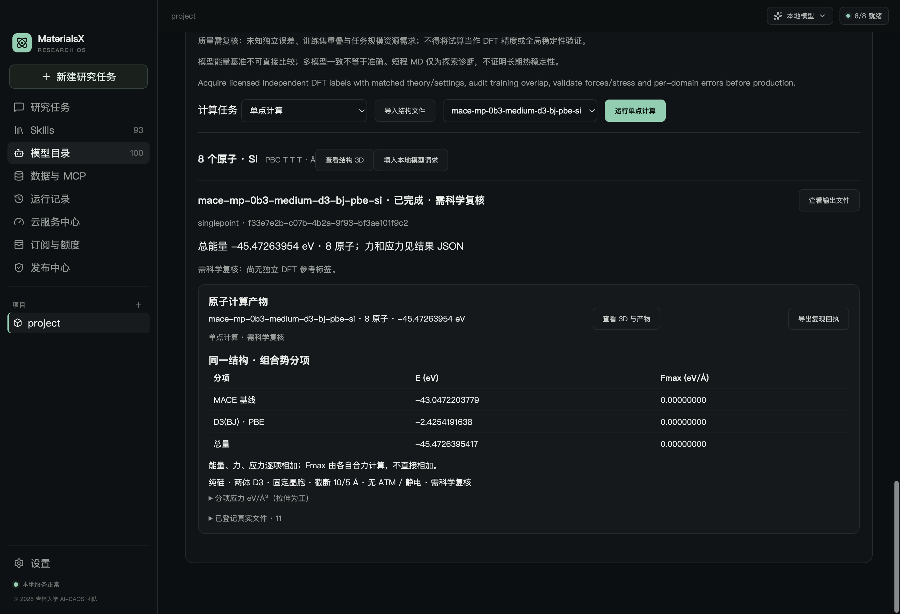
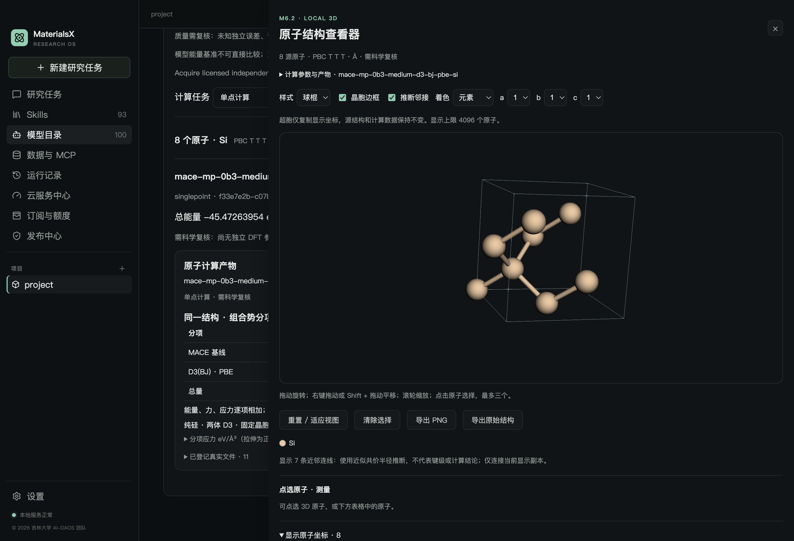

# MaterialsX

**面向材料研究的本地 AI 工作台。** 将文献、实验数据和原子结构放进同一个研究项目，结合模型、Skills 与科学工具，完成分析、计算和可追溯的研究交付。

[官方网站](https://materialsx-jlu.github.io/MaterialsX/zh-CN/) · [下载 0.3.0-preview.1](https://github.com/materialsx-jlu/MaterialsX/releases/tag/v0.3.0-preview.1) · [快速开始](#快速开始) · [开发文档](CONTRIBUTING.md)

> **0.3.0-preview.1** 提供 macOS Apple Silicon 与 Windows x64 预览安装包。尚未完成正式签名、公证及 Windows 实机验收；不作为正式收费发行。

## 主要功能

- **项目化研究**：在同一工作区管理对话、文件、研究计划、运行记录和交付产物。
- **本地 AI 助手**：连接 LM Studio 等本地模型，选择 Pi 或 Codex 执行引擎；模型与工具调用由用户在应用内配置。
- **文献与实验数据**：读取 PDF、表格和材料数据，保留来源位置与处理记录；通过 Skills 和 MCP 扩展研究流程。
- **材料计算与可视化**：查看结构、筛选机器学习势，执行受支持的单点、结构优化和短程动力学任务，并检查 3D 结果。
- **可选云服务**：登录平台后在应用内使用云模型、MX 点钱包和用量记录；这些功能需要另外部署的服务支持。

## 界面

以下截图使用示例项目与本地测试数据，不包含真实账户或订单。

| 项目化研究任务 | 科研 Skills |
| --- | --- |
| [](docs/images/readme/workbench-030.png) | [](docs/images/readme/skills-030.png) |

| 材料模型目录：来源与适用范围 | 研究数据与交付：项目输入、MOOS 数据和产物 |
| --- | --- |
| [](docs/images/readme/model-catalog-030.png) | [](docs/images/readme/research-delivery-030.png) |

| 原子计算：结果与分项能量 | 3D 结构查看器：晶胞、键连与测量 |
| --- | --- |
| [](docs/m6/screenshots/m615/components-zh.png) | [](docs/m6/screenshots/m615/native-3d-zh.png) |

## 快速开始

安装包请从 [0.3.0-preview.1 发行页](https://github.com/materialsx-jlu/MaterialsX/releases/tag/v0.3.0-preview.1) 获取。希望从源码运行，可使用 Node.js 24 和 npm：

```bash
git clone https://github.com/materialsx-jlu/MaterialsX.git
cd MaterialsX
npm ci
npm run dev
```

打开应用后，创建项目；在设置中连接已启动本地 API 的模型（例如 LM Studio 的 `http://localhost:1234/v1`），再从 Skills 页面选择研究流程或直接在对话中提问。需要 Python 科学工具时，按 [开发指南](CONTRIBUTING.md) 安装相应运行时。

## 源码与服务

本仓库包含桌面应用、静态官网、共享合同、科研工具和 Go 核心控制面。LiteLLM 服务及控制台、独立用户计费后台及其管理 API、MOOS 服务代码分别维护；公开源码中的连接入口需要这些服务部署后才能使用。[发布范围与部署说明](docs/GITHUB_PUBLICATION.md)

## 文档

[开发与测试](CONTRIBUTING.md) · [研究功能文档](docs/UNIFIED_AGENT_DEVELOPMENT_PLAN.md) · [安全报告](SECURITY.md) · [AGPL-3.0 许可证](LICENSE) · [第三方许可](THIRD_PARTY_LICENSES.md)

© 2026 吉林大学 AI-DAOS 团队
