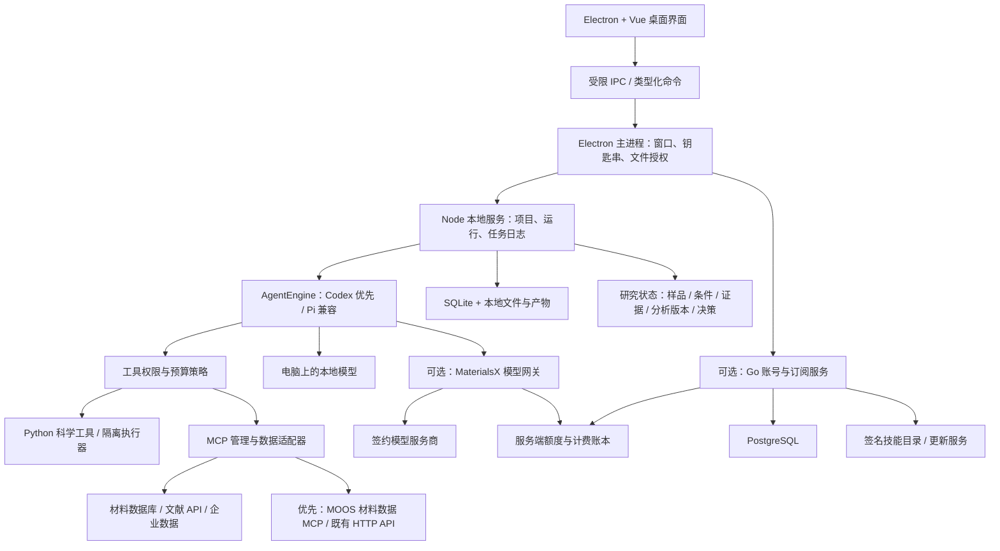

# MaterialsX 完整开发计划

版本：0.3 · 规划基线：2026-09-30 · 状态：待进入技术验证阶段

2026-10-01 增补：付费云模型与 Token 系统按 [M5 开发计划](M5_TOKEN_API_DEVELOPMENT_PLAN.md) 执行。首发测试接入 RootFlowAI 的 `gpt-5.6-sol`，采用供应商卡片与分段导航，保留无 BYOK 和本地模型模式；[M5.0](m5/README.md) 已交付探针、核心合同、规范与草图，核心 Responses/Pi 实测通过，采购对账待确认。尚未开放付费云模型，M5.1 身份/PG/设备已实现，验收与启动见 [指南](m5/identity.md)；M5.2 受限网关/Pi闭环本机验收完成，M5.3事务账本/材料流程本机技术验收完成，正式收费关闭，指南见 [M5.3](m5/metering.md)；M5.4 测试订单/订阅/退款与微信适配已交付，真实商业验收待商户、正式计量/产品政策，见 [M5.4](m5/payments.md)；M5.5 六导航/独立后台/任务账单与发布目录已实现并完成本机技术验收，见 [M5.5](m5/workspace.md)；Windows/生产/正式发行证据仍待验收，M5.6 未开始。

2026-10-01 增补：M5 配套 [运营中心计划](M5_OPERATIONS_CENTER_DEVELOPMENT_PLAN.md)，首版一名管理员，面向中国大陆接微信或支付宝其中一个渠道，补全支付、退款、用户、用量成本及版本发布闭环。M5 及其运营计划替代下文早期阶段命名中的付费接入/后台安排；安装包发布与自动更新分别验收。展开后的 M5 预计 47–70 个研发日，身份和审计基础已随 M5.1 落地，运营界面与资金业务仍为规划。

2026-10-01 增补：机器学习势、智能选势与原子级 3D 工作台按 [M6 开发计划](M6_ML_POTENTIALS_3D_DEVELOPMENT_PLAN.md) 执行。默认内置模型目录与双语任务 Skills，预装通过验收的核心势；首条闭环为真实结构导入、选势、优化、3D 对比与报告。M6 可用本地 LLM 独立推进；M6.0 注册表、合同、样本与目录入口已交付，见 [M6.0 说明](m6/README.md)。M6.1 本地双核心 CPU 单点、真实结构导入、任务取消与产物已实现并在 macOS 实测；M6.2 静态 3D 与产物已实现并完成 macOS 验收，见 [查看器](m6/viewer.md)；M6.3 本地 FIRE 固定/显式变胞优化与前后对比已完成 macOS 工程验收，见 [优化](m6/relaxation.md)；M6.4 可解释选势、默认任务 Skills 与受控平台科学调度已实现，见 [选势](m6/selection.md)；M6.5 受限 NVE/NVT、真实轨迹与播放器/导出/对比已实现，见 [动力学](m6/dynamics.md)；M6.6 审核扩展包/保留集/质量矩阵与 macOS 离线测试包工程已实现，见 [科学验收](m6/validation.md)；Windows 实机/完整安装器/签名与独立领域精度仍待验收，见 [运行时](m6/runtime.md)。

2026-10-02 优先级调整：按用户最新指示，暂缓 [M7 多尺度 AI4Materials 提案](M7_MULTISCALE_AI4MATERIALS_DEVELOPMENT_PLAN.md) 及其首个材料选型，保留为研究参考。当前下一步按 [M6 势资源中心开发计划](M6_POTENTIAL_HUB_DEVELOPMENT_PLAN.md) 推进 M6.7–M6.12：全面目录、按需下载与自动挂载、AI 选势/真实计算、3D 与双语报告、官方发布及新论文持续增补。前三阶段先交付一个可用的自动分析闭环；M6.7 已实现广目录、双语索引/页面、本地 Skill 搜索和创建内容合同，见 [使用与扩展](m6/potential-hub.md)；M6.8/M6.9 已实现审核下载/挂载、五 checkpoint 本机实算、授权自动分析与用户 Skill 创建，见 [使用和验收](m6/automatic-analysis.md)；M6.10 已完成 SevenNet 新家族 macOS CPU 单点/固定晶胞优化、独立环境与四项 Nano 候选补齐，见 [使用与验收](m6/sevennet-adapter.md)；M6.11 已完成新势发现、审核队列和签名更新/回退/轮换及撤回保护，见 [使用与验收](m6/discovery-updates.md)；下一步 M6.12 分发与集中回归，领域精度结论保持需复核。

2026-10-05 执行合并：Agent、科研及 MOOS 三线已合并为 [统一开发计划 UA.0–UA.14](UNIFIED_AGENT_DEVELOPMENT_PLAN.md)，均待实施。该文档是唯一排期、依赖、阶段状态和完成标准入口；原 LA/RA 文档冻结为历史参考，[MOOS MCP](local-agent/MOOS_MCP_SERVICE_PLAN.md)、[基础组件](local-agent/CODEX_CAPABILITY_BASELINE.md) 与 [论文/流程规范](local-agent/RESEARCH_SKILLS_AND_PAPER_SEARCH_PLAN.md) 仅为技术附件。优先复用公开 Codex runtime，Pi 保留本地模型兼容，材料流程用 Skills；新增材料数据优先通过 MOOS MCP，缺数据再依授权补外部来源。统一任务/合同/MCP/缓存/校验/主题责任，逐阶段迁移和清理，不重建 M5/M6 或 MOOS 数据层，M7 保持暂缓。下一步从 UA.0 开始。

## 1. 产品决策摘要

2026-10-05 新增专项：[管线 Skills 与创作者服务计划 PS.0–PS.9](PIPELINE_SKILLS_DEVELOPMENT_PLAN.md)。先接现有光子屏蔽管线形成本机研究闭环，再验收作者上传、报价结算、受邀收费及公开发布；首条 XCOM 商业/托管/分发仍受管线权利门槛限制。共用能力依赖 UA/M5，不能再建重复任务与账本。此次只整理计划，没有开始实现。

**MaterialsX 是一个安装在研究人员电脑上的材料科研工作台，以本地 Agent 底座理解目标，优先通过 MOOS MCP 获取材料数据，组织项目证据，执行分析，并根据真实反馈推进可验证研究。** 最新路线以统一 UA 计划为准：优先复用公开 Codex runtime，Pi 保留本地模型及历史兼容。

推荐首发：Electron + Vue 3 桌面客户端、本地 Agent/领域工具服务、Python 科学运行环境；按统一计划验证 Codex 集成与 Pi 兼容。MOOS 保留自己的材料数据/复核/资产服务，以只读 MCP 首发接入。Go + PostgreSQL 提供可选账号、订阅、模型网关和技能发布服务。

用户已确认首版同时覆盖文献/通用分析、计算材料、高分子/复合材料。首版必须完成五条闭环：

1. 导入论文/PDF → 提取材料、样品、配方、工艺、性能 → 核对原文证据 → 导出 JSON/CSV/XLSX。
2. 导入实验 CSV/XLSX → 清洗、单位检查、统计和绘图 → 导出图表、分析脚本与报告。
3. 查询材料数据库/导入 CIF → 查看结构和条件化属性 → 保留来源及方法 → 导出结构与检索报告。
4. 晶体/原子结构 → 计算配置与校验 → 小规模 DFT/MD 或受支持计算器运行 → 解析收敛与物理结果 → 导出可复现实验包。
5. 配方/工艺/性能数据 → 约束检查与适用域分析 → DOE/多目标候选 → 人工审阅 → 导出下一轮实验表。

核心付费价值是任务成功率、材料工作流、可追溯输出、模型使用便利和企业管理。开源 skills 的简单集合不能单独构成稳定的产品优势。

## 2. 已知需求与规划假设

### 2.1 已明确的需求

- 类似 Codex 的桌面工作台体验，C/S 架构，本地安装。
- 可配置模型，底层使用 Pi。
- 默认提供较丰富的材料领域 skills，支持第三方扩展。
- 接入材料 API/MCP，支持工具管理。
- 提供按月订阅的商业模式。
- 本轮产出完整计划，后续再开发。
- Pi 项目已确认为 `https://github.com/earendil-works/pi`。
- 三个领域方向全部包括在首版范围内，不把计算材料或高分子/复合材料整体推迟到后续版本。
- 移除用户自带云模型 Key 的方式；云模型统一由平台订阅提供，本地模型选项保留。
- K-Dense Scientific Agent Skills 纳入初始内置技能包，按材料与通用科研用途选择、审核和固定版本。

### 2.2 暂定假设

| 项目 | 本计划默认值 | 改变时的影响 |
| --- | --- | --- |
| Pi 基线（已确认） | earendil-works/pi | 实施时固定经验证的正式发布版本 |
| 主用户 | 材料研究生、科研人员、企业研发工程师 | 工业生产场景需要更严格的审计和验证 |
| 范围（已确认） | 文献/通用分析 + 计算材料 + 高分子/复合材料 | 三条产品线均有 v1 验收；具体材料子类与求解器仍需验证 |
| 差异化实现 | 配方—工艺—结构—性能证据链 | 采用复合材料等真实样例验收，而非只提供通用聊天 |
| 系统 | Windows x64、macOS arm64 为 v1 支持范围 | macOS x64/Linux 桌面放在 v1.1，按需求调整 |
| 首个开发验证环境 | 当前 macOS；第 2 周内启动 Windows CI | 不能把跨平台适配留到发布前 |
| 语言 | 中文优先，数据与引用保留原文；代码预留 i18n | 完整英文内容在 v1.1 验证 |
| 部署 | 本地单用户可独立工作；云服务可选 | 完整企业内网部署在 v1.2 交付 |
| 发布地区/支付主体 | 中国大陆首发已确认，支付主体待定 | 付费 Beta 前开通微信或支付宝其中一个渠道 |

除标注“已确认”的条目，其他均为规划假设，支持先开展工作，无需一次性决定所有商业细节。

## 3. 产品范围与版本边界

### 3.1 功能分层

| 模块 | v0.1 技术预览 | v0.5 可用 Alpha | v1.0 付费版本 | v1.1 / v1.2 |
| --- | --- | --- | --- | --- |
| 桌面工作区 | 项目、会话、流式输出、停止 | 文件树、产物、历史恢复、分支 | 安装升级、诊断、导入导出 | 多窗口、跨设备同步（可选） |
| 模型 | 平台测试网关 + 1 个本地端点验证 | 平台模型目录、本地模型配置、能力探测、测试限额 | 订阅额度、路由、成本上限 | 团队模型策略、更多平台服务商 |
| Skills | 加载、显式选择、版本记录 | ≥30 个通过验收的内置技能 | ≥84 个经审核可用技能 | 用户提交、团队私有库 |
| API/MCP | 1 个本地 MCP、1 个远程 MCP 验证 | 首批 5 个数据适配器 | 更多材料数据库、健康监控 | ELN/LIMS、HPC、商业数据库 |
| 材料数据 | 基础对象 schema | PDF 提取、CSV/XLSX 分析、CIF | 批处理、评测、审阅与重跑 | 表征专项、主动学习 |
| 订阅 | 接口与账本模型预留 | 测试环境 | 月付、额度、发票/账单入口、取消续费 | 企业合同、内网授权 |
| 计算 | 经审核的本地工具 | CPU 分析、ASE、结构处理、DFT/MD 模板 | 受控代码运行；小规模 QE/LAMMPS 闭环 | 大型 HPC、云计算任务、多引擎拓展 |
| 高分子/复合材料 | 配方与测试数据 schema | 配方检查、工艺关联、机械性能分析 | DOE、约束优化、Pareto 候选 | 更细分的表征/工艺模型 |

“可用技能”要求：许可证可分发、依赖可安装、示例可运行、适用边界清楚、有回归样例。目录条目不计作已交付技能。

### 3.2 首版暂不承诺

- 完整复刻 Codex 的所有能力；首版不做复杂通用多 Agent 调度。
- 自研或训练材料基础大模型。
- 随安装包提供 VASP、Gaussian 等受授权限制的引擎。
- 无条件读取所有论文全文、商业材料库或实验仪器专有格式。
- 在未知硬件上运行任意 DFT/MD，或自动操控实体实验设备。
- 生成结果天然达到论文发表或工业工艺验证标准。
- 云端多用户协同编辑、科研项目管理 ERP。

## 4. 用户体验与关键流程

### 4.1 主界面

- 左侧：项目、会话、最近产物、技能库、数据连接。
- 中间：任务对话、执行步骤、工具调用状态、错误与重试、停止按钮。
- 右侧：PDF 与证据定位、可编辑数据表、图表、晶体/分子结构、报告预览。
- 底部/任务详情：模型、数据发送目标、运行模式、预算与用量、环境状态。
- 设置：平台模型选择、本地模型配置、数据源/MCP 凭据、Python 环境、订阅、隐私、更新与诊断。

结果必须可以被查看、修正、导出和再次运行；任务不能只以一段聊天总结结束。

### 4.2 首次启动

1. 选择本地项目目录和界面语言。
2. 选择模型方式：平台订阅（默认推荐）或本地模型。平台模式登录并校验权益；本地模式无需平台账号。
3. 进行文本、工具调用、结构化输出测试；图像支持单独测试。
4. 选择材料方向，启用对应技能包；展示下载体积和所需服务密钥。
5. 提供内置脱敏样例，一次运行生成表格和报告。
6. 提示本地项目、模型服务、数据源各自的数据流向。

模型下载不混入主安装流程；没有本地模型时明确缺少推理能力，不能把“本地安装”描述成“完全离线可用”。

### 4.3 五条验收场景

**A. 文献变数据**：用户导入 10 篇授权使用的复合材料论文，要求提取增强体、基体、质量/体积分数、加工温度、拉伸强度。系统先解析原文，再建立文献—样品—工艺组—测试记录关系。表格中每个值可跳到页码/表格/原文片段；未报告的信息保留缺失状态。用户修正后生成新版本，保留原提取记录。

**B. 实验变报告**：导入应力—应变 CSV 与样品信息表。系统识别单位、重复测量、缺失值和测试条件；在用户选定拟合区间后计算弹性模量等派生指标，输出误差条、统计条件、脚本和报告。原始数据不被覆盖。

**C. 检索变候选**：用户检索特定组成和性能区间的材料。系统说明数据源、字段含义、计算/实验属性和筛选条件，生成有来源的候选表与结构预览；不能将计算带隙直接表述成实验测量，也不能仅凭检索结果保证可合成性。

**D. 计算材料**：导入一个支持的晶体，执行结构校验；生成 Quantum ESPRESSO 的小体系 SCF 输入与收敛扫描计划，或 LAMMPS 的受支持 MD 模板。在已配置的计算环境运行微型验收案例，解析能量、力、应力、轨迹及收敛状态，输出输入/日志/版本/参数完整的计算包。缺少求解器或赝势/力场时只能完成准备阶段，明确标记“未执行”。

**E. 高分子与复合材料**：导入配方和拉伸测试表，校验含量基准、重复样与工艺条件，在组成总和、可加工区间与成本等已知约束下生成 DOE 或 Pareto 候选。输出建议实验表、选择依据和预测不确定性；未知材料密度、界面性质或加工约束保持未知，不用模型补齐。

### 4.4 计算材料首版深度

v1 支持三个明确层次：pymatgen/ASE 的结构操作和受支持轻量计算器；Quantum ESPRESSO 小体系 DFT 工作流；LAMMPS 小体系 MD 工作流。每个求解器首版只承诺经测试的输入类型、输出字段和模板，支持矩阵在 M0 固定。

ASE 提供原子对象、算法和计算器接口，并不等于包含所有底层求解器。[ASE 官方文档](https://docs.ase-lib.org/index.html) LAMMPS 运行需要已安装/构建的可执行程序和相应输入。[LAMMPS 运行文档](https://docs.lammps.org/Run_head.html)

QE/LAMMPS 优先通过经过许可审查的可选计算包/容器接入；用户也可配置已有引擎路径。首版优先 CPU、小体系、短时间演示，记录赝势/力场来源和哈希、单位制、边界条件、随机种子、步长、积分器与收敛判据。不得把不适用的势函数推广到任意高分子/合金，或把进程退出码为 0 当作物理收敛。

未安装计算包时仍可创建/校验输入和解析已有输出，但付费 v1 的发布验收必须在支持环境实际完成至少一个 DFT 案例和一个 MD 案例。大型体系、GPU、MPI 集群调度和复杂商业求解器留在后续。

## 5. 总体 C/S 架构

这里的 S 分为两类：电脑内的本地运行服务，以及可选的云端商业服务。本地服务生命周期由桌面客户端管理，首版不要求用户部署独立服务器。



### 5.1 推荐选型与理由

| 层 | 推荐方案 | 职责与选择理由 |
| --- | --- | --- |
| 桌面壳 | Electron，选开发时受支持稳定版并精确锁定 | Pi 的 JS 运行环境易集成；文件、进程和跨平台打包路径直接 |
| 前端 | Vue 3 + TypeScript + Vite + Pinia | 项目与会话状态明确；复杂科研表格、预览区与设置页 |
| 通用控件 | Element Plus；工作台布局自行实现 | 复用表格、表单、弹窗，减少基础控件维护 |
| 本地应用服务 | Node + TypeScript，独立进程 | Pi 会话、队列、MCP 生命周期、本地任务状态 |
| Agent | 优先固定公开 Codex runtime，Pi SDK 保留兼容 | 按统一 UA 计划验证基础执行、会话、MCP 和 M5 网关，不向产品泄露上游私有类型 |
| 本地持久化 | SQLite WAL + 文件存储 | 支持离线、事务、备份；大文件不进数据库 |
| 科学运行环境 | 托管 CPython + uv + 分领域锁文件 | 不要求用户先配置 Python；避免依赖互相污染 |
| 文档处理 | PDF.js 预览；本地解析器/OCR 做适配验证 | 解析与展示分离，页码和 bbox 可追溯 |
| 图表/结构 | ECharts + Python Matplotlib；结构视图评估 3Dmol.js/Three.js | 可交互查看与高质量文件导出分开实现；结构视图以 CIF 正确性为选择门槛 |
| 云服务 | Go net/http + pgx + PostgreSQL | 账号、组织、订阅、额度、审计与对账统一所有权 |
| 云文件 | S3 兼容对象存储 | 更新包、技能包；用户研究文件只有显式启用同步后进入 |
| API 合约 | JSON Schema / OpenAPI，生成类型 | IPC、工具输入输出、云接口都可校验 |
| 后台任务 | 首版本地 SQLite 队列；云 PostgreSQL outbox + worker | 当前任务量不引入重型工作流集群 |
| 后续长任务 | 达到跨主机多阶段计算需求后评估 Temporal | HPC/云计算需要重试、补偿与长时状态时再引入 |

这是对 `standard-product-dev` 的桌面适配：保留 Vue、Go 商业服务和 Python 科学处理的职责划分；本地 Pi 层由 Node 承担，不在用户电脑安装 Go/PostgreSQL/Temporal。Tauri 可减少基础体积，但需额外 Rust 层和 Node sidecar；当前优先降低 Pi 集成复杂度。该选型是工程判断，不声称 Codex 使用同一技术栈。

### 5.2 本地通信

首选 Electron 主进程到本地服务的私有 IPC/管道，不对局域网监听。Renderer 只拿到窄接口，例如 `run.start`、`run.cancel`、`artifact.open`。

若将来增加浏览器客户端才开放 loopback HTTP：绑定 127.0.0.1，使用每次启动随机凭证、严格 Origin 校验和连接认证。开发调试端口不得随生产包开启。

### 5.3 推荐仓库布局

```text
apps/
  desktop/                  # Electron main/preload + Vue renderer
  local-service/            # 本地项目、任务、Pi 会话宿主
  admin-web/                # 后期订阅、账本、发布管理
packages/
  contracts/                # IPC / API / 事件 / schema
  pi-adapter/               # Pi 版本兼容与事件标准化
  model-config/             # 能力检测、配置与脱敏
  policy/                   # 文件、网络、工具与预算约束
  skill-registry/           # 清单、版本、校验和、锁定
  mcp-runtime/              # 连接、认证、工具授权、生命周期
  materials-domain/        # 样品、工艺、性能、证据模型
  artifact-store/           # 文件注册、哈希、导出、备份
python/
  materialsx_tools/         # 解析、单位、分析、结构、图表
  environments/             # 按 OS/架构与领域生成锁文件
services/
  control-plane/            # Go API、worker、订阅和模型网关
skills/
  materialsx/               # 自研材料技能
  manifests/                # 第三方来源、许可、版本、依赖
connectors/                 # MP、OPTIMADE、文献等适配器
evals/                      # 脱敏/授权样例、金标准、评分器
docs/                       # 架构、开发、运维、许可证
```

本轮只创建规划文档。实际目录在 M0/M1 按需建立。

## 6. Pi 集成设计

核验事实：原 [badlogic/pi-mono](https://github.com/badlogic/pi-mono) 已重定向到 [earendil-works/pi](https://github.com/earendil-works/pi)。当前 SDK 文档描述 Node/Bun 嵌入、会话、工具与资源装配；SDK 使用 MCP 需显式增加对应扩展并绑定生命周期。[Pi SDK 文档](https://github.com/earendil-works/pi/blob/main/packages/coding-agent/docs/sdk.md)

### 6.1 适配层约定

产品内部定义 `AgentRuntime`，暴露：`createSession`、`send`、`steer`、`followUp`、`cancel`、`resume`、`fork`、`subscribe`、`dispose`。这些是产品拟定接口，不保证与 Pi 方法一一同名。

Pi 只拥有模型上下文和会话记录；MaterialsX 拥有项目、任务、证据、产物、权限和业务状态。SQLite 中保存 Pi session 标识和索引，不平行实现第二套模型对话真源。

- 每个运行快照记录 Pi 版本、模型标识、skill 锁文件、工具 schema、依赖环境和策略版本。
- 活跃会话放入独立子进程；默认最多 2 个活跃任务，可按内存和服务商额度调整。
- 不直接解析 CLI 终端输出作为 UI 主协议；优先 SDK 事件。
- 阻止自动加载用户全局未知扩展、工作区内未经信任的脚本和任意 `.pi` 配置。
- 只向会话提供显式批准的资源加载器和工具集合。
- 避免长期 fork Pi；版本更新经过兼容测试，由 `pi-adapter` 吸收变化。

### 6.2 MCP 选择门槛

优先验证 Pi 已提供的 MCP 扩展能否满足凭据注入、工具权限拦截、断线恢复、schema 校验和审计需求。全部通过则复用，并由 MaterialsX 管理配置。

若必要权限钩子不足，使用独立 MCP 客户端适配器，将其工具注册给 Pi，并关闭该会话的另一条 MCP 连接路径。**不同时维护两个同名工具集合或两套 MCP 连接管理器。**

### 6.3 任务状态与恢复

状态：`queued → preparing → running → waiting_user → completed / failed / cancelled / interrupted`。`waiting_user` 可回到 `running`；程序重启后未完成运行标为 `interrupted`，不能伪报成功。

本地事件带 `run_id + sequence`，写入日志后推送 UI。前端重连按序补读，重复事件幂等忽略。工具调用带 invocation ID；只读任务可退避重试，有副作用的工具必须先查执行记录。断电后重新加载模型会话不等于恢复外部执行进程。

阶段产物先写临时文件，校验后原子注册。恢复从最近成功阶段开始；论文 OCR 等长任务可重用中间缓存。会话压缩前后都保留证据/产物索引，避免靠摘要保存唯一事实。

## 7. 模型配置与路由

### 7.1 两种模式

| 模式 | 推理路径 | 平台是否接触提示内容 | 是否可离线 |
| --- | --- | --- | --- |
| 本地模型 | Pi 兼容或验收通过的 Codex 本地模型适配 → 用户电脑端点 | 否，默认不开遥测内容 | 模型、依赖、文件均已缓存时可用；在线 paper_search 单独联网 |
| 平台订阅 | 本地 Agent（Codex 优先集成路线）→ MaterialsX 网关 → 签约服务商 | 网关需处理请求；默认不持久化正文 | 推理不可离线，本机执行和产物由客户端管理 |

本地运行并不代表推理数据不会离开电脑。界面持续显示模型去向；切换到外部模型不会继承本地模式的“禁止外发”授权。

### 7.2 配置字段

桌面端：`mode`、`platform_model_id` 或 `local_model_id`、`local_endpoint`、`max_output_tokens`、`timeout` 和任务预算。平台模型能力、上下文上限与费率从签名目录/服务端获取；客户端不保存供应商 Key，也不提供任意远程模型 base URL 或请求头配置。

服务端供应商配置：`provider_id`、`api_type`、`base_url`、`model_id`、`secret_ref`、`context_limit`、`supports_tools`、`supports_images`、`supports_structured_output`、`retry_policy`、`cost_profile`、`data_region`。仅运营管理与网关可访问供应商凭据。

本地端点只允许经校验的 loopback 地址，重定向不得跳转到外部主机，不注入云服务商凭据。Materials Project 等数据库和 MCP 自身需要的访问授权仍独立保留，不作为用户提供云模型 Key 的替代入口。

默认 API 类型仅开放经过测试的适配器。OpenAI 兼容不等于所有模型都支持可靠工具调用；连接测试应涵盖一次真实工具调用、错误处理、流式取消和 JSON schema 返回。测试失败时清楚标注可用能力。

### 7.3 支持次序

- M0：使用运营方测试凭据在服务端验证一个主流云 API；另验证一个本地兼容端点。
- M1：提前交付最小平台网关、测试账号认证、请求限额和用量记录，供 Alpha 使用；不把供应商 Key 下发桌面。
- Alpha：平台网关至少验证两类模型协议路径；Ollama/LM Studio 作为本地候选实测。
- v1：平台按首发地区选择 2–3 个可靠云服务商，兼容端点由运营侧逐个验收。
- 桌面高级设置支持本地端点、代理、超时和企业 CA；禁用 TLS 校验不作为正常产品选项。

检索归类可选低成本模型；证据整合和分析用高能力模型；OCR/图片任务需视觉能力。默认不跨服务商静默 fallback，避免隐私与账单变化。每任务设 token、金额/额度和时长上限。

## 8. Skills 产品化

技能层只描述方法与步骤；确定性计算、文件操作和外部写入由有输入/输出 schema 的工具实现。关键材料校验不能只写在提示词里。

### 8.1 内置策略

- 初始内置来源确定为 [K-Dense Scientific Agent Skills](https://github.com/k-dense-ai/scientific-agent-skills)，不是仅列出推荐安装链接或推迟到后续版本。
- 当前基线：82 个 K-Dense 材料/通用科研技能已内置并默认启用；继续开发 12 个自研材料技能，并开展领域效果评测。
- v1 目标：至少 84 个已审核技能，按文献、数据、计算材料、高分子/复合材料、科研表达分包。
- 初次安装带审核后的 K-Dense 技能文本、示例、来源/许可证和固定版本清单；按项目方向默认启用，Python/模型/数据库依赖按包下载。
- 缺少依赖或数据源授权时显示“待配置”，不得显示“可运行”。上游技能若要求外部 LLM Key，应适配平台模型工具或本地模型；未适配时标记不可用，不向用户索取云模型 Key。
- 用于发现的目录可以更广，默认激活集合按项目领域缩小，按需加载正文和工具。
- 用户可导入 Git 仓库、ZIP 或目录；导入仅扫描与预览，不自动运行安装脚本。

候选清单及自研边界见 [INTEGRATIONS.md](INTEGRATIONS.md)。

### 8.2 Manifest 最小字段

`id`、`namespace`、`version`、`upstream_url`、`upstream_commit`、`license`、`notice_files`、`sha256`、`review_status`、`supported_os`、`runtime_lock`、`required_secrets`、`network_domains`、`read_roots`、`write_roots`、`tool_allowlist`、`eval_suite`、`minimum_app_version`。

项目使用 `skills.lock.json` 固定实际 skill 和依赖版本。更新目录不自动改变正在运行的任务或旧项目；升级先展示权限变化，可回滚到已保留版本。

### 8.3 许可与供应链

[K-Dense 仓库](https://github.com/K-Dense-AI/scientific-agent-skills) 声明仓库 MIT，并提醒单个 skill 的许可证可能不同。必须分别审查 skill 文本、附带脚本、Python 依赖和访问的数据；保留署名、许可证、修改说明。不能仅按仓库总许可证打包所有内容。

发布流水线：固定来源 → 静态检查/依赖检查 → 隔离样例运行 → 科学质量评估 → 人工审核 → 生成 SBOM 和签名 → 灰度发布。签名证明来源与完整性，不等于代码安全或科研结果正确。

## 9. 材料 API 与 MCP

### 9.1 接入原则

已有官方 HTTP API/Python SDK 的数据源，先做可靠适配，再按需要包装成 MaterialsX 自有 MCP server。**官方 API 已存在，不代表官方 MCP 已存在。** 本计划不将未验证的社区 server 作为生产依赖。

首批 5 个适配器：Materials Project、OPTIMADE、PubChem、Crossref、OpenAlex。第二批：NOMAD、COD 专用入口、AFLOW、JARVIS、Zotero 等。具体官方入口、密钥与优先级见 [INTEGRATIONS.md](INTEGRATIONS.md)。

### 9.2 统一返回结构

所有检索结果带 `source_id`、`record_id`、`query`、`retrieved_at`、`api_version`、`license_or_terms_url`、`citation`、`raw_snapshot_hash`；涉及性能的结果还需 `method`、`units`、`conditions` 和数据类型（实验/计算/预测）。

缓存 key 包含源、版本、身份权限、查询与字段，避免不同用户共享私有查询结果。分页有记录数/体积上限，429/503 退避；跨库去重按结构、组成、方法和来源综合判断，不能只按化学式合并。

### 9.3 MCP 功能

- 支持 stdio 与 Streamable HTTP；以经测试协议版本矩阵验收，不追随 draft 自动升级。
- 连接配置、能力发现、单工具启停、健康检查、超时、取消、日志和 reconnect。
- stdio 子进程只注入该连接所需环境变量；HTTP OAuth 连接按协议处理授权、scope、token audience 和刷新。[MCP 授权规范](https://modelcontextprotocol.io/specification/2025-11-25/basic/authorization)
- MCP 的 resources/prompts 作为数据与模板展示；工具注解是提示，不能替代本地授权。
- sampling、远程文件写入、ELN 写入、集群提交默认关闭，后续作为明确权限单独启用。
- 断线不无限自动重发写操作；未经确认的上传/发布不作为查询附带动作。

## 10. 材料领域数据模型与科学质量

### 10.1 对象关系

```text
Workspace → Project → Document / Dataset / Structure
Project → MaterialSystem → Sample → ProcessHistory
Sample → Characterization → Observation / PropertyMeasurement
Document → EvidenceSpan → Observation / Claim
Run → ToolInvocation → Artifact
Artifact → ParentArtifact + SourceHash + EnvironmentSnapshot
```

材料定义不只保留化学式：高分子需要基体牌号、分子量信息、添加剂、含量基准；复合材料需要增强体尺寸/含量/取向；金属陶瓷需要组成、热处理、相和晶粒；晶体需要晶胞、占位和周期边界。

### 10.2 测量记录的最小字段

| 组 | 字段 |
| --- | --- |
| 身份 | `observation_id`、`sample_id`、`document_id`、`property_name` |
| 原始值 | `raw_value`、`raw_unit`、原文表述和比较符号 |
| 标准化 | `normalized_value`、`normalized_unit`、转换公式与前提 |
| 条件 | 温度、湿度、应变率、方向、仪器/方法、处理历史 |
| 统计 | n、均值/中位数、SD/SE/CI 类型及置信水平 |
| 证据 | 页码、bbox、表/图编号、原文片段、文件哈希 |
| 判断 | `evidence_type`、质量标记、审阅状态、缺失原因 |
| 谱系 | 提取模型、工具/skill 版本、run ID、修订人和父记录 |

缺失使用 `null` 配合 `not_reported / unreadable / not_applicable / conflicting`，不把缺失写成 0。推断值单独标记，不与原文测量值混放；模型自报置信度不能当作统计置信概率。

### 10.3 核心科学校验

- wt%、vol%、phr、摩尔分数分开表达；缺密度时不强行把质量分数转成体积分数。
- 压力/强度、模量、温度差/绝对温度、质量密度等单位由确定性库校验。
- 同一样品的不同测试温度、方向和制备批次不自动合并。
- 提取相关性与提出因果假设分开；实验建议注明验证方法和适用范围。
- 晶体结构保留占位、无序、对称性容差；结构转换做关键物理量回读检查。
- 相图只使用兼容的方法、能量参考与修正体系；ML 预测必须包含适用域和独立评估。
- 图线数字化列为 Beta 功能，标记采样/读图误差，需要人工确认；不可冒充原始实验数据。

## 11. 文档解析、搜索和导出

解析流程：文件类型校验 → 原件只读保存/引用并计算 hash → 页级文本与版面抽取 → 必要时 OCR → 表格与图片索引 → 样品关系解析 → schema 验证 → 人工审阅。

M0 比较本地 PDF 解析方案的精度、许可证、平台安装成本；优先验证 pypdf/pdfplumber 与 MarkItDown 类适配器，扫描件 OCR 再验证 PaddleOCR 等候选。最终选型以授权样本和分发许可为准，不提前承诺所有解析器可一起打包。云 OCR 单独启用并显示发送页数、目标和费用。

v0.5 用 SQLite FTS 做本地全文搜索；实际召回评测不足时再增加本地向量索引与混合检索。检索结果始终保留页码和来源，不用“有 RAG”代替质量验收。

基础导出：JSON、CSV、XLSX、Markdown、HTML/PDF、PNG/SVG、CIF/XYZ/POSCAR（按信息保真能力）。同时导出 `manifest.json`、原始证据索引、环境锁文件、脚本与参数。DOCX/PPTX 属于后续技能包，逐项处理许可和运行依赖。

## 12. 执行权限、隐私与本地安装

Pi 上游明确说明自身不提供完整文件/进程/网络/凭据权限系统，因此隔离由宿主负责。[Pi 权限说明](https://github.com/earendil-works/pi#permissions--containerization)

### 12.1 执行等级

| 等级 | 默认允许内容 | 边界 |
| --- | --- | --- |
| 查看 | 项目内已授权文件、已配置数据查询 | 只读；外发数据受模型/连接设置约束 |
| 受控工具 | 内置审核脚本、结构化工具、新建项目产物 | 参数校验、目录边界、资源限制；不是任意代码沙箱 |
| 隔离代码 | Agent 生成 Python/shell、未受信扩展 | 使用受支持容器/隔离环境，无宿主密钥、最小挂载、默认断网 |
| 高级宿主执行 | 用户明确授权的任意本机命令 | 清楚显示完整本机权限；不能宣传成隔离模式 |

受控 Python 子进程和虚拟环境本身不提供安全隔离。首版无 Docker/兼容隔离运行时的用户仍可完成前三条闭环，但任意生成代码不在默认模式下执行。Windows/macOS 隔离后端安装成本在 M0 单独验证；企业环境可禁用宿主执行。

### 12.2 权限具体实现

- Renderer 启用 context isolation/sandbox、禁用 Node integration，IPC 校验 sender 和 payload；预览的 HTML/PDF/Markdown 视为不可信内容。[Electron 安全文档](https://www.electronjs.org/docs/latest/tutorial/security)
- 文件操作做 realpath、符号链接越界检查、文件大小限制；删除/覆盖原件前生成可恢复快照。
- OS 钥匙串保存平台登录令牌和数据源/MCP 凭据，配置文件只存引用；云模型供应商 Key 只放在服务端密钥存储。Linux 无可用安全存储时不能静默退回明文。
- Agent 不能读取所有宿主环境变量；临时凭据按 connector 最小注入，日志统一脱敏。
- 权限绑定项目、工具、域名、路径和有效期；同一已授权范围不反复询问；权限扩大时再提示。
- 恶意论文或 MCP 输出不能修改系统策略、隐藏上传、安装新扩展或取消预算限制。
- 退出可取消进程树，应用崩溃后清理孤儿进程；任务超时不以 UI 关闭作为唯一终止方式。

### 12.3 数据政策默认值

聊天、原始文件、提取结果和结构默认保存在本地；错误遥测采用最小元数据且可关闭。平台网关处理提示正文但默认不持久化；运营日志只保留 request ID、时间、模型、usage、错误类型。第三方服务商保留政策不能由本产品单方面保证。

“严格离线”模式关闭外部模型、远程 MCP、更新检查和遥测；可导入离线技能/依赖包。云账号过期不影响读取和导出已有本地项目。完整企业内网部署在后续版本另行提供。

## 13. 月度订阅与模型费用

### 13.1 推荐产品组合

| 方案 | 收费构想 | 包含内容 | 商业边界 |
| --- | --- | --- | --- |
| Community | 免费 | 本地项目、基础技能、本地模型、基础导出 | 不含平台云模型额度；本地硬件和数据源费用自付 |
| Pro | 月付，测试价假设 ¥199/月 | 高级批处理、完整官方工作流包、有限平台模型额度、更新与支持 | 不承诺无限模型调用 |
| Research | 月付，测试价假设 ¥599/月 | 更高平台额度/并发、大批次分析、预算管理 | 本地硬件仍限制实际并发；云算力另外计量 |
| Team | v1.1 按席位 + 共享额度 | 组织权限、审计、团队技能/连接策略 | 文件共享仅在启用后发生 |
| Enterprise | v1.2 合同制 | 内网部署、SSO、离线授权、支持与定制 | 数据库和科学软件授权单独核验 |

以上价格只用于用户访谈和单位经济模型，不是最终报价或市场事实。v1 只上线 Community、Pro、Research，减少套餐实现复杂度。

已分发的第三方开源技能按原许可证使用；取消订阅不追溯限制原许可证权利。付费点放在官方工作流维护、应用高级功能、平台模型和组织服务。

MaterialsX 的月度订阅由本产品独立提供，平台模型能力通过允许相应用途的服务商 API 合同采购。不把用户其他聊天产品的会员账户或登录凭据作为模型转售来源；客户端仅使用平台令牌访问网关，供应商采购账户统一在服务端管理。

### 13.2 额度和成本模型

内部记录真实模型、token 分类、工具/API 成本、重试与缓存命中；用户看到统一额度和每次任务消耗，价格表与换算规则可查。

```text
单任务可变成本 = 输入 token 成本 + 输出 token 成本
               + 缓存/推理等供应商计费项 + OCR/搜索/API 费用
               + 计算/存储/流量成本
可用模型成本预算 = 月费净收入 - 支付与服务成本 - 目标贡献额
```

示例仅说明算法：若净收入假设为 180 元、服务成本 20 元、目标贡献率 60%，则当月模型/API 成本预算最多约 52 元。实际需用真实供应商报价、税费、重度用户分布和任务评测重新计算，不能据此直接承诺 token 数。

平台模型调用采用“预留额度 → 执行 → 实际结算 → 释放剩余额度”。预留量覆盖输入与输出上限，不足时先降低上限或拒绝；重试创建明确 attempt，避免重复收费。进程崩溃、断流或 usage 缺失进入待对账状态，不能直接按 0 结算或任意扣满。

### 13.3 订阅生命周期

内部规范化状态：`pending / trialing / active / past_due / suspended / canceled / expired`，映射具体支付渠道状态。首版不默认提供免费云额度试用，防止在风控完成前出现不受控消耗。

- 购买：创建订单 → 支付服务 → 验签 webhook → 事务更新订单/权益 → 发布权益变更。
- 续费：按用户账期生成新额度，不按自然月随意重置。
- 取消：默认本期结束后不续费，明确到期日期。
- 升降级：v1 默认下周期生效；即时按比例补款作为后续功能。
- 付款失败：短时提示重试；不能无限延长平台额度。文件访问与导出持续可用。
- 退款/拒付：保存原账本，增加逆向调整；未结算调用与已消耗额度按公开规则处理。

云端账本为唯一余额真源，使用整数最小单位/定点数；不可用客户端余额或前端套餐隐藏决定授权。Webhooks 验签、事件去重、状态拉取和周期对账同时存在，以处理重复、乱序和漏通知。[订阅生命周期参考](https://docs.stripe.com/billing/subscriptions/overview)

### 13.4 支付渠道与离线权益

在 M0 确定首发地区、签约主体和支付渠道。可接 Stripe 的主体可采用其订阅产品；国内优先评估微信/支付宝/合同支付。是否支持自动续扣取决于已获开通的产品和签约能力，不能把一次性支付按月开通冒充自动续费。未开通自动续费时，v1 明示“按月购买，到期手动续费”。

付费本地功能用服务器签发的短期权益凭证，规划离线宽限期 7 天且不得超过已支付权益有效期；不以修改本机时间延长权限。企业离线许可证单独设计。平台模型每次仍需在线校验额度。客户端授权可被篡改，真正有成本的服务必须在云端控制，不能依赖桌面防破解保住账本。

## 14. 云服务与运营职责

云端最少启动两个进程：Go API/模型网关、后台 worker；共用 PostgreSQL。模型网关可在增长后独立扩容，初期保持模块隔离、部署简单。

主要数据表：`users`、`devices`、`organizations`、`memberships`、`plans`、`subscriptions`、`orders`、`payment_events`、`entitlements`、`usage_reservations`、`usage_events`、`ledger_entries`、`provider_requests`、`skill_releases`、`audit_events`。

关键约束：支付事件 ID、模型 request/attempt ID、额度预留 ID 唯一；预留/结算与账本写入同一事务；组织权限在每个服务端入口校验；运营补偿只能追加记录，不能直接改历史用量。

最小管理后台：用户/订单查询、模型可用性、套餐与价格表版本、限额、对账异常、技能发布与回滚、脱敏错误日志。运营无默认读取用户本地科研文件的能力。

预定接口组：`/v1/auth/*`、`/v1/devices/*`、`/v1/entitlements`、`/v1/billing/*`、`/v1/usage/*`、`/v1/model-gateway/*`、`/v1/registry/*`、`/v1/updates/*`。具体模型协议由适配器确定；网关不能成为任意 URL 代理。

## 15. 打包、环境与更新

- 安装用户不需要预装 Node、Git、Go 或数据库。
- Electron 自带运行环境；Python 采用已审查的分平台分发包，环境放在应用数据目录。
- 初始环境只含必要 CPU 工具；结构处理、OCR、ML、QE/LAMMPS 计算包分环境锁定并延迟下载。
- Windows 用签名安装包，macOS 用签名/公证包；证书和开发者账号由产品方提供。
- CI 分别在 macOS arm64 和 Windows x64 构建与测试；不以单机交叉打包等同于平台验收。
- 应用更新包与技能更新包独立签名；stable/beta 渠道、下载校验、失败恢复。
- 数据迁移前做备份。旧客户端不直接读取新 schema；回滚恢复兼容备份或阻止降级。
- 企业可用离线安装包 + 签名技能/依赖包 + 代理/镜像配置。
- 卸载默认保留项目；清理应用缓存与清理科研数据分开，后者需要明确操作。

规划性能目标（需要 M0 测量调整）：参考 16 GB RAM/SSD、无独显设备；冷启动进入可交互 UI 的 p95 ≤5 秒，基本工作台空闲总内存 ≤1.2 GB（不含本地模型/OCR/科学任务）；1,000 条会话消息虚拟滚动流畅；取消后 UI 在 1 秒内反映状态，进程树在 5 秒内终止或显示正在强制终止。网络首 token 与科学任务时长按模型和样本单独报告。

## 16. 质量评估和发布门槛

### 16.1 评测资产

建立 80 个授权/脱敏任务作为首套数据集：20 个文献提取、15 个 CSV/统计、10 个结构/数据库、10 个 DFT/MD 准备与结果验证、10 个配方/DOE/优化、10 个权限与异常、5 个端到端复杂任务。分开发调优集与保留集，关键材料标注由领域人员复核。扩大到 v1 的 120+ 用例时保持保留集隔离。

黄金标准包括字段值、单位、样品关联、条件和证据定位。评分器区分“正确拒绝”“正确缺失”“数值正确但来源错误”“看起来合理但凭空补全”。不把模型回答自评作为验收。

### 16.2 v1 目标门槛

| 维度 | 拟定门槛 | 说明 |
| --- | --- | --- |
| 五条核心闭环 | 固定模型/环境保留集成功率 ≥90% | 逐类报告失败，不能被总体平均掩盖 |
| DFT/MD | 支持环境实际完成微型案例并匹配基准容差 | 含未收敛、势/赝势缺失、单位错误和中断恢复案例 |
| 配方/DOE/优化 | 约束检查、样本拆分与确定性基准全通过 | 数据不足时输出实验设计而非不可靠性能预测 |
| 文献字段准确率 | 纳入范围字段 precision ≥95%，recall ≥85% | 与专家金标准比较，分别报告扫描/文本 PDF |
| 数值证据绑定 | 自动发布到正式数据集的非缺失数值 100% 有证据 | 低置信/不完整记录转待审，不冒充通过 |
| 单位/确定性计算 | 所有规定边界样例通过 | 给出误差容限及数学/物理依据 |
| 安装和升级 | 两个支持系统全新环境测试通过 | 断网、代理、中文路径、无管理员权限场景 |
| 订阅与账本 | 并发、重复/乱序 webhook、断流对账全部通过 | 不重复发权益、不超支、不重复结算 |
| 权限隔离 | 已定义越界测试全部通过 | 原文件保护、密钥泄露、prompt injection、symlink |
| 恢复 | 应用/工具进程中断可恢复或明确标 interrupted | 不丢原始文件，不伪报完成 |

这些是产品目标，当前没有任何实测达标声明。若科学质量不达标，应缩小支持场景或转为强制人工审阅模式，再发布。

### 16.3 自动化验证

TypeScript 类型与模块测试、Python 确定性工具测试、Go 计费并发/事务测试；Playwright 桌面关键路径；真实支持系统安装烟测；连接器录制样例合同测试与低频真实 API 检查；LLM 回归有固定预算和版本信息。

每个工作包的完成定义见 [BACKLOG.md](BACKLOG.md)。计划文档不以“测试全部通过”冒充已完成产品验证。

## 17. 实施阶段与依赖

估算前提：2 名全职工程师（桌面/Agent、后端/交付），1 名材料/Python 工程师，计算材料及高分子/复合材料专家兼职标注与验收，QA/设计/运维兼职；使用 AI 辅助开发。用户确认三方向都包括后，v1 参考工期调整到 22–26 周。各阶段需等待真实样本、第三方账号和签名证书，不把 AI 输出速度当作安装与科学验证速度。

| 阶段 | 参考时间 | 交付物 | 进入下一阶段的条件 |
| --- | --- | --- | --- |
| M0：技术与需求验证 | 第 1–2 周 | 架构 ADR、Pi/模型/MCP spike、两系统安装、DFT/MD 环境验证、10 个验收样例 | SDK、模型工具调用、求解器路径和数据许可可行 |
| M1：桌面与运行内核 | 第 3–5 周 | 工作区、会话、模型设置、流式执行/停止、SQLite、权限基础、最小平台网关 | 任务重开可追踪；供应商 Key 不下发桌面；测试账号有限额 |
| M2：三方向科学 Alpha | 第 6–13 周 | 五条闭环、30 技能、5 适配器、DFT/MD 小例、配方 DOE | 每个方向有可运行成果；10–20 名试用用户完成真实任务 |
| M3：付费 Beta | 第 14–18 周 | 扩展 Go 云服务与模型网关，接入订阅、额度账本、对账、管理后台 | 支付和模型成本闭环通过；主要用户留存/成功率可评估 |
| M4：v1 发布 | 第 19–24 周，预留至第 26 周 | ≥84 技能、签名安装/升级、计算包、科学质量验收、支持文档 | 第 16 节发布门槛通过，完成灰度反馈修复 |
| M5：团队与扩展 | v1 后 4–8 周起 | Team、私有技能、NOMAD/AFLOW/JARVIS/HPC 优先项 | 由付费用户需求选择；不同时展开所有方向 |

关键路径：Pi/权限与环境验证 → 本地稳定运行和最小平台网关 → 证据数据模型 → 核心场景 → 科学评测 → 付费/安装发布。M1 提供认证、测试限额和用量记录，订阅接口与数据模型同时预留；完整支付及账本在 M3 接入。

若主要由后续 Codex 会话加一位产品负责人推进，工作包按顺序交付；首次粗估以 32–44 周作为人力不足的参考范围，M0 后按实测重估。该范围不是承诺工期，也不代表本聊天会在后台持续自动开发。

## 18. 资源和投入规划

参考 24 周团队投入约为：桌面/Agent 24 人周、后端/交付 24 人周、材料/Python 24 人周、设计/QA/双领域支持合计 12–20 人周，即 84–92 人周，另留约 2 周进度缓冲。此为覆盖面估算，需 M0 后拆分校准。

现金预算按下式建立，不先虚构供应商报价：

```text
研发现金 = 人员投入 × 实际人周成本
         + 开发/评测模型预算 + CI 与签名费用
         + 云数据库/网关/存储 + 数据库/软件许可
         + 测试设备与领域验收 + 15%–25% 预备金
```

模型评测设日/月硬上限、单用例 token 上限和失败重试上限。Alpha 使用运营方分配的有限测试预算；免费模式使用本地模型，云模型订阅按用户和任务限制平台预算。

## 19. 风险与预案

| 风险 | 早期信号 | 处理方案 |
| --- | --- | --- |
| Pi API/包名快速变化 | SDK 示例与发布包不同步 | M0 固定通过测试的发布版；适配层隔离；计划性升级 |
| 第三方 skills 数量多但可用率低 | 安装失败、隐藏外部服务要求 | 缩小默认集合、锁环境、逐项 smoke；未验证不宣称可用 |
| PDF 样品关联错误 | 同名样品跨表/补充资料混淆 | 单独 sample registry、证据审阅、冲突状态 |
| 材料数据缺少实验条件 | 候选排序看似合理但不可比较 | 条件强制字段/缺失状态；不可比时不做硬排序 |
| Windows 科学依赖不兼容 | wheel 缺失、需现场编译 | 分平台锁文件、预构建 CPU 环境、替代工具 |
| 任意代码越界 | 仅靠提示词/venv 限权 | 默认受控工具，未知代码只进隔离运行时 |
| 平台模型毛利不稳定 | 重度用户/重试成本超预算 | 预留结算、任务硬上限、套餐模型清单、显式超额购买 |
| API 配额/访问限制 | 429、私有权限、数据条款变化 | 用户自有凭据、退避、缓存、连接器下线开关 |
| 订阅合规/自动续费渠道不可用 | 商户未获开通 | 月度手动购买先行，文案明确；上线前完成对应审查 |
| 过度扩张功能 | 多求解器、ELN、多 Agent 同时抢资源 | 五条核心流程先做明确子集；按支持矩阵验收 |

## 20. 上线和后续运营

内部样例 → 10–20 名材料用户封闭 Alpha → 小范围付费 Beta → 分批开放 v1。首发渠道只选择一个主要市场，支付和模型目录与其一致。

衡量指标：首次有效产物完成率、核心任务成功率、用户修正时间、每成功任务成本、7/30 日重复使用、付费转化、续费、支持工单、崩溃率。指标优先使用脱敏事件；采集研究文件或完整聊天用于评测需另行明确授权。

运营责任：产品方负责账号/证书/支付主体、价格、服务条款与领域验收；开发负责实现、迁移、测试、诊断和发布；材料专家负责金标准、科学边界与高风险结果审核。后续可由 Codex 按工作包实施，但外部账号开通和领域签收仍有对应责任人。

## 21. 后续开发的起点

从 M0 验证开始，在 M1 交付一个可安装的最小纵向切片：**新建项目 → 配置模型 → 导入材料 CSV → Pi 调用受控 Python 分析工具 → 展示图表和有来源的报告 → 关闭并恢复项目**。

随后在同一架构上增加 PDF 证据提取、MCP 数据查询和内置技能管理。只有在这条路径通过后，才扩展技能数量和上线订阅。

需要产品方在相关阶段提供而非现在阻塞规划的材料：5–10 份可用论文/实验数据及期望结果、首发地区和支付主体、测试模型与数据库 Key、Windows 测试机/CI、应用签名证书、试用用户。开发样例可先用授权公开数据和合成数据。

## 22. 资料与版本核验记录

以下为 2026-09-30 的调研基线，**不是已经选定的生产依赖版本**。开发时应选择通过验证的正式发布版本并锁定依赖。

| 对象 | 本轮核验内容 | 记录 |
| --- | --- | --- |
| Pi | 仓库重定向、SDK 文档、权限说明 | main SHA `1b347794e2a630e4359f2584f4eea388145d0ddf`；GitHub API 读取 |
| K-Dense skills | skills 目录、候选名称、许可声明 | main SHA `65d6e786832e2c52832713117bbbf5096b56f77f`；GitHub API 读取 |
| MCP | 已发布传输与授权文档 | 以 [2025-11-25 传输规范](https://modelcontextprotocol.io/specification/2025-11-25/basic/transports) 为候选兼容基线，实施前复核更新 |
| 材料数据源 | 官方 API/SDK 或标准入口 | 见接入目录，不宣称已联网测试每个接口 |
| 支付 | 订阅生命周期文档 | 仅作为技术设计参考，不表示商户已经开通 |

外部资料核验与本计划设计建议分开：来源支持依赖能力与接口存在性；架构、版本边界、数量、工期、价格和质量阈值属于本项目建议。
