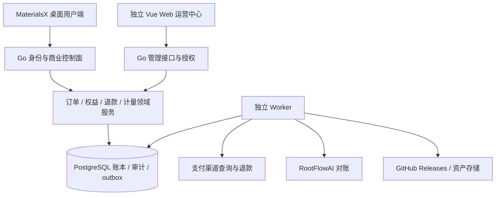

# MaterialsX M5：运营中心开发计划

版本：1.2\
制定日期：2026-10-01\
状态：独立 Web 后台、用户、财务、用量核对、公告和版本目录已实现并本机验收；工单、采购账单/告警、开户与通知、部署恢复入口已补齐；真实采购资料与正式运营验收待完成。本轮入口见 [生命周期交付](m5/lifecycle-delivery.md)；当前待办见 [清单](m5/remaining-work.md)\
关联基线：[M5 付费云模型与 Token 接入计划](M5_TOKEN_API_DEVELOPMENT_PLAN.md)\
版权：© 2026 吉林大学 AI-DAOS 团队

## 1. 结论与定位

MaterialsX 需要一个独立、受保护的云端 Web 运营中心，作为 M5 付费 Beta 的上线条件。桌面端服务科研用户；运营中心负责账号、收款、权益、退款、模型成本、客服与版本发布。两端共用 Go 控制面的业务规则和 PostgreSQL 账本，不能各自维护一份余额。

首版以“一名管理员能完成日常运营并处理异常”为目标。先完成最小商业闭环，再扩展多人分权、营销、团队账户和自动更新。运营后台不代替材料科研工作台，也不默认收集用户电脑中的论文、结构、会话正文或研究成果。

## 2. 已确认决策与待定项

| 项目 | 决策 | 实施边界 |
| --- | --- | --- |
| 首发市场 | 中国大陆 | 商户主体、部署地域与实际收款能力仍需确认 |
| 首个支付渠道 | 微信支付或支付宝，先接一个 | 在商户可用性验证后选定；不同时开发两个完整渠道 |
| 购买方式 | 月度套餐、补充额度包，手动续费 | 不默认开通自动扣款 |
| 退款 | 申请、核算、人工审批、原路退款 | 退款期限、已消耗额度处理和适用范围尚未确定；生产售卖前发布明确规则 |
| 运营人员 | 首版仅一名管理员 | 具名账号、MFA、完整审计；预留以后财务、客服、发布等角色 |
| 云模型 | RootFlowAI 的 `gpt-5.6` 为首发测试目标 | 能力、采购费率、商业使用范围以 M5.0 验证结果为准 |
| 供应商凭据 | 平台服务端保管 | 普通用户无 BYOK；后台默认只显示密钥引用及状态 |
| 本地模式 | 持续保留 | 云端停售、维护或账号冻结不删除本地项目 |
| 发布渠道 | GitHub Releases 可作为初始公开安装包分发渠道 | 仓库可访问性、资产与正式发布门槛需验证；Git 标签不等于已发布版本 |

退款规则和正式售价不能用开发测试价格或假定值代替。规则未定时可以完成沙箱、接口和审批界面，不开放正式购买。

## 3. 已有基础与增量

当前已有独立 PG 身份/账本、管理员 MFA、用户/财务/用量页面及版本下载目录；微信小额实付与积分订阅、M5.3B 指定账户真实消费已验收。真实原路退款、正式部署、采购对账、客服工单及完整运营演练尚待完成。

现有 Go 原型使用单进程 JSON 存储、开发权益入口和 loopback 监听，不能直接对公网开放作为运营系统。首版运营中心依赖 MX-502 的正式身份/PostgreSQL、MX-504 的事务账本及 MX-505 的支付接入。

当前 Windows 安装包采用 NSIS，macOS 包为 DMG；没有已验证的桌面自动更新链路。后台登记和发布版本可以先实现，自动更新须另行通过 M4 安装、签名、升级恢复验收。

## 4. 信息架构与首版范围

建议左侧导航：

```text
工作台
用户与设备
订单与支付
订阅与额度
退款中心
用量与成本
供应商与路由
版本与资源发布
客服与公告
审计与安全
系统设置
```

| 模块 | P0：付费 Beta 前必须完成 | P1：后续扩展 |
| --- | --- | --- |
| 工作台 | 新注册、付费用户、收退款、云请求、待处理异常；可跳转具体记录 | 留存、转化漏斗、更多趋势与预测 |
| 用户与设备 | 搜索、账号详情、会话撤销、云访问启停、权益和工单关联 | 组织、团队、席位、邀请 |
| 订单与支付 | 创建/查看订单、验签回调、补查、关单、渠道对账 | 第二支付渠道、自动续扣、自动开票集成 |
| 订阅与额度 | 套餐/费率版本、账期、来源明确的额度授予与回收、到期提醒 | 优惠券、推荐奖励、批量机构套餐 |
| 退款中心 | 申请、退款试算、人工审批、原路退款、结果查询与账本冲正 | 符合已发布政策的低风险自动审批 |
| 用量与成本 | 请求/任务/订单关联、预留/结算、采购成本、待对账、补偿队列 | 多供应商成本比较与经营分析 |
| 供应商与路由 | RootFlowAI 健康、额度状态、受控密钥更换、模型能力、限流、版本化配置 | 多供应商切换、自动路由优化 |
| 版本与资源发布 | 安装包登记、审核、发布说明、下载目录、撤回推荐、版本兼容信息 | 桌面自动更新、独立 Skills/科学运行时更新 |
| 客服与公告 | 用户主动提交的工单、退款关联、维护/版本公告、处理记录 | 多客服分派、知识库与消息模板 |
| 审计与安全 | 管理员登录、MFA、操作审计、导出记录、紧急开关 | 多人角色、双人审批、企业访问策略 |
| 系统设置 | 环境/域名、支付与密钥引用、额度限制、告警与备份状态 | 多环境自助管理、组织级设置 |

所有页面都区分空数据、加载、无权限、失败及部分完成。操作后显示真实服务端结果；审批通过、退款成功和退款到账不能合并成一个状态。

## 5. 核心页面规格

### 5.1 工作台与新用户

- 卡片：新注册云账号、首次成功云调用、首次实付、付费权益有效用户、实收、成功退款、净收款、已确认采购成本、待确认成本。
- 异常列表：支付未开通权益、退款结果未知、长时间预留、usage 缺失、供应商故障、发布失败。每项显示负责人、持续时长、下一步与关联记录。
- 新用户详情：注册时间、脱敏联系方式、账号状态、设备、套餐、订单、云调用元数据及工单。可以撤销会话、暂停云访问；赠送测试额度须指定原因、额度来源、到期与上限。
- 本地未登录用户不算“注册用户”。下载次数不算“安装人数”；无用户授权的客户端统计，不推断本地活跃人数。
- 云请求失败、用户取消、研究结果 `needs_review` 分开统计。科学质量未通过不能自动解释为平台故障或退款条件。

### 5.2 财务页面

订单详情统一展示订单号、用户、商品和价格版本、人民币金额、渠道交易号、回调/查询证据、授予额度、退款及账本记录。金额用整数分存储，credits 用独立整数单位；前端不能计算最终扣款或退款。

订单异常提供“查询渠道状态”“重放已验证事件”“执行补偿”入口，不提供无证据的“标记已支付”。人工调整必须创建有原因和来源的账本交易，不修改历史记录或直接编辑余额。

首版支持导出财务核对表和收集用户开票需求；税务发票自动化不作为首版默认能力。联系方式、账单导出和附件访问受权限与审计控制。

### 5.3 版本页面

展示版本号、stable/beta 通道、Git 标签与 commit、OS/架构、文件大小/SHA-256、下载地址、签名/公证状态、许可与对应源码链接、支持的客户端协议/数据库范围、验证报告及发布说明。

首版流程：建立草稿 → 登记构建资产和证据 → 检查门槛 → 管理员确认发布 → 更新下载目录/公告。草稿不对用户可见；只有已公开且有效的资产进入下载列表。

## 6. 用户、购买、权益闭环


1. 订单冻结商品、价格、额度、有效期和退款政策版本，后续配置变更只影响符合生效规则的新订单。
2. 浏览器跳转成功仅作展示；以验签且匹配金额、商户、订单的服务端事件或渠道查询确认付款。
3. 同一支付事件重复/乱序到达，订单、订阅和额度只产生一次有效变化；事务内登记 outbox，异步通知失败可重试。
4. 月度订阅权益与额度账期明确关联；手动续费时显示准确新账期和额度安排。开发授予不能变成真实实付权益。
5. 新用户免费本地模式无需购买。首版不默认赠送可无限消费的云试用额度；是否赠送与额度大小由运营配置并记录。
6. 用户收到结果和账本最终结算是独立状态。usage 未确认时显示待对账，不伪造 token 或终态扣款。

## 7. 退款设计

### 7.1 状态与信息

退款申请记录原订单、原因、申请金额、政策版本、试算快照、相关额度授予、未结算请求、审批人、渠道退款号、状态和处理时间。

业务申请状态：`requested → reviewing → approved / rejected / canceled`。执行状态独立记录：`not_started → submitting → pending → succeeded / failed`。一个订单可有多次部分退款，每次独立追踪；申请批准不代表渠道已退款。

### 7.2 执行步骤

1. 校验原订单实付及渠道信息，计算可退上限：实付金额减去已成功退款及仍在执行中的退款金额。按原订单政策和商品版本计算额度与权益影响。
2. 试算展示已消耗、可回收、预留和待对账额度；在事务中锁定订单及相关额度授予，避免并发重复申请与继续消费。不能从用户其他订单购买的额度中随意扣除。
3. 存在未结算请求时，先完成结算/对账，或按已批准规则处理；试算结果变化必须重新确认。不得猜测已用量、产生负余额或直接抹去使用记录。
4. 审批明确退款金额、回收额度、套餐结束方式和通知内容。对将要退款的可回收额度建立冻结记录，并按政策限制相应权益。
5. Worker 使用稳定退款业务号请求渠道原路退款。超时先查询，不把“未收到响应”当成失败重新创建另一笔退款。
6. 渠道确认成功后，事务追加额度冲正、权益变化和审计，解除相应冻结；不删除历史订单、usage 或账本。明确失败时按规则释放冻结；结果未知保持 `pending`，进入查询与人工核对队列。
7. 桌面与工单展示处理进度；退款到用户支付账户的时间以渠道状态与说明为准。

冻结、冲正、订阅调整必须有同一退款 ID，可幂等重放。部分退款的人民币与 credits 换算遵循原订单商品/政策版本，并明确整数舍入和剩余尾差处理，不能使用当前销售价格。

首版人工审批由唯一管理员执行。单人操作不宣称双人审批；高金额或批量动作设可配置额度上限、再次认证、原因及完整审计，超限进入待处理。将来增加人员后可启用审批人与执行人分离。

## 8. 用量、采购成本与对账

- 按用户、订单额度来源、任务、request/attempt、模型、费率版本查询；支持从扣款追溯至供应商请求元数据。
- 客户收入与采购成本分别记录。net cash = 实收减成功退款；这不是已实现利润，也不直接等于按服务履约计算的收入。
- 展示已确认采购成本、待确认成本和渠道费用；成本缺失时不展示确定毛利。供应商余额无接口时标为“未知/人工核对”，不推断正常。
- 支付对账匹配渠道交易、金额、退款及本地状态；用量对账匹配供应商 usage/账单和平台请求；额度对账检查授予、过期、预留、结算、释放、冲正。
- Worker 处理漏通知补查、缺失 usage、退款查询、到期及 outbox；重试有退避、次数/时长上限和异常队列。
- 人工导入供应商账单只导入对账字段，校验来源和重复；不要求上传科研正文。补偿操作展示影响预览并记录原因，不提供通用 SQL 控制台。
- 沿用 M5 待对账告警初值：24 小时提醒、72 小时人工处理；这是内部运行目标，实施时按渠道能力验证，不是退款到账承诺。

## 9. 供应商、路由与控制开关

首版只管理已验证的 RootFlowAI/`gpt-5.6`。页面包含域名/协议、能力证据、健康、错误率、首事件时间、采购余额可见性、并发、任务/用户/每日采购上限和费用版本。

密钥在服务端 secret store 中保存；配置引用不包含明文。受控更换采用验证新凭据、切换新请求、保留审计、撤销旧凭据的流程。不可把 Key 写入工单、日志、GitHub Actions 输出或安装包。

路由和费率修改先生成版本及影响预览。进行中的请求继续使用创建时固定的配置；禁止因故障静默换成其他模型。供应商故障暂停新调用，取消与结算仍能继续处理。

独立开关：停止新销售、停止新云请求、限制测试账户、维护公告。停售不自动撤销已购权益；暂停云服务也不影响本地模型和本地项目读取。

## 10. 发布中心与 GitHub Releases

### 10.1 首版人工发布闭环

- 后台记录版本和资产，先通过 M4 门槛：构建来源、双平台验证、签名状态、许可通知/对应源码、研究示例权利及脱敏检查。
- 创建/关联 GitHub Release 草稿、上传经审核资产、核对版本/commit/哈希及发布说明，最后执行发布。仅到草稿或部分上传成功时，不更新公开下载目录。
- GitHub 凭据仅服务端，权限限定需要的仓库与发布操作。API 超时先查询已有草稿/资产，避免重复 Release；本地发布记录和远端不同步进入修复队列。
- 版本可以撤回推荐或停止新用户下载；保留历史审计。已发布资产优先采用不可变策略，错误包以新版本更正，不能以同版本替换内容掩盖差异。
- 仓库若不公开，不能假定 `browser_download_url` 对所有用户可用；需受控对象存储或平台授权下载，不把仓库令牌提供给桌面用户。
- 下载统计注明来源和口径。GitHub 资产下载次数只能表明该渠道下载行为，不能证明安装或运行。

### 10.2 自动更新独立工作包（P1）

后台公布新版本不会让 Electron 自动升级。当前 NSIS 包不能直接套用 Electron 内置 `autoUpdater` 的 Windows Squirrel/MSIX 路径，须验证与现有打包方式兼容的更新实现；macOS 自动更新需签名及相应 feed/更新资产。

独立验收包括更新 manifest/资产、签名与哈希、断点/重试、下载后确认安装、stable/beta 分离、用户暂停、按固定用户/设备分组灰度、最低协议版本、数据备份及迁移兼容性。需要的 ZIP、blockmap 等以所选实现为准，不能只上传 DMG/EXE 就宣称支持自动更新。

“回滚”先撤回新版本推荐和恢复已验证下载入口；旧客户端能否安全降级取决于数据库/项目格式兼容，禁止自动覆盖用户研究数据。未过正式门槛的开发预览必须清楚标记，不标为正式 stable。

### 10.3 Skills 与模型资源

P0 记录每个应用版本携带的 84 项 Skills、目录版本、来源/许可和资源哈希，复用现有清单；不建设任意脚本热更新市场。

P1 与 M6 协作管理势函数、权重与科学运行时：许可、大小、OS/架构、元素/能力、校验、兼容范围、撤回和回退。运营发布不能绕过 M6 科学验收，云模型开通也不代表本地权重已安装。

## 11. 管理员权限、审计和数据边界

首版一名具名管理员，角色从服务端独立授予，用户不能自行声明 admin；首次管理员通过受控部署流程建立，不保留公开初始化接口。登录采用 MFA、会话到期/撤销；Web 使用 Secure/HttpOnly Cookie 时，写操作同时防护 CSRF。

服务端每次校验 action 和对象范围，不能靠隐藏菜单授权。预留以下权限组，首版可以由同一管理员持有：

| 权限组 | 允许操作 | 默认限制 |
| --- | --- | --- |
| 用户/客服 | 账号元数据、工单、会话撤销、申请退款 | 不能直接改余额或退款成功状态 |
| 财务 | 订单、试算、审批、渠道退款、对账导出 | 不能读取供应商明文 Key 或发布程序 |
| 模型运营 | 供应商配置、健康、路由、预算 | 不能改支付证据/历史账本 |
| 发布 | 草稿、资产审核、公告和版本发布 | 不能绕过发布门槛 |
| 平台管理员 | 授予权限、环境配置、紧急开关 | 高影响动作再次认证并审计 |

退款、赠送额度、云访问冻结、费率调整、换密钥和发布动作先显示影响预览，提交理由、版本号和幂等键；并发修改使用版本冲突控制。

审计记录 actor、action、对象、脱敏前后值、理由、结果、关联业务号和时间。由服务端追加写入，普通管理 UI 无编辑/删除入口；定期导出到受控备份。此设计不宣称能抵抗数据库所有者篡改。

用户本地文件、论文正文、对话内容和结构数据不进入普通后台。云调用仍按 M5 告知发送必要内容；客服只访问用户主动同意提交的附件，并显示范围、访问记录和删除期限。诊断使用脱敏 request ID、版本及错误码。

管理接口、支付接口、普通账户接口分别限流。导出设置权限、字段白名单、下载有效期并处理 CSV 公式注入。账户停用、删除申请与法定/合同财务保留范围区分，具体保留期限在上线前确定。

## 12. 技术架构



- `apps/admin/`：Vue 3、TypeScript、Vite、Element Plus，复用设计变量和类型合同，独立构建/部署。
- Go 控制面：复用 M5 身份、billing、payments、providers 和 usage；新增 admin、releases、support 等必要领域。首版 API/网关同进程，Worker 独立。
- PostgreSQL 是资金与状态事实源；金融变更与审计/outbox 原子提交，服务端负责权限、金额和状态机，前端只提交操作意图。
- 首版采用 PostgreSQL outbox/任务表，不为后台另引入微服务集群、Redis 或工作流引擎。
- 科学 Python 不承担支付和账号逻辑；桌面 SQLite 不存生产总账、后台会话或渠道密钥。
- 开发、预发布、生产分别配置；真实回调仅指向正确环境，不在生产暴露 `/v1/dev/*`。管理员 Web 与用户服务可分子域，均使用 HTTPS。

## 13. 数据和接口草案

复用 M5 的 users、devices、sessions、orders、payment_events、subscriptions、credit_grants、reservations、ledger、usage、refunds、audit_events、outbox，不新增第二套资金模型。

新增/细化实体：

| 实体 | 核心数据 |
| --- | --- |
| admin_memberships / permissions / admin_sessions | 身份、授权、MFA 状态、会话、撤销 |
| refund_events / refund_holds | 原订单/授予、冻结额度、试算版本、审批、渠道事件 |
| reconciliation_jobs / discrepancies | 类别、证据引用、差异、重试、负责人和处置 |
| releases / release_assets / publication_jobs | 版本/通道、commit、平台、哈希、审核、远端标识和发布结果 |
| support_tickets / ticket_events | 用户、类别、业务关联、同意上传附件、处理时间线 |
| announcements / policy_versions | 对象范围、生效时间、版本、内容和发布状态 |

拟定 `/v1/admin/` 接口（名称在 MX-501/502 合同评审时固定）：

| 接口族 | 操作意图 |
| --- | --- |
| `session`、`overview`、`exceptions` | 后台身份、统计及异常工作队列 |
| `users/{id}`、`devices/{id}/revoke` | 元数据、云访问限制、会话撤销 |
| `orders/{id}/query-payment`、`reconciliations` | 有证据查询、差异核对与补偿 |
| `refunds`、`refunds/{id}/quote`、`approve`、`reject` | 申请、试算与审批；执行由持久化任务驱动 |
| `credit-adjustments`、`plan-versions` | 有来源的追加调整、商品/权益版本发布 |
| `usage`、`costs`、`providers`、`route-versions` | 查询、预算及版本化配置 |
| `releases`、`releases/{id}/validate`、`publish` | 草稿、门槛验证和发布任务 |
| `tickets`、`announcements`、`audit-events` | 客服、通知与审计查询 |

所有列表分页、按权限返回脱敏字段。写操作带幂等键和版本；异步操作返回 operation ID，可查询真实进度；不得让一次 HTTP 请求等待整个渠道退款或安装包上传。

## 14. 实施顺序、工作包与工量

MX-OPS-01 身份与审计基础已实现并本机验收，指南见 [M5.1](m5/identity.md)；M5.3已交付用量/核对基础Web页面，M5.4已交付测试财务工作台，真实支付商业验收及其他工作包待完成。运营中心不能整体等到 MX-506 才开发：身份和审计随 MX-502，资金页面随 MX-504/505 逐步交付。

| 工作包 | 对应 M5 | 交付 | 核心门槛 | 新增研发日 |
| --- | --- | --- | --- | ---: |
| MX-OPS-01 | MX-501/502 | 页面合同、管理登录、权限与审计基础 | 具名管理员/MFA；接口越权拒绝 | 2–3 |
| MX-OPS-02 | MX-502/506 | 用户/设备、工作台和异常队列 | 真实口径、对象关联、脱敏与操作记录 | 1–2 |
| MX-OPS-03 | MX-504/505 | 订单/权益/退款财务工作台 | 实付到权益、原路退款到冲正全链路 | 2–3 |
| MX-OPS-04 | MX-503/504 | 供应商/用量/成本与对账页面 | 未知成本可见、可追溯补偿与预算开关 | 1–2 |
| MX-OPS-05 | MX-506 + M4 | 版本/资产管理、GitHub 发布与下载目录 | 真实资产/哈希、草稿审核、失败恢复 | 2–3 |
| MX-OPS-06 | MX-506 | 工单、公告与政策版本 | 无默认科研数据上传、通知有真实结果 | 1–2 |
| MX-OPS-07 | MX-507 | 运营演练和上线手册 | 支付/退款/恢复/发布异常完整演练 | 1–2 |

M5 原估计为 37–53 个研发日，已包含基础账号、支付、退款和必要后台。上述 **10–17 日为运营规格展开后的净增量估计**，不再次计算原 M5 已安排的支付适配、事务账本与网关。M5 加本计划约 **47–70 个研发日**；此为工程工量，不是自然日承诺，单人研发还受联调、商户开通、签名和评审等待影响。完成 MX-501 合同与页面草图后重新估算。

建议顺序：后台授权与审计 → 用户/订单 → 权益/用量 → 支付/退款 → 供应商/异常处理 → 版本/工单/公告 → 付费 Beta 演练。无真实商户时先做沙箱；无供应商账单接口时先实现带审计的导入核对。

P1 自动更新、更多支付渠道、多人审批、团队席位、营销及 M6 资源发布另行估算，未包含在上述净增量内。

## 15. 验收清单

| 编号 | 场景 | 必须成立的结果 |
| --- | --- | --- |
| OPS-01 | 普通用户/过期管理员调用管理接口 | 服务端拒绝；角色不能由客户端伪造 |
| OPS-02 | 重复、乱序、漏支付通知及金额不符 | 只授予一次；不符拒绝；漏通知可补查 |
| OPS-03 | 退款时仍在调用模型，两个审批并发 | 冻结和预留无竞争超支；冲突可见；不误扣其他订单额度 |
| OPS-04 | 退款提交超时、回调重复、部分退款 | 查询同一退款；不重复退款；退款金额不超过原实付 |
| OPS-05 | 成本/usage 缺失、worker 重启 | 明确待确认；不伪造利润；事务和 outbox 可恢复 |
| OPS-06 | 赠送/调整/费率变更/导出 | 原因、版本、权限和审计完整；历史不可直接编辑 |
| OPS-07 | 上传错误平台/架构、commit 或哈希不匹配 | 阻止公开发布；测试通道不进入 stable |
| OPS-08 | 旧版权/许可材料不全、门槛失败 | 不通过正式发行审核；预览如需分发须准确标识且满足分发许可 |
| OPS-09 | GitHub 上传部分失败、超时或 URL 不可访问 | 不宣称已发布；幂等查询/修复；公开目录无无效版本 |
| OPS-10 | 下载次数、新用户、任务待复核 | 指标口径准确，不冒充安装人数或技术失败 |
| OPS-11 | 用户本地 PDF/会话、凭据及诊断附件 | 无默认上传；日志/导出/公开包无密钥；同意范围可审计 |
| OPS-12 | 停售、供应商停机、恢复数据库 | 新请求受控，已有资金记录不丢，本地模式仍可用 |

自动更新进入 P1 后另验收：灰度分组稳定、下载恢复、签名/哈希拒绝、更新中断、迁移失败恢复及不兼容降级阻止；不能用后台发布成功代替这些验证。

## 16. 上线与日常运营

上线前完成：商户主体与渠道、实名具名管理员/MFA、正式价格/退款政策、用户条款与云数据说明、环境域名、渠道回调、告警、备份恢复和 M4 分发门槛。

首版日常操作建议：

1. 每日先处理异常队列：支付未开通、退款 pending、待对账、供应商采购不足。
2. 财务核对订单/渠道收退款与额度账本；差异留证、处置、复核，不直接改数据库。
3. 检查模型能力/成本和错误率，必要时限制新云调用或停止新销售并发布说明。
4. 工单回复记录处理经过；用户通知优先在桌面订单/工单可见，邮件等渠道接入另行配置。
5. 新版本先草稿与门槛审核，再发布和公告；失败版本撤回推荐，保留历史。
6. 定期演练数据库恢复、管理员会话撤销、支付补查、退款恢复和供应商故障。

实施产物保存于 `docs/m5/`：权限矩阵、界面草图、支付/退款状态机、对账报告、发布/撤回手册、告警规则和操作演练记录。只在真实或明确标识的沙箱验收证据成立后标记完成。

## 17. 开发前待补充

| 待定项 | 对开发的影响 |
| --- | --- |
| 微信还是支付宝、商户主体和账号可用性 | 固定 MX-505 实际适配；可先完成渠道抽象和沙箱 |
| 退款期限、已消耗额度、套餐终止和部分退款政策 | 决定最终试算及权益回收；必须在售卖前明确 |
| 管理员登录方式/账号与 MFA 初始化 | 决定身份配置；不在公开文档填真实凭据 |
| 平台域名、部署环境、告警接收方式 | 决定回调、后台和运维配置 |
| 正式售价、额度、测试预算及单人高风险操作上限 | 决定试运营限制和正式商业配置 |
| GitHub 仓库可访问性、签名和发行资产状态 | 决定公开下载及正式发布方式 |
| 资料/财务记录/附件保留期限及开票处理 | 决定删除申请、审计与财务操作流程 |

上述未定项不阻止规划、合同和非资金界面开发；不会以默认假设触发真实收退款、供应商消费或外部版本发布。

## 18. 参考与维护

- [M5 总计划](M5_TOKEN_API_DEVELOPMENT_PLAN.md)、[M4 发布工程](m4/README.md)、[M6 势函数与 3D 计划](M6_ML_POTENTIALS_3D_DEVELOPMENT_PLAN.md)。
- [GitHub Releases 管理](https://docs.github.com/en/repositories/releasing-projects-on-github/managing-releases-in-a-repository)：草稿、资产及发布操作。
- [GitHub Releases REST API](https://docs.github.com/en/rest/releases/releases)：版本、资产、哈希和下载元数据；实施时复核权限与 API 版本。
- [Electron autoUpdater](https://www.electronjs.org/docs/latest/api/auto-updater)：平台支持与 macOS 签名要求；不据此认定当前 NSIS 包已有更新能力。

本计划补充 M5 运营规格，不改变无 BYOK、本地免费可用、供应商 Key 仅服务端和科学证据验收的既定边界。新增商业政策或权限应记录版本、影响及验收，不能只修改后台文案。

## M5.3 用量与核对基础交付

`/ops` 复用 M5.1 管理员 MFA，展示请求/采购未知计数与待核对队列，支持金额预览、证据幂等导入、平台承担与只读账本重建。HttpOnly 短会话、Origin/CSRF、预期版本和审计已接入；没有向浏览器发供应商 Key 或 refresh token。正式成本率、付款/退款工作台、告警通知和版本发布仍按后续工作包实施。[操作指南](m5/metering.md)。

## M5.4 财务工作台增量

MX-OPS-03 随本轮交付 `/ops` 订单/退款/证据/队列、测试到账、核算预览、版本化单管理员审批、人工队列恢复查询及独立现金/合成金额汇总。测试到账按钮只在隔离开发 test 模式挂载且要求 MFA、Origin 和 CSRF；生产没有人工标记支付入口。退款超时保留冻结、按原退款号查询，不重复 POST。

已通过 PG、受限角色及实际桌面测试闭环；商户、小额实付、正式费率/条款和原路退款尚未验收，故工作包商业验收未关闭。详细限制与证据见 [M5.4](m5/payments.md)。

## M5.5 独立后台增量（2026-10-01）

`apps/admin/` 已实现总览、用户、订单退款、用量核对、供应商固定路由、版本下载目录与审计。复用 Go/PG 的 MFA/同源 cookie/CSRF、对象和并发版本授权。管理员修改暂停开关/双语公告追加审计；只停止新准入。后台不展示用户论文、对话、生成内容或供应商密钥。

MX-OPS-04 首版交付方式调整为：人工完成 GitHub 公开 immutable Release，后台依据部署审核文件和公开 asset/commit/hash 回查登记下载目录，可撤回并保留历史。GitHub 自动上传/发布队列、支持工单与自动更新未实现；M4 稳定发行门禁不降级。本机已完成实际 Vue 后台审批退款、暂停恢复及审计测试，见 [M5.5](m5/workspace.md)。正式财务与跨平台商业验收仍待商户、条款、Windows 和签名证据。
