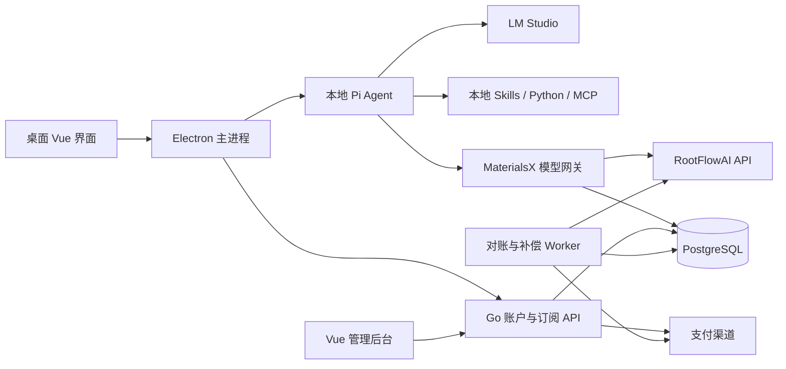

# MaterialsX M5：付费云模型与 Token 接入系统开发计划

版本：1.0  
制定日期：2026-10-01  
状态：待用户审阅；尚未开始实现  
首发测试供应商：RootFlowAI  
首发目标模型：`gpt-5.6`  
版权：© 2026 吉林大学 AI-DAOS 团队

## 1. 目标与已确认决策

为 MaterialsX 构建完整的付费云模型系统：用户登录、购买套餐或额度包，在本地研究工作台调用平台接入的外部模型，并查看任务用量、费用、余额和产物。

本文件作为 M5 后续实现、测试和验收的执行基线。现有总体计划 `docs/DEVELOPMENT_PLAN.md` 继续适用于 M0–M4；本文件细化并更新付费模型接入部分。存在冲突时，优先遵循用户最新指令，并记录决策变更。

| 决策 | 本期执行要求 |
| --- | --- |
| 首发供应商 | RootFlowAI 中转 API |
| 首发目标模型 | 精确使用 `gpt-5.6`；无法访问时报告原因，不静默改成其他模型 |
| API 域名 | `https://api.rootflowai.com` |
| OpenAI 兼容 Base URL | `https://api.rootflowai.com/v1` |
| 模型协议 | 优先验证 Responses；只有验证目标模型兼容后才采用 Chat Completions |
| UI 参考 | 用户提供的供应商管理截图：顶部分段导航、搜索、供应商卡片、选中状态和详情面板 |
| BYOK | 不提供普通用户云模型密钥入口；平台统一采购和管理供应商密钥 |
| 本地模式 | 保留 LM Studio、现有本地 Pi、Skills、工具和本地数据 |
| 付费方式 | 月度套餐 + 补充额度包；首版按月购买、手动续费 |
| 本次变更范围 | 仅编写开发计划，不改应用代码、不保存真实密钥、不发起模型推理 |

目标模型名称是用户指定的供应商模型 ID。本计划不据此保证底层模型来源、具体版本、能力或可用性；这些分别记录供应商声明和实测证据。

### 1.1 首版范围

- 一个供应商 RootFlowAI，一个目标模型 `gpt-5.6`，保留扩展更多供应商和模型的结构。
- 真实流式问答、工具调用、Skills 执行、RPSME 受管抽取。
- 登录与设备管理、服务端授权、生产账本、任务预算、订单和一个支付渠道。
- 供应商管理、网关、路由、用量、资源库页面，以及必要的运营后台。
- macOS arm64 与 Windows x64 桌面端回归。

本期不接其他聊天产品的订阅账户或 Cookie，不开放 MaterialsX 下游公共 API 服务，不一次性接通全部模型目录，不实现复杂多供应商自动择价和自动续扣。后续功能应单独列工作包。

## 2. 已有基础与差距

以下结论基于当前项目代码与 M3/M4 文档。

| 部分 | 已有能力 | M5 增量 |
| --- | --- | --- |
| 桌面工作台 | Electron、Vue、Pinia、SQLite、Codex 浅色主题 | 云模型页面、账户、购买与任务费用 |
| Pi 适配 | 本地 OpenAI Completions、会话、流式与取消 | 平台 Provider、Responses 兼容与会话隔离 |
| 材料任务 | 84 项 Skills、分页 RPSME、断点与产物校验 | 模型来源可替换、阶段用量聚合 |
| 平台模式 | UI 与模式字段，当前发送消息只进入等待状态 | 真正通过 MaterialsX 网关调用供应商 |
| Go 控制面 | 套餐、预留、结算、释放、追加式记录 | 正式认证、事务数据库、授权与网关 |
| 当前账本 | 单进程互斥锁与 JSON 原型 | PostgreSQL、多实例事务、不可变记录 |
| 当前账户 | 安装标识 | 正式用户、会话与设备令牌 |
| 支付 | 开发权益模拟 | 订单、回调验签、退款、对账 |

当前套餐价格和 credits 是开发假设，不迁移成真实已付款权益。开发授予记录应独立保留或隔离，不转换成生产付费余额。

## 3. 页面与交互设计

### 3.1 导航与角色

在桌面侧栏增加“模型与用量”入口，内部参考截图使用顶部分段导航：

```text
Agent  |  供应商  |  网关  |  路由  |  用量  |  资源库
```

普通用户可以查看模型来源、可用状态、个人用量、预算与套餐；管理员在独立受保护的后台维护供应商密钥、路由和销售费率。无权限的配置操作由服务端拒绝，不能仅依靠隐藏按钮。

桌面模型页与管理后台共享视觉语言，但分别提供适合角色的操作。截图中的多品牌订阅卡片不直接照搬为实际可用能力。

### 3.2 页面规格

| 页面 | 展示内容 | 用户操作 | 管理操作 |
| --- | --- | --- | --- |
| Agent | 当前模型、模式、工具能力、预算与会话配置 | 选择本地/平台模型，设置任务预算 | 配置允许使用的能力与套餐范围 |
| 供应商 | 来源卡片、名称、协议、模型数、状态、最近验证 | 查看 RootFlowAI 与本地运行时详情 | 配置受控 API 域名、密钥引用、启停与检测 |
| 网关 | 连接状态、认证状态、区域、延迟、错误摘要 | 重新连接、查看脱敏诊断 | 检查上游健康、并发与限流 |
| 路由 | 当前任务使用的模型和公开规则 | 为会话选择可用模型 | 维护平台别名、版本和预算规则 |
| 用量 | 余额、预留、待对账、消耗趋势、任务账单 | 查看明细、导出个人账单 | 核对供应商成本与用户扣款 |
| 资源库 | 已接入云模型、100 项材料模型目录、84 项 Skills | 搜索、分类、双语说明和示例 | 发布模型能力和评测状态 |

### 3.3 供应商卡片

- 白色/深色卡片随当前主题切换，网格布局可适应窗口宽度。
- 显示名称、来源类型、协议、验证状态；RootFlowAI 标记“中转 API”。
- 首版平台卡片只有 RootFlowAI；本地卡片展示已配置的 LM Studio 等运行时。
- 状态包含：未配置、待验证、可用、受限、故障、已停用。
- 点开卡片展示说明、模型、能力、最近检测时间；管理员另见密钥引用和配置表单。
- 搜索覆盖中英文名称、模型 ID 和协议；选中使用边框与勾选，不能只靠颜色。
- 未接入的供应商不显示“已就绪”。后续目录项必须标明“计划接入”。
- 不展示真实密钥、第三方账户邮箱或截图中的用户信息。

### 3.4 研究任务中的呈现

- 输入框附近显示：平台/本地、当前模型、任务预算和可用额度。
- 发送后即时展示用户消息；文本复用现有 32ms 缓冲与前端动画帧合并机制。
- 工具状态与模型文本分开展示，保留已有 Markdown、公式、表格排版。
- 任务结束显示输入/输出/缓存等用量、实际费用、结算状态和产物链接。
- “处理中”“模型已结束”“任务完成”“待复核”“待对账”分别记录，不能互相代替。
- 余额不足、目标模型不可用、上游限流、断流提供具体原因及恢复入口。
- 本地运行显示“未调用平台模型”，不展示虚构云端 Token 费用。

## 4. 架构与职责



| 层 | 负责 | 不承担 |
| --- | --- | --- |
| Vue renderer | 页面与输入、模型选择、账单展示 | 供应商密钥、可信余额和计费决策 |
| Electron 主进程 | 凭据存储、受控 IPC、Pi 连接、文件权限 | 生产账本与自行授予权益 |
| Pi 适配包 | Agent 会话、协议事件、工具与工作流 | 支付、正式账户、真实额度真源 |
| Go API/网关 | 身份、授权、路由、计量、计费和订单 | 本机科学脚本和重型文档处理 |
| PostgreSQL | 事务、状态、幂等和账本 | 存储本地科研原始文件 |
| Worker | 对账、补偿、超时处理和告警 | 无记录地重发生成请求 |

首版 Go API 与网关可部署在同一个进程，Worker 为独立进程。Redis 不作为首版必需依赖；额度正确性依靠数据库事务。新增框架应有明确需要，不能为已有本地任务额外引入一套云端工作流引擎。

## 5. RootFlowAI 接入配置与验证

### 5.1 公开配置

以下信息依据 [RootFlowAI API 参考](https://rootflowai.com/docs/api/reference)；文档核对日期为 2026-10-01。文档可访问不等于当前账户或模型已通过测试。

| 项目 | 值/处理 |
| --- | --- |
| Provider ID | `rootflowai` |
| 供应商类型 | `relay` |
| API origin | `https://api.rootflowai.com` |
| Base URL | `https://api.rootflowai.com/v1` |
| 目标模型 | `gpt-5.6` |
| 模型发现 | `GET /v1/models` |
| 优先生成接口 | `POST /v1/responses` |
| 候选兼容接口 | `POST /v1/chat/completions` |
| 认证 | 服务端 Bearer 认证 |
| 密钥读取位置 | 服务端 `ROOTFLOWAI_API_KEY` 或生产 secret manager 引用 |

不能拼接出 `/v1/v1`。API 根域名打开后跳转门户不作为 API 健康结论；使用目标 API 路径核对。

平台模型别名可设为 `mx-gpt-5.6`，内部固定映射到供应商 `gpt-5.6`；UI 同时说明模型与 RootFlowAI 来源。别名改变映射必须版本化并公告，不静默替换。

### 5.2 密钥交付边界

- 用户已在会话中提供测试凭据；本计划不复制该凭据，也不生成包含凭据的文件。
- 后续实施从服务器环境或密钥系统读取；文档和示例仅使用变量名、空值或密钥引用。
- 测试与生产密钥分离，设置可用模型和额度限制。
- 不写入桌面 SQLite、renderer、安装包、默认配置、截图、Git 或请求日志。
- 不通过命令参数、shell 历史、错误输出或测试报告暴露密钥。
- 日志仅记录密钥记录 ID；诊断屏蔽 Authorization、Cookie 和完整上游响应中的敏感字段。
- 用户日后选择模型不需要重新提供供应商 Key。

公开示例（只写入本计划，不代表已部署）：

```dotenv
ROOTFLOWAI_BASE_URL=https://api.rootflowai.com/v1
ROOTFLOWAI_MODEL=gpt-5.6
ROOTFLOWAI_API_KEY=
```

### 5.3 M5.0 验证顺序

1. 通过 `/v1/models` 核对认证、模型 ID 与账户可见性。此操作不证明余额、分组和全部能力。
2. 核对账户分组、有效价格、限额、商业用途和数据处理范围；记录依据，不自行假定。
3. 在已设定测试预算后，运行一个最小非流式生成；核对真实输出、错误结构、请求 ID 与 usage。
4. 运行 Responses 流式测试，核对文本、完成事件、错误、usage 和停止行为。
5. 运行单个只读工具调用，再运行多轮工具结果回传；工具仅在本机执行。
6. 核对结构化输出、输入上限、最大输出参数、推理参数和缓存口径；未测能力标记 unknown。
7. 验证固定 Pi SDK 版本对 Responses 的事件支持；需要调整时先做兼容性探针，再决定最小升级。
8. 只有 Responses 不满足且 Chat Completions 经独立验证满足时，明确记录协议决策后改用该协议。

若 `gpt-5.6` 未返回、余额不足、接口不兼容或上游拒绝，保留失败证据。不得更换成相似名称或把 mock 结果标作真实调用。

### 5.4 当前验证状态

| 项目 | 状态 |
| --- | --- |
| 文档与 API 路径 | 已核对公开文档 |
| 测试密钥有效性 | 未验证 |
| `gpt-5.6` 对本账户可见 | 未验证 |
| 本模型实际可调用、真实来源与能力 | 未验证 |
| 本账户分组和精确采购价 | 未验证 |
| 流式、工具调用、usage、Pi 兼容 | 未验证 |
| 商业上线与供应商日志/数据保留安排 | 待确认 |

## 6. 模型网关与 Pi 集成

### 6.1 模型元数据

维护供应商、真实模型 ID、协议、状态、能力、上下文窗口、输出上限、价格版本、最近验证时间和证据引用。可展示全部供应商可见模型，但只有审核启用的模型对用户开放。

输入长度按真实模型限制和账户策略计算。超限时明确分块或压缩；不设置统一的 2700 Token 上限，也不悄悄截断证据。对于未知限制，先设置可说明的保守测试上限并标记待验证。

### 6.2 请求链路

- Pi 保留在桌面本机，发送模型请求到 MaterialsX 网关，不直接携带 RootFlowAI Key。
- 网关校验用户访问令牌、模型权限、任务预算和请求大小，并统一选择供应商。
- Pi 使用的平台访问令牌是 MaterialsX 凭据，不能与供应商 Key 混淆。
- 同一会话切换本地/平台模型时重建或切换对应 Agent 状态，保持历史与工具调用 ID 的合法性。
- 网关不能接受普通用户指定的任意上游域名、API Key、计费值和请求头。
- 服务端校验 token 上限、工具 schema 大小及不支持参数，避免客户端绕过预算。

### 6.3 流式与恢复

网关提供 Pi 可解析的目标协议事件，桌面主进程转换成现有 UI 流式事件。避免只返回拼接文本而丢失 tool call、finish reason、usage 或错误。

每个事件带请求标识和可去重顺序。分别处理 HTTP 错误、流中错误、空文本但有效工具调用、推理内容但无最终回答、截断参数和无完成事件。

同一 request ID 的重复请求只查询或订阅既有执行状态，不创建新生成。不同 request ID 的相同文本属于新的用户请求，不按文本去重。

首版可保存非正文的请求状态与最终计量；不默认长期存储模型正文。短期加密流缓冲如用于重连，需明确 TTL、访问权限和删除机制。没有缓冲时诚实提示“无法补读文本”，不能以恢复为名重新推理。

客户端断线、停止、上游取消、实际停止和结算状态分别记录。取消不保证供应商立即停止计费。

## 7. Token、额度与成本模型

### 7.1 三类单位

| 单位 | 含义 |
| --- | --- |
| MaterialsX 登录令牌 | 用户认证，不能作为余额 |
| 模型 Token | 上游实际输入、输出、缓存等计量 |
| MaterialsX credits | 用户套餐与补充额度的统一消费单位 |

采购成本、用户销售费用和额度换算单独版本化。用户模型价格公开，后台保存采购成本；用户不直接继承供应商会员折扣、赠送额度或采购账本。

### 7.2 RootFlowAI 成本口径

依 [RootFlowAI 计费说明](https://rootflowai.com/docs/guide/pricing)，页面 `$` 是其站内额度标识，不应直接作为 USD 采购成本；有效价格依赖分组和会员档，已包含倍率的价格不能再次乘倍率。

实现中区分 `provider_credit`、CNY 和 MaterialsX credits，保存采购换算版本及生效时间。精确采购价格待本账户核对；不复制其他模型示例报价到 `gpt-5.6`。

参考 [供应商模型价格页](https://rootflowai.com/pricing) 查明目标模型的分组、单位和长上下文阶梯。页面可见内容不足以锁定目标账户价格时，记录待确认并停止生产售卖配置发布。

### 7.3 用量归一化

记录总输入、总输出、普通输入、缓存读取、缓存写入、推理用量等字段及来源协议，区分未知与零。保留必要的原始 usage 计量字段，不保存响应全文。

```text
费用 = 各互不重叠计费项的数量 × 该项有效单价
```

- 如果推理 Token 已包含在输出总量中，不能重复加收。
- 如果缓存已包含在输入总量中，计算普通输入前先按协议扣除对应部分。
- 累计 usage 事件以最终/最新有效累计值结算，不能逐事件相加。
- 按次、多模态和外部工具费用以后单独定义，不默认套用文本 Token 公式。
- 金额与 credits 使用整数最小单位或定点数，统一舍入规则；禁止浮点直接扣款。
- Token 总数不是跨模型通用的销售额度，不承诺不同模型等价消耗。

### 7.4 套餐与额度包

Community 保留本地模式；Pro、Research 提供各自云端额度。¥199/¥599 和已有额度只是旧开发假设，需完成真实任务成本分析后定价。

月度权益按账期授予；人工月购建议按日历月计算并处理月末日期。补充额度有独立有效期，优先扣即将到期的额度，同到期日再按授予时间排序。到期、退款和补偿只追加记录。

可用余额 = 有效授予 − 已结算消耗 − 有效预留。UI 分别显示可用、预留、待对账与到期时间。

## 8. 预留、结算、幂等与补偿

```text
认证与授权 → 预算检查 → 事务预留 → 持久化请求/attempt
  → 上游调用与流式 → 归一化 usage → 事务结算 → 释放差额
```

内部以 request ID、attempt ID、reservation ID、payment event ID 为不同幂等边界。客户端不能调用正式结算或自行释放已执行请求；这些由服务端网关和 Worker 完成。

预留由服务端按输入计量、模型输出上限、可能的推理用量、价格阶梯和独立费用计算，不能相信客户端报的 Token 数。优先用经验证的计数方法；供应商不提供精确计数时采用有说明的保守上界。预留按无缓存优惠的情况计算，实际命中后结算优惠；无法确定成本上界的参数组合不开放正式付费。

| 异常 | 必须处理 |
| --- | --- |
| 并发余额竞争 | 账户/额度批次行锁或等价事务约束，不允许超额预留 |
| 重复请求、重复结算 | 返回既有结果；核对重复 ID 的参数一致性，不重复调用或扣款 |
| 用户停止 | 上游取消与 usage 核对；已产生用量按公开规则结算 |
| usage 缺失/执行状态不明 | 保留有限期限的预留并进入待对账，不按零或满额猜测 |
| 失败且确认无用量 | 释放预留并记失败原因 |
| 网络超时但可能已生成 | 先查请求状态；供应商无查询能力时进入人工/日志对账，不盲重发 |
| Worker 重复运行 | 事务与状态检查保证幂等 |
| 服务崩溃 | 启动后扫描 pending 状态，按上游证据恢复 |
| 预留到期但可能仍在执行 | 先停执行并确认，不仅凭 TTL 释放资金 |
| 平台导致重复上游成本 | attempt 成本全部记录；用户账单追加补偿 |
| 价格变化 | 单调用冻结销售版本，记录采购版本与后续差额，不改历史账单 |
| 实际超预留 | 优先通过保守预留和输出上限避免；不得静默产生用户欠费，进入异常补偿 |

测试默认关闭 SDK 隐式自动重试。生产只对明确适合重试的状态执行有限退避；每次可能产生采购成本的尝试都有记录。供应商不提供幂等保证时，不声称能保证上游绝不重复执行。

待对账默认 24 小时告警，最多 72 小时转人工处理；这些是拟定运营 SLA，发布前确认。无法取得可靠用量时需明确用户补偿规则和平台成本归属，避免无限冻结。

## 9. 材料 Skills 与任务预算

- 一次研究任务对应 task ID；分页、摘要、修复和合并分别对应阶段及调用 ID。
- 保留现有 RPSME 的真实文档预处理、逐页证据定位、缓存和最终校验；不改成模型自由声明任务完成。
- 从现有受管流程抽出模型调用接口，本地与平台实现共用阶段代码和产物检查。
- 设置任务额度上限、模型轮次上限、输出上限、时长和重试上限；服务端同时校验账户日/月预算。
- 本地缓存命中且没有新模型调用不扣模型费用；重新抽取或改变模型造成新调用时明确提示。
- 本地 Python、已有 PDF 解析和本地工具不虚构 Token 消耗；以后如付费科学 API 单独列项。
- 预算不足时保存真实阶段进度，补充额度后继续；不能把中断草稿标成完整结果。
- 云模型能够生成文件不代表科学质量通过；RPSME 产物仍分“通过”和“待复核”。

平台模式首次外发提示模型来源、供应商、将发送的分页证据/工具结果范围，允许记住项目选择。原 PDF 不默认上传整份；必要文本送往网关再送 RootFlowAI，不能宣称全程离线。

## 10. 账户、设备与权限

- 首版采用一个确定的账户登录方案；桌面通过系统浏览器完成授权，使用 PKCE/state 或等价安全绑定。
- 访问令牌短期有效，刷新令牌轮换、撤销并限制重放；设备列表支持退出设备。
- macOS Keychain、Windows 系统凭据存储持久化敏感凭据；SQLite 仅保存非敏感账户展示数据。
- 服务端依据已认证用户识别账户，不信任传入的 account ID。
- 用户、运营和管理员分权；密钥、价格发布、退款、补偿等操作审计。
- 云调用每次在线校验；本地功能保持可用，离线不授予云端消费权限。
- 开发权益端点只在明确开发环境开放，生产构建和配置验证禁止开放。
- 按用户、设备、模型实施限流与并发控制；采购余额告警与全局云调用停用开关。

## 11. 支付、订阅与退款

首版接一个已开通商户能力的渠道。渠道和主体待确认，采用接口隔离；沙箱验证不能代替真实支付验证。

```text
服务端创建订单 → 支付页/二维码 → 验签回调/主动查询
  → 核对金额、币种、商户与订单 → 事务确认支付并授予额度
```

- 订单状态：pending、paid、closed、refund_pending、partially_refunded、refunded；用支付事件推动合法转换。
- 订阅状态：pending、active、suspended、expired、canceled；账期和额度独立记录。
- 重复回调、乱序回调、漏通知用幂等与主动查询处理；浏览器返回页不授予余额。
- 订单和额度授予同一事务，或通过事务 outbox 确保可靠一致。
- 首版不自动续扣；套餐到期提醒，手动购买下一账期。
- 升降级默认下账期生效，界面展示生效日期。
- 部分退款和全额退款有公开规则；已消耗/预留部分需核对后处理，逆向账本不可改历史。
- 充值和扣款记录支持用户导出；发票/报销信息按渠道和运营能力明确显示。

## 12. 数据表与 API 契约

### 12.1 核心数据

| 组 | 表/实体 |
| --- | --- |
| 身份 | users、devices、sessions |
| 模型 | providers、provider_credentials（仅密钥引用）、models、model_capabilities、route_versions |
| 价格 | purchase_price_versions、sales_price_versions、plans、credit_packs |
| 付费 | subscriptions、billing_periods、orders、payment_events、refunds |
| 消费 | credit_grants、research_tasks、provider_requests、request_attempts、usage_reservations、usage_events |
| 账本与运营 | ledger_transactions、ledger_entries、reconciliation_jobs、audit_events、outbox_events |

以不可变账本记录资金/额度流转，余额快照只作为可重建视图。定义成对的转移记录和批次归属，在实现时验证账本守恒。唯一约束包含事件 ID、账户+幂等键、reservation ID 和 attempt ID。

### 12.2 拟定接口

接口为设计基线，M5.0 固化请求/响应 schema 和错误码。

| 路径组 | 用途 |
| --- | --- |
| `/v1/auth/*` | 登录、刷新、退出 |
| `/v1/devices/*` | 列出与撤销设备 |
| `/v1/models` | 用户可调用的模型、能力、价格版本 |
| `/v1/providers` | 用户可查看的公开来源 |
| `/v1/tasks` | 创建/查询任务与预算 |
| `/v1/model-gateway/responses` | 认证后的 Responses 请求与流式 |
| `/v1/model-gateway/chat/completions` | 经验证启用的兼容协议 |
| `/v1/model-requests/{id}` | 请求状态与结算结果 |
| `/v1/model-requests/{id}/cancel` | 取消自己的请求 |
| `/v1/billing/plans`、`/v1/billing/credit-packs` | 套餐与额度包 |
| `/v1/billing/orders/*` | 下单与查询 |
| `/v1/billing/webhooks/{channel}` | 支付通知验签 |
| `/v1/entitlements` | 当前登录账户的权益 |
| `/v1/usage/summary`、`/tasks`、`/ledger` | 个人用量与账单 |
| `/v1/admin/*` | 供应商、价格、订单、对账和审计 |

服务端计费内部接口不对桌面用户开放。所有列表分页，所有对象按主体授权；幂等键、request ID、trace ID 分别规定用途。

## 13. 项目改造位置

以下均为未来改造点，本次未创建实现模块。

| 位置 | 改造内容 |
| --- | --- |
| `packages/contracts/src/desktop.ts` | 账户、公开 Provider、模型能力、用量和任务预算类型 |
| `packages/control-plane-client/src/index.ts` | 环境化平台地址、认证请求、订单/权益；保留开发隔离 |
| `packages/pi-adapter/src/` | 平台 session/provider、协议探针、模型调用接口 |
| `packages/pi-adapter/src/rpsme-workflow.ts` | 复用工作流，注入模型调用与阶段用量 |
| `apps/desktop/main/index.ts` | 平台模式真实运行、账户 IPC、流式和取消 |
| `apps/desktop/main/store.ts` | 非敏感账户快照、任务关联和必要迁移 |
| `apps/desktop/preload/index.ts` | 窄权限的新功能 IPC |
| `apps/desktop/renderer/src/` | 模型与用量导航、卡片、登录、购买和费用 UI |
| `services/control-plane/internal/` | auth、store、providers、gateway、billing、payments、usage |
| `services/control-plane/cmd/worker/` | 对账与补偿 worker |
| `services/control-plane/migrations/` | PostgreSQL migration |
| `apps/admin/` | 独立受保护的 Vue 管理界面（新增） |
| `scripts/` | 脱敏探针、迁移、回归与成本评测 |
| `docs/m5/` | 联调报告、计费样例、上线/回滚和对账手册 |

## 14. 分期工作包、依赖与验收

所有工作包初始状态为未开始。工作量是研发估计，供应商、商户、部署和审核等待时间不计入。

| 阶段 | 工作包 | 主要交付 | 验收门槛 | 工作日 |
| --- | --- | --- | --- | ---: |
| M5.0 | MX-501 接入探针与契约 | RootFlowAI/`gpt-5.6` 脱敏报告、协议决策、UI 草图、计费/预算规范 | 实际模型、流式、工具和 usage 经验证；否则列明阻断与可继续工作 | 2–4 |
| M5.1 | MX-502 生产身份与存储 | PostgreSQL、迁移、登录、设备、安全凭据、生产环境隔离 | 账户越权被拒绝，刷新/撤销生效，备份恢复验证 | 5–7 |
| M5.2 | MX-503 平台网关与 Pi | RootFlowAI adapter、协议流式、真实任务、取消与错误 | 桌面真实回答、只读工具调用、多轮工具结果闭环 | 6–8 |
| M5.3 | MX-504 生产计量与账本 | 预留/结算、价格版本、任务预算、reconciliation worker | 并发无超扣，重复不扣，缺失 usage 待对账，账本可重建 | 7–10 |
| M5.4 | MX-505 商业支付 | 一个渠道、正式订单、订阅、额度包、退款 | 小额实付、重复/漏通知、权益开通与退款闭环 | 6–8 |
| M5.5 | MX-506 桌面与运营页面 | 六项导航、供应商卡片、余额/任务账单、购买、后台 | 中英文、浅/深色和角色权限回归，完整购买使用流程 | 5–7 |
| M5.6 | MX-507 付费 Beta | 材料任务评测、故障/容量、双平台、运维与灰度 | 真实用户小范围实付，成本、科学产物、隐私与恢复达标 | 6–9 |

合计约 37–53 个研发工作日。页面骨架和协议契约可以提前设计，最终授权和计费接线必须等待服务端契约确定。

### 14.1 推荐执行顺序

```text
MX-501 → MX-502 → MX-503 → MX-504 → 技术 Alpha
                                      ↓
                                 MX-505 + MX-506 → MX-507 → 付费 Beta
```

技术 Alpha 使用受限测试账户和运营测试额度，不收费、不把手动测试授予描述成购买。M5.2 先验证单请求计量，M5.3 再打通完整材料任务消费与预算。

### 14.2 进入下一阶段的条件

- 无法确认 `gpt-5.6` 的协议或工具能力时，继续数据库、账户、mock 契约和 UI 设计，但不发布实际可用模型状态。
- 未确认销售费率、采购口径和测试预算时，不做无上限生成测试或正式售卖。
- 未开通支付商户时可以完成沙箱与非支付模块，不声称实付闭环完成。
- 凡新阶段使用 mock、沙箱或手工数据，报告必须显式标明。

## 15. 测试与验收用例

### 15.1 供应商与协议

- `RF-01`：模型可见性、401/403/404/429/5xx、未知模型、分组权限和余额不足。
- `RF-02`：非流式、SSE 分片、跨 UTF-8 边界、首文本、完成事件、流内错误。
- `RF-03`：空文本有效工具调用、工具参数分片、多轮回传、参数截断和坏 JSON。
- `RF-04`：usage 缺失、累计/重复 usage、缓存/推理重叠、实际供应商日志对账。
- `RF-05`：停止、断线、超时、服务器重启；记录上游是否支持查询/取消，不伪造能力。

### 15.2 资金与身份

- `BILL-01`：同账户并发至少 100 次预留竞争；成功预留之和不超过余额。
- `BILL-02`：同 request/event 重复提交与不同参数复用；不重复扣费，冲突明确拒绝。
- `BILL-03`：不同价格版本、长上下文阶梯、缓存、舍入、套餐与补充额度排序。
- `BILL-04`：到期、退款、取消与未结算调用竞争；账本守恒且可重放。
- `AUTH-01`：用户 A 无法读取、取消或导出用户 B 的任务和账单。
- `AUTH-02`：撤销设备、刷新重放、生产关闭开发授予、管理员权限审计。
- `PAY-01`：签名/金额/商户不匹配、重复与乱序通知、漏通知补查、实付和退款。

### 15.3 材料与桌面

- `MAT-01`：材料问答，长 Markdown、公式、表格流式呈现正常。
- `MAT-02`：固定获授权 PDF 完成分页抽取、真实 JSON、中文摘要与校验报告。
- `MAT-03`：证据匹配失败仍交付待复核结果，科学质量状态与收费状态分离。
- `MAT-04`：预算耗尽、阶段缓存、继续任务；用量可追溯至每次请求。
- `UI-01`：供应商卡片与搜索、详情、路由、用量在浅/深色下可读。
- `UI-02`：macOS/Windows 安装、登录、购买、模型选择、停止、重启与凭据恢复。
- `SEC-01`：打包内容、配置、日志和诊断不包含真实 Key；云请求范围说明准确。

性能目标：收到供应商事件后，桌面可见更新 p95 ≤100ms；本地停止操作 UI p95 ≤1s。网关额外延迟、上游首 Token 和完整任务时长分别测量。目标需固定环境和样本验证，不把上游延迟算成网关承诺。

## 16. 部署、运维与上线

- 开发、预发布、生产分离账户、数据库、密钥、支付配置和域名。
- 正式桌面只连接受控 HTTPS 平台域名；本地模式仍限 loopback。
- 部署 Go API/网关、Worker、PostgreSQL、TLS 入口和管理员静态界面。
- 网关禁用响应缓冲，支持 SSE 心跳和合适的流式超时；不设置会终止正常长回答的统一短超时。
- PostgreSQL 定期备份并实际演练恢复；迁移先在预发布验证，定义回滚兼容范围。
- 监控上游错误率、首事件时间、并发、采购余额、待对账积压、账本差异和支付异常。
- 正文不进入普通日志；计量日志记录 request/attempt、模型、usage、费率版本、时间和脱敏错误。
- 必要供应商账单查询或导入只获取对账元数据，不批量拉取科研正文；无可用接口时提供审计的人工导入。
- 发布先进入测试账户白名单，设置每日采购和单任务上限；小范围实付通过后逐步放开。
- 故障可停云调用与销售入口，不影响本地文件、本地模型和历史产物读取。
- macOS/Windows 正式签名和已有 M4 发布阻断项继续单独验收，M5 完成不自动解除。

## 17. 开发前仍需确定的配置

| 项目 | 已有结论 | 后续需要 |
| --- | --- | --- |
| UI | 采用用户截图的导航与卡片形式 | M5.0 出具体草图 |
| 首发渠道 | RootFlowAI | 测试账户分组、模型能力、日志与商业使用范围 |
| 目标模型 | `gpt-5.6` | 验证可见性、协议、输出和工具能力 |
| 测试密钥 | 会话已提供，不写文档 | 实施时安全注入测试服务 |
| 测试预算 | 未设定 | 单调用、单任务、每日和总采购预算 |
| 支付 | 月购 + 补充额度包、手动续费 | 商户主体、首发渠道和退款规则 |
| 部署 | Go + Worker + PostgreSQL | 云服务器、平台域名和数据库配置 |
| 正式售价 | 尚未确定 | 实测采购成本与材料任务分布后发布价格版本 |

配置未定不阻止接口、数据库、mock 和页面设计；不得用假定值开通生产收费。

## 18. 后续实施记录规则

每次实施更新本计划对应工作包状态，并在 `docs/m5/` 保存：变更范围、接口决策、测试命令、脱敏结果、真实或模拟环境、待解决项和成本。只在验收证据成立时标记完成。

实现顺序以第 14 节为准；新增供应商、支付渠道或自动路由需先补计划与验收。任何密钥和生产敏感信息不得作为实施记录附件。

## 19. 参考资料

- 用户提供的供应商管理页面截图。仅参考视觉与信息结构，不随仓库公开原图，不复制截图中的账户数据或订阅接入逻辑。
- [RootFlowAI 文档](https://rootflowai.com/docs)
- [RootFlowAI API 参考](https://rootflowai.com/docs/api/reference)
- [RootFlowAI Codex 接入说明](https://rootflowai.com/docs/tools/codex)
- [RootFlowAI 计费说明](https://rootflowai.com/docs/guide/pricing)
- [RootFlowAI 模型价格](https://rootflowai.com/pricing)
- 项目已有文档：`docs/DEVELOPMENT_PLAN.md`、`docs/m3/README.md`、`docs/STATUS.md`、`docs/m4/local-rpsme-workflow.md`。

外部文档是供应商说明，可能变化；实施时重新核对目标模型和账户，并以实际响应与账单完成验证。
