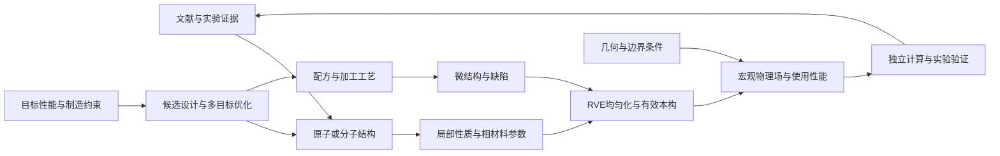

# MaterialsX M7 提案：多尺度、多保真 AI4Materials 与逆向材料设计

版本：0.1  
制定日期：2026-10-02  
状态：按用户 2026-10-02 最新指示暂缓；保留研究参考，尚未实施  
版权：© 2026 吉林大学 AI-DAOS 团队

当前优先级已调整为 [M6 势资源中心](M6_POTENTIAL_HUB_DEVELOPMENT_PLAN.md)：先完成势目录、下载挂载、AI 选势与真实分析闭环。本文的多尺度方法及首个材料建议不作为当前执行计划。

2026-10-02 选型补充：公开数据检索后的具体建议见 [首个材料选择](M7_FIRST_MATERIAL_SELECTION.md)：以 WWFE 玻璃/环氧作小型工程基准，以 DTU 单向碳纤维/乙烯基酯作首个真实材料实验对照候选；高分子分子反设计另用明确化学组成的树脂系列。本文原 CF/PEEK 示范候选不作为优先冻结材料，最终选型仍待 M7.0 数据与参数审计。

## 1. 目标与结论

可以为 MaterialsX 补上微观到宏观的桥梁，并进一步支持从目标性能反向寻找材料结构、配方和工艺。完整方法应是：

> 证据数据 → 原子/分子建模 → 工艺与微结构 → 均匀化和本构 → 宏观场预测 → 受约束逆向设计 → 高保真计算与实验反馈。

机器学习原子间势负责部分原子尺度计算，神经算子负责特定问题族的场预测。两者之间必须有经过验证的尺度转换模型；不能把原子能量、力直接当成零件强度，也不能只靠安装框架就获得通用材料逆向设计能力。

产品目标分开验收：

1. **不依赖商业有限元软件**：数据生成、训练和预测可全部采用自有代码与许可兼容的开源组件。
2. **预测阶段采用代理模型**：在明确的材料、几何、工况和误差范围内，用户任务可以只运行已经训练的模型。
3. **研究闭环**：返回可制造的候选集合、适用范围、证据和下一轮验证方案；具备实验反馈后，再评价发现价值。

第 1 项不等于“不使用有限元方法”；第 2 项不等于“任意材料和任意 CAD 都可以预测”。如果要求训练期也完全不使用 FEM，可针对适合的问题研究解析解、实验、FFT 均匀化、有限体积或其他数值方法；选择应由物理问题和精度决定。

## 2. 与现有 M5/M6 的关系

| 已有基础 | 本阶段复用方式 | 必须补齐的能力 |
| --- | --- | --- |
| RPSME 文献抽取与原文证据 | 提取组成、配方、工艺、结构和测试条件 | 同一试样跨尺度关联、质量分级、结构化工况 |
| Materials XYZ 本体 | 连接 X 配方工艺、Y 微结构缺陷、Z 力学性能 | 连续场、各向异性张量、载荷历史、本构参数与不确定性 |
| M6 原子结构、MLIP、优化、受限 MD | 使用受支持结构和审核过的原子任务产物 | 弹性/输运等专用计算合同及独立精度验证 |
| M6 模型注册、质量矩阵和产物哈希 | 建立连续体模型、尺度桥接模型的登记与验收 | 新的科学适用域及连续体数据合同 |
| 富媒体、原子 3D、项目任务 | 提供统一项目、任务卡片、证据入口 | 网格/体素场、截面、张量方向、误差场与尺度图 |
| Pi、本地/平台 LLM 与 M5 服务 | 编排受控工具、解释结果、审计任务 | 独立计算队列、算力额度与数据上传控制 |

当前 M6 科学执行域主要是无机三维周期晶体的探索性 CPU 任务，质量门槛仍有 `needs_review` 和生产限制。现有 MACE/CHGNet 核心不能据此宣布能够预测高分子链、复合材料界面或宏观强度。

`materials-xyz-extraction` 的 XYZ 指本体中的 X/Y/Z，不是原子坐标 `.xyz` 格式。本阶段增加映射层和版本化合同，保留原始本体及证据，不直接改写已有抽取数据。

M7 不解除 M6 的生产门槛，不改写 M6 历史验收证据；M5 的身份、支付和 LLM Token 计费可独立运行。昂贵科学计算与 LLM Token 必须分别计量。

## 3. 全链路与跨尺度对象



| 尺度/对象 | 主要输入 | 主要输出 | 对应方法与边界 |
| --- | --- | --- | --- |
| 电子/原子/分子 | 元素、晶体、分子图、链构型、电荷/自旋、温压 | 能量、力、相稳定性线索、弹性与输运的候选参数 | DFT、经验证 MLIP、分子力场；任务和材料域分别审核 |
| 相与界面 | 组分、晶相、链结构、界面、加载历史 | 相刚度、黏弹参数、界面行为、热参数 | 专用 MD/实验/参数识别；时间尺度和理论层级要对齐 |
| 微结构 | 晶粒、取向、相比例、纤维、孔隙、结晶度、缺陷 | RVE 场、有效刚度/导热张量、内部状态 | 数值均匀化、解析基线、物理约束代理模型 |
| 试样/零件 | 有效本构、空间材料分布、几何、载荷、温度 | 位移、应变、应力、温度及有定义的性能指标 | 开源参考求解器、FNO/DeepONet/几何算子等 |
| 使用与设计 | 工况、目标、成本、制造边界、可靠性要求 | 候选分子/配方/工艺、Pareto 前沿、验证任务 | 贝叶斯优化、进化优化、条件生成及主动学习 |

分子不是所有材料的自然设计变量。无机材料使用组成、晶格、占位、缺陷和相；高分子使用重复单元、序列、分子量分布和链构型；复合材料还要设计纤维、界面、铺层与加工过程。

## 4. 核心桥梁一：原子/分子到材料参数

### 4.1 无机晶体路线

从受支持的晶体体系开始，逐项增加小应变能量/应力计算、弹性张量拟合、必要的声子或输运专用工作流。拟合时记录晶胞、应变幅度、温度、压力、模型理论层级和参考数据。

晶体弹性张量不能直接作为多晶零件本构。还需引入晶粒取向分布、相组成、孔隙与代表性体积，处理晶体坐标到试样坐标的张量旋转。原子计算得到的缺陷能或扩散势垒也不能直接充当疲劳寿命标签。

### 4.2 高分子/复合材料路线

```text
重复单元/共聚序列/分子量分布
  → 多条链与统计构型、密度和结晶状态
  → 经验证的基体及界面模型
  → 松弛、刚度、热响应等参数及其温度/速率依赖
  → 纤维/基体/孔隙/界面的微结构模型
```

分子 SMILES 只是化学连接表示，不包含完整聚合物微结构。还需建模链长分布、立构、构象、交联/结晶状态、填料和界面，并以多个统计构型而非单条理想链代表样品。

高分子任务需要单独验证的模型或经典/专用力场。短时 MD 的应变率、冷却速率和松弛时间通常与实验不同，必须记录并校准；不能直接把短时轨迹输出的玻璃化温度、模量等当作任意实验条件下的真值。

### 4.3 参数识别与校准

先建立可解释基线，如线弹性、广义 Maxwell 黏弹性或适用的界面关系，再考虑神经本构。优化目标应同时包含已观测响应、单位与物理约束；不可识别的参数返回区间/相关性和需要补充的试验。

高层实验修正项应有独立记录。校准后的本构是新的版本化对象，不能覆盖原始 MLIP 或宣称原子模型因此通过了所有领域验收。

## 5. 核心桥梁二：加工到微结构

同一种分子/组分通过不同工艺可以产生显著不同的结晶度、取向、界面和孔隙，最终性能也会变化。因此必须建模：

\[
y = G_{\mathrm{process}}(m,p,\eta)
\]

其中 `m` 是组成/结构，`p` 是温度、压力、速率、时间等过程，`y` 是微结构，`η` 是未观测过程因素。

可采用测量数据回归、相场/结晶动力学参考模型、图像特征模型和多保真代理。初期有缺项时，允许直接输入实测微结构，并明确该阶段没有预测加工形成过程。

微结构不能仅存一个“平均孔隙率”：需要任务相关的形态、位置、尺寸、连通性、取向分布和统计代表性。显微图、CT、XRD、DSC 等观测应关联样品、制样方向和测量方法。

文献中不同论文的过程—结构—性能记录可形成候选关联，但不是天然的因果标签。工艺推荐需要受控试验、适当统计设计或明确因果假设支持。

## 6. 核心桥梁三：RVE 均匀化与有效本构

### 6.1 RVE 的角色

代表性体积单元（RVE）连接微结构与宏观材料点。相材料参数加上纤维/晶粒/孔隙/界面几何，经过多个独立加载，得到有效响应。

首版选择线弹性 RVE，输出六维对称表示下的有效刚度 `C_eff`；热传导作为独立物理任务，输出有效导热张量 `k_eff`。分别检验代表性尺寸、离散收敛、边界条件和各向异性。

周期、均匀位移或均匀牵引边界会影响有限 RVE 的响应，不能混为同一训练标签。在线弹性小应变且尺度分离成立时，以宏微观能量一致性（Hill–Mandel 条件）检查桥接：

\[
\langle\sigma:\delta\varepsilon\rangle
= \bar\sigma:\delta\bar\varepsilon,
\qquad \bar\sigma=C_{\mathrm{eff}}:\bar\varepsilon.
\]

简单体积分数平均可作受限解析基线或界限比较，不能普遍代替含缺陷、复杂界面和取向的均匀化。

### 6.2 本构模型对象

除弹性张量，后续本构需带状态、时间和路径，例如：

\[
(\sigma_{t+1},h_{t+1})
=H(\varepsilon_{0:t+1},T_{0:t+1},h_t;\theta).
\]

`h` 代表内部变量，`θ` 代表参数。黏弹、塑性、损伤和相变不能用无历史的应力回归统一替代。

小应变本构可研究自由能导数和耗散约束；大变形另需明确应力/应变度量、客观性及材料对称性。TANN 研究提供了热力学约束本构和多尺度均匀化的参考，但其研究结果不是本项目的验收证据。[TANN 本构研究](https://arxiv.org/abs/2005.12183)、[多尺度 TANN 研究](https://arxiv.org/abs/2108.13137)。

### 6.3 尺度分离失效

裂纹局部化、尺寸效应、强梯度、界面主导或只有少数晶粒的零件，可能不能用普通局部均匀化处理。应标记失效条件，研究显式微结构、非局部本构或分区耦合；不能让路由器在这些情形继续套用 `C_eff`。

## 7. 宏观预测：神经算子和参考求解器

宏观预测对象是带条件的场映射：

\[
(u(x,t),\sigma(x,t),T(x,t))
=\mathcal{S}(g,b,\ell,\theta(x),h_0).
\]

`g` 为几何，`b` 为边界条件，`ℓ` 为载荷/热源历史，`θ(x)` 为材料分布和本构。首版只对单一物理任务输出对应字段，不把所有多物理场一并承诺。

### 7.1 建议组件及实际角色

| 组件 | 在 MaterialsX 中的候选角色 | 能力边界/选择条件 |
| --- | --- | --- |
| PyTorch + NeuralOperator | 首个固定拓扑、规则网格 FNO/TFNO 代理 | 提供模型实现，需要自有任务数据、训练和验证 |
| DeepXDE | DeepONet、PINN 和多保真研究适配器 | 适合限定 PDE/边界问题；优化失败、刚性问题等需单独检查 |
| NVIDIA PhysicsNeMo | 后续 GPU 训练、图/网格代理和工程配方 | 按当前版本、任务和硬件审核；框架/示例不等于通用预训练材料模型 |
| GINO/其他几何算子、MeshGraphNet 类方法 | 不规则几何、网格和时变场的后续候选 | 新几何族、边界类型、拓扑变化分别验收 |
| FEniCSx + 必要的几何/网格工具 | 初期弹性/导热 RVE 与宏观参考数据 | 是开源有限元路线；固定环境并记录离散与收敛 |
| code_aster | 后续较完整的固体本构/工程基准候选 | 复杂性和部署成本更高，首期不同时接多套固体求解器 |
| OpenFOAM | 后续流动、加工、传热数据生成候选 | 主要采用有限体积法，不能归类为纯有限元库 |
| NOEM | 分区/超级单元、重复子域的混合加速研究 | 官方定义为 FEM 与可复用神经算子结合，保留装配/耦合 |
| Warp | 可微 GPU 数值内核和特定优化任务候选 | 是编程/仿真基础，不自动提供经验证的连续体材料模型 |
| Newton、Genesis | 特定动力学/接触/软体过程研究候选 | Newton 侧重机器人仿真；Genesis 含 MPM/FEM 等数值求解器，不是通用材料场代理 |
| MindScience | 国内运行平台和领域模型的后续评估候选 | 逐项核验当前子项目、后端、算子、许可与目标硬件；首期不增加第二套训练后端 |

上述组件均为候选；本文件没有安装它们或审核其全部模型。每个实际交付包都要固定版本、权重、许可证、哈希和运行证据。

官方能力参考：[NeuralOperator](https://github.com/neuraloperator/neuraloperator)、[DeepXDE](https://github.com/lululxvi/deepxde)、[PhysicsNeMo](https://github.com/NVIDIA/physicsnemo)、[FEniCSx](https://fenicsproject.org/download/)、[OpenFOAM 数值格式](https://doc.openfoam.com/2606/tools/processing/numerics/schemes/)、[NOEM](https://github.com/lu-group/noem)、[Warp](https://github.com/NVIDIA/warp)、[Newton](https://github.com/newton-physics/newton)、[Genesis 连续体求解器](https://genesis-world.readthedocs.io/en/latest/user_guide/theory/soft_solvers.html)。

### 7.2 对“完全替代”的限定

- NeuralOperator 支持函数空间映射和跨分辨率应用；这不自动保证新网格精度，也不保证新拓扑、材料和工况的外推。跨分辨率保留测试仍必需。
- 标准 FNO 通常采用规则网格；CAD 需要几何处理、区域/边界标记与场表示。GINO 研究采用 SDF、点云及图/傅里叶算子结合，可作为几何路线参考。[GINO 原始论文](https://arxiv.org/abs/2309.00583)。
- PINN 可以对明确的方程和条件采用物理残差训练，但仍需离散采样、数值优化和验证。小残差不能独立证明真实解正确；已有研究展示常规 PINN 在一些对流、反应、扩散问题中的训练失败。[PINN 失效研究](https://arxiv.org/abs/2109.01050)。
- NOEM 保留有限元与神经算子的组合，不作为“完全不使用 FEM”的实现。
- 可微物理支持梯度计算，不自动保证材料模型正确，也不等于现成机器学习预测器。
- ONNX/TensorRT 作为候选导出路径；FFT、复杂数、自定义图算子和动态形状需逐模型测试。首个可复现部署基线可保留原生 PyTorch。
- “毫秒级”只能在指定硬件、模型、场大小上测量。分别统计几何预处理、模型前向、后处理、传输与渲染，以及用户看到结果的总时间。

## 8. 从性能反向到结构的完整机器学习方法

### 8.1 正向模型

用版本化的组合模型表达多尺度关系：

\[
\theta=G_{\mathrm{phase}}(m,p),\quad
y=G_{\mathrm{process}}(m,p),\quad
\theta_{\mathrm{eff}}=G_{\mathrm{hom}}(\theta,y),\quad
z=G_{\mathrm{macro}}(\theta_{\mathrm{eff}},g,b,\ell).
\]

每一个 `G` 都可以是解析方法、参考求解器、实验识别、机器学习或组合；必须标注来源、适用域和不确定性。缺少桥接模型时输出缺口，不由 LLM 用文字补出数值。

### 8.2 逆向问题

设计变量 `d=(m,p,y_design,g_design)`，只开放确实可控制的部分。给定使用条件下的目标 `z*`，求解：

\[
\min_{d\in\mathcal D}
\bigl[L(z(d),z^*),\;\mathrm{cost}(d),\;\mathrm{risk}(d)\bigr]
\quad\text{subject to}\quad c_j(d)\le0.
\]

约束包括化学有效性、组成、制造温度窗口、原料可得性、几何边界、数据适用域和资源上限。需要时采用目标达成概率或保守分位数；不将未经校准的方差直接当作概率保证。

从性能到分子结构通常是一对多且不适定。平台应返回一组不同方案，说明哪些变量可识别、哪些依赖假设，并保留 Pareto 权衡；不能承诺由一条拉伸曲线唯一恢复分子结构。

### 8.3 选用优化方法

| 问题条件 | 优先方法 | 使用要求 |
| --- | --- | --- |
| 少量实验、变量数有限、单次评价昂贵 | 高斯过程/其他代理 + 受约束贝叶斯优化 | 先定义搜索空间、重复测量噪声和批次约束 |
| 离散配方、铺层、序列、多目标 | NSGA-II/其他进化方法 | 候选逐项进行物理和制造检查 |
| 可微且经验证的连续链路 | 梯度优化/伴随或自动微分 | 检查梯度、非光滑状态和可控设计变量 |
| 数据充分、需要新分子/新微结构 | 条件生成/GNN/扩散等 | 生成仅是候选入口，必须经过独立正向复核 |

首期从有限候选库和可制造配方优化开始，再扩展分子生成。化学价态检查通过不等于可合成；合成路线、原料、加工稳定性和实验可行性需另行验证。

### 8.4 闭环复核

1. 用户定义目标、测试条件、允许变化的材料/工艺变量。
2. 校验数据适用域，识别缺少的本构、结构或证据。
3. 生成/搜索候选，计算跨尺度正向预测和联合不确定性。
4. 排除不满足硬约束的候选，返回多样化 Pareto 集合。
5. 为候选选择更高保真计算或下一轮实验，含能区分竞争解释的测量。
6. 记录真实结果和失败样本，更新数据与模型；用保留数据评价更新收益。

优化器会寻找代理模型漏洞。最终候选必须用未参与该次优化评价的参考计算或独立实验复核，不能只重新运行同一代理模型作“验收”。

## 9. 两条研究路线与首个示范

### 9.1 无机路线：先接已有 M6

```text
受支持无机晶体 → 独立校验的弹性参数
  → 相/晶粒取向/孔隙 RVE → 有效弹性张量
  → 固定几何试样的位移与应力场
  → 组成/缺陷/取向/孔隙的受约束候选设计
```

先选有足够参考数据的一类材料，优先验证弹性和稳定性。新缺陷/组成不能仅因元素被支持就视为适用；声子、热输运、裂纹和塑性分别立项。

### 9.2 高分子/复合材料路线：独立模型与数据包

暂以 CF/PEEK 或类似热塑性复合材料作示范候选，具体材料由现有数据和团队选择确定：

```text
基体结构/界面与实测参数
  + 温度、压力、冷却速率、铺层等加工条件
  → 结晶度、纤维取向、孔隙和界面状态
  → RVE/层合材料有效本构
  → 指定载荷与温度下的刚度/变形/温度场
  → 建议的基体候选、配方、界面和工艺窗口
```

最早闭环允许使用实验测得的基体/纤维参数和微结构，先跑通后半段。之后分别用经过验证的分子模型、过程模型替换这些入口；明确每次替换后的误差增量。

首期目标可选纵横向刚度、指定载荷位移、密度和受限导热指标。固定几何与铺层族，限制温度和小应变工况。强度、疲劳、分层、冲击和寿命需要专用损伤机制及标定数据，不能从线弹性应力云图直接给出可信结论。

### 9.3 第一个技术验证任务

选择二维平面应变线弹性 RVE 与同一几何族的宏观试样，比较解析基线、FEniCSx 参考解、简单代理和 FNO/DeepONet。明确二维假设，不能据此宣布三维复合材料已经验证。

先验收参数与场预测，再研究分子层。第一次逆向闭环可以优化相比例、取向和孔隙约束，输出需要实际制备验证的候选；分子反设计是后续独立里程碑。

## 10. 数据、单位与证据合同

以下为拟新增对象，实施时进入 `packages/contracts` 和版本化 schemas：

| 对象 | 最低必需字段 |
| --- | --- |
| `DesignTarget` | 指标/单位、几何、温度、载荷/速率/历史、目标方向/范围、制造约束 |
| `MaterialEntity` | 组成/分子/晶体表示、相/批次、结构来源、电荷/自旋（适用时）、设计变量 |
| `ProcessRecord` | 温度/压力/时间历史、加工路径、设备/批次、实际可控变量 |
| `MicrostructureRecord` | 测量/生成方法、尺寸、坐标、取向、体积分数、缺陷统计、原始资产 |
| `ConstitutiveCard` | 定律/参数、应力应变度量、适用温度/速率/路径、坐标、校准与保留证据 |
| `RVECase` | 相与界面、本构、几何、边界类型、离散、尺寸收敛、加载及响应 |
| `ContinuumCase` | PDE/本构版本、几何哈希、网格/点坐标、边界/载荷、状态与参考方法 |
| `FieldArtifact` | 物理量、单位、点/单元位置、分量/坐标、场数组、时间、有效区域和缺测 |
| `ModelCard` | 框架/权重/数据版本、任务域、表示、硬件、验证指标、许可证、哈希 |
| `BridgeRecord` | 输入/输出对象、尺度转换方法、假设、校准、误差传播和科学状态 |
| `CandidateSet` | 候选结构/配方/工艺、目标预测、约束检查、排名依据、复核计划 |

所有对象关联 `projectId`、`sampleId/batchId`、来源证据、运行 ID 和内容哈希。合成数据、真实测量、文献转录、模型预测分别标记；禁止将某论文的结构与另一论文的性能拼成同一试样真值。

内部连续体计算采用明确的 SI 单位，界面可显示 GPa、MPa、μm 等。原子尺度 eV/Å 与连续体 Pa/m 的转换记录规则和来源。张量必须说明 Voigt/Mandel、工程剪切约定、分量顺序和坐标变换；热传导系数与热扩散率不能混同。

缺测值保持 `null` 并附原因。推测值有推测标记，不能伪造零值；物性比较必须对齐温度、应变率、方向、测试方法和样品状态。

## 11. 科学验证与不确定性

### 11.1 验证分层

1. **软件正确性**：合同、单位、坐标、张量旋转、数值读写、取消/恢复和哈希。
2. **数值正确性**：解析基准、网格/RVE 尺寸收敛、平衡、边界、能量和响应稳定性。
3. **代理泛化**：材料/工艺/几何族保留集、跨分辨率、加载历史与 OOD 拒绝。
4. **实验一致性**：未参与拟合的样品批次与独立测量，含实验噪声和偏差分析。
5. **逆向有效性**：候选实际目标达成、成本与可制造性，以及相对简单基线的收益。

数据按论文、样品批次、几何族或母结构分组拆分。同一算例的不同网格、同一次试验的相邻点和同一 MD 轨迹切片不能随机泄漏到训练/测试两侧。校准集、优化反馈集和最终保留集分别记录。

### 11.2 指标与准入

| 层 | 指标/检查 | 不充分的替代证据 |
| --- | --- | --- |
| 弹性/本构 | 参数误差、对称性、稳定性、路径响应；耗散约束适用时检查 | 单个相关系数高 |
| RVE | 边界与能量一致性、代表性尺寸、有效张量、局部场误差 | 仅对比平均模量 |
| 宏观场 | 位移/温度/应力的规范化场误差、关键区域、响应量、平衡和边界 | 仅展示彩色云图 |
| 泛化 | 未见样品/几何/工况误差、OOD 召回与误拒、跨分辨率 | 同一几何上的随机点测试 |
| 不确定性 | 独立数据覆盖率、区间宽度、校准误差 | 模型集成分歧直接等同准确性 |
| 逆向设计 | 复核后的目标达成、多样性、制造检查、对基线改善 | 代理自身评分提高 |
| 性能与体积 | 指定硬件下冷/热启动、端到端 p50/p95、内存、磁盘和缓存 | 只报告 GPU 前向速度 |

尖角或点载荷的理想化应力奇异性，可能使峰值随网格变化。需定义物理化载荷、区域平均或其他有工程意义的指标，不能把不收敛的最大应力直接用作优化目标。

M7.0 为所选问题登记具体误差阈值、参考方法、测试集和失败处理，再进入验收。阈值由目标用途、参考误差与试验噪声决定，不对所有材料统一承诺“误差小于 1%”。

### 11.3 跨尺度误差传播

同时追踪测量噪声、模型不确定性、参数识别不确定性、离散误差与尺度假设偏差。优先采用联合采样/集合传播，保留参数和模型误差间的相关性；不能把每一层独立置信度相乘当作总可靠性。

对超过适用域的任务返回 `out_of_domain` 或缺少证据，不静默外推。区间无法校准时直接标记未校准，不包装成可靠置信区间。

拟定科学状态：`exploratory`、`numerically_verified`、`experimentally_validated`，每种状态必须限定材料、任务、工况和数据版本。工程任务 `completed` 不自动提升科学状态；上游未验收的桥接参数不能使整个全链路成为实验验证结果。

## 12. MaterialsX 产品集成

### 12.1 运行架构

复用桌面项目、Pi 编排与 M6 任务模式，新增独立 multiscale/continuum 工作器。原子环境、连续体参考求解器和训练环境分开锁定，避免全部框架堆入当前 Python 环境。

拟新增目录（本轮不创建运行代码）：

```text
packages/contracts/src/multiscale-*.ts  # 数据、任务和科学状态
packages/multiscale/                  # DAG、校验、产物和调度
multiscale/                          # Python 参考求解/训练/推理工作器
models/continuum/                     # 注册卡片；权重由包管理器管理
schemas/multiscale/                   # 导入导出合同
docs/m7/                             # 实施与验收证据
```

任务 DAG 中每个节点有不可变输入、模型/环境版本、状态、日志和产物。支持断点恢复、内容寻址缓存、依赖失效、资源预检、超时和停止。失败节点不能用文字声明代替真实输出；缺少必要参数时说明阻塞原因。

LLM 负责理解需求、提出流程、解释选择和结果。确定性代码负责模型准入、单位、任务域、预算、文件权限和产物校验；LLM 不自行修改科学门槛或把目录收录视为可运行。

### 12.2 建议任务 Skills

| 拟定 Skill | 中文名称 | 中文使用例子 | English example |
| --- | --- | --- | --- |
| `materials-multiscale-plan` | 多尺度研究规划 | 为这个热塑性复合材料列出分子到试样刚度的可执行链路及缺少数据。 | Plan an evidence-linked multiscale workflow for this composite and identify missing data. |
| `materials-constitutive-identification` | 本构参数识别 | 从这组多温度测试拟合受限黏弹参数，报告不可识别项。 | Fit a scoped viscoelastic model and report parameter identifiability. |
| `materials-rve-homogenization` | 微结构与均匀化 | 在周期边界下计算这个微结构的有效刚度，检查尺寸与离散收敛。 | Homogenize this RVE and check size and discretization convergence. |
| `materials-continuum-prediction` | 宏观场预测 | 在模型支持的几何与载荷范围内预测位移场，显示适用域和误差。 | Predict the displacement field within the validated domain and show uncertainty. |
| `materials-inverse-design` | 受约束逆向设计 | 以刚度与密度为目标，给出可制造配方的 Pareto 候选及复核任务。 | Propose manufacturable Pareto candidates for stiffness and density with verification jobs. |
| `materials-active-learning` | 主动学习与实验闭环 | 从候选中挑选下一批最有信息价值的实验，限制数量并说明原因。 | Select an informative experimental batch under a fixed resource limit. |

双语说明、示例、`@` 选择沿用现有 Skills 体验。每项 Skill 的就绪状态与数据/模型/工作器的可用状态分开；只有真实样例通过验收才默认启用可执行流程。

### 12.3 富媒体与复杂 3D

可以支持，但连续体场查看器不能仅复用原子球棍视图。新增类型化场卡片和受控渲染组件：

- 微结构：体素、晶粒/纤维方向、孔隙分割、相标记。
- 宏观结果：三角/四面体/其他受支持网格、切片、截面、位移变形、矢量与张量方向。
- 对比：参考场、预测场、误差场、校准过的不确定性场，统一色标/单位/坐标。
- 时间：真实时序场播放；变形放大倍数明显显示。
- 证据：从某一场/参数回到 RVE、本构、原子任务、实验和论文证据。

首版仅实现所选任务的必要网格与字段；大场采用降采样预览/按需读取，并保留原始数据。图像插值只改变显示，不补出新的物理解。VTK.js 等作为候选，需要性能、支持格式和许可证验证；不执行模型输出的任意 HTML/JavaScript。

## 13. 分阶段开发与验收

阶段顺序为建议；前一层数据和质量不足时，后一层可用实测参数单独验证，但不能称为完整微观到宏观闭环。

| 阶段 | 交付 | 核心验收门槛 |
| --- | --- | --- |
| M7.0 科学合同与示范冻结 | 定义两条路线；选定首个问题；单位/坐标/目标/模型卡；数据盘点；资源预检 | 明确可控变量、参考解、独立测试、误差阈值、数据权利及不支持任务；无数据即显式缺口 |
| M7.1 相参数与本构桥接 | 实测参数导入；小应变弹性识别；原子弹性计算合同与独立校验；版本化本构卡 | 解析/参考/实验比较；单位与张量检查；拒绝将未验收参数提升为可靠全链结果 |
| M7.2 微结构/RVE 与参考数据 | 固定类型微结构导入/生成；FEniCSx 小规模 RVE；加载、均匀化和训练数据集 | RVE 尺寸/网格收敛；边界与能量；独立几何/样本划分；每例可复现 |
| M7.3 宏观代理基线 | 固定几何族小应变弹性；简单回归/POD 基线；FNO 或 DeepONet 训练与推理 | 独立保留场误差、OOD、跨分辨率；与较简单方法比较精度/算力收益 |
| M7.4 场可视化与多尺度报告 | 3D/2D 场、截面、误差、单位/色标、证据 DAG；范围受限的实验校准 | 真实字段和数值抽查；原始数据导出；校准/保留实验分离；本机性能基准 |
| M7.5 逆向设计 | 有限候选库/配方优化；约束、Pareto、联合误差；高保真复核 | 人工设定目标与可制造变量；优化候选用独立参考复核；包含失败与不确定项 |
| M7.6 主动学习与分子扩展 | 新批次实验反馈、选样、模型版本比较；经单独验证的分子生成/过程模型 | 独立实验目标达成；新模型对保留集不退化；分子候选化学与合成/加工可行性评审 |

高分子专用模型/力场和工艺—结构模型以独立包逐步推进，不能因为 M7.3 宏观代理完成就标记它们已完成。损伤、疲劳、冲击、多物理场和任意 CAD 的扩展需各自的新任务合同与实验数据。

每阶段交付包括代码/合同、锁定环境、真实示例、双语 Skill、产物与验收报告。研发工期在 M7.0 数据和硬件预检后估计；不得把训练和实验等待时间按普通界面功能推算。

## 14. 部署、磁盘与计算资源

默认内置的是目录、方法说明、合同和已验收的小型示例，不默认下载所有 SciML 框架及训练数据。

| 包层 | 分发策略 | 体积/成本决定因素 |
| --- | --- | --- |
| 基础应用与 M6 | 保留当前包管理方式 | 原子环境与已有权重 |
| 连续体预测包 | 按任务选择；固定 CPU/GPU 环境 | PyTorch/运行库、所选权重、示例场 |
| 参考求解包 | 独立可选环境或远端工作器 | 网格工具、求解器、线性代数库与平台支持 |
| 训练包 | 研发工作站/HPC 优先；不进入普通安装包 | GPU 运行库、优化器、数据管线、检查点 |
| 研究数据 | 项目管理，配置空间上限和清理规则 | 网格、场分量、时间步、样本数量、缓存和多个保留版本 |

不能由“模型数量”准确推算系统大小。举例：一个 `128³` 场、9 个 float32 分量约占 72 MiB；1,000 个此类样本仅场数组就约 70.3 GiB，尚不包括网格、时间步、标签副本和检查点。实际数据需先测量压缩率与访问效率。

本机 CPU 用于小规模基准、预览与受限推理；训练/大 RVE 或长时间任务优先独立工作站/HPC。macOS CPU、Apple GPU 与 NVIDIA CUDA 能力分别验收，不以 CUDA 示例推断本机性能。

开源代码、权重、数据和运行库分别审核许可。平台提供云计算时，在 M5 身份/审计基础上增加独立任务预估、资源上限、计量和取消结算；LLM 积分消耗不代表科学计算费用已被覆盖。上传结构、配方和实验数据前明确目的地和范围。

## 15. 研究产出与成功标准

有价值的首个成果不是“接入了多少模型”，而是一套可以复现的限定领域闭环：

1. 一个有真实试样关联的过程—微结构—性能数据集，保留原文和实验依据。
2. 一条通过独立参考验证的尺度桥接关系，明确时间/尺寸和本构假设。
3. 一个在独立材料或几何/工况保留集上有报告的宏观代理模型。
4. 一组经高保真或实际实验复核的逆向设计候选，证明相对基线的收益。
5. 一个可下载研究包：输入、版本、脚本、模型、场、误差、证据、失败记录和复核说明。

可针对消融研究比较：仅宏观数据模型、加入本构/均匀化模型、加入原子参数与实验校准后的模型；用相同保留集衡量数据效率、外推失败和候选达成率。只有原子层提供可量化改善时，才把它保留为必要计算环节。

## 16. 开发前需补充的信息

以下不影响本规划落地，但影响具体实施选择：

- 首个材料子类、目标物理量和测试工况；无机路线与复合材料路线的优先顺序。
- 已有同批次的分子/组成、工艺、显微/CT 和力学/热学数据及其使用权。
- 首个几何族与输入格式：参数化试样、已有网格或 CAD；是否需要改变拓扑。
- 可用本机/工作站/HPC、GPU 型号、计算与实验资源上限。
- 哪些设计变量能真实制备，以及独立验证试验和参考数据的责任人。

建议先启动 M7.0 的数据盘点与限定示范定义，再实施 M7.1/M7.2；在宏观基线、实验和尺度桥接成立后，逐步开放性能到分子结构的逆向探索。

## 17. 参考来源与解释边界

查阅日期：2026-10-02。框架能力以链接来源为依据；开发阶段、合同、路线和选型是针对 MaterialsX 的建议，不是上游项目已经实现的功能。

- [NeuralOperator 官方库](https://github.com/neuraloperator/neuraloperator)：FNO 与神经算子实现。
- [DeepXDE 官方库](https://github.com/lululxvi/deepxde)：PINN、DeepONet、多保真等算法。
- [NVIDIA PhysicsNeMo 官方库](https://github.com/NVIDIA/physicsnemo)：物理机器学习组件与训练配方。
- [NOEM 官方实现](https://github.com/lu-group/noem)：FEM 与可复用神经算子结合。
- [GINO 原始研究](https://arxiv.org/abs/2309.00583)：几何表示与图/傅里叶算子。
- [TANN 原始研究](https://arxiv.org/abs/2005.12183)、[多尺度 TANN](https://arxiv.org/abs/2108.13137)：热力学本构及均匀化方法参考。
- [PINN 训练失效研究](https://arxiv.org/abs/2109.01050)：物理损失优化的局限。
- [FEniCSx 官方项目](https://fenicsproject.org/download/)、[OpenFOAM 数值文档](https://doc.openfoam.com/2606/tools/processing/numerics/schemes/)：开源数值参考路线。
- [Warp](https://github.com/NVIDIA/warp)、[Newton](https://github.com/newton-physics/newton)、[Genesis 文档](https://genesis-world.readthedocs.io/en/latest/user_guide/theory/soft_solvers.html)：可微与多类数值仿真组件。

本文件不含生产部署、模型下载或训练执行授权；后续用户指定阶段时，再按对应合同与验收门槛实施。
