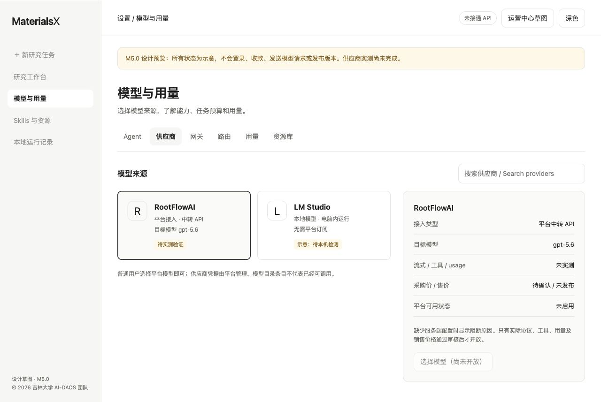

# M5.0 执行与验收报告

日期：2026-10-01（Asia/Shanghai）。对应 MX-501。状态：代码、离线交付及 gpt-5.6-sol 核心 Responses/Pi 实测通过，采购和生产验收待完成；未开放生产云模型。

© 2026 吉林大学 AI-DAOS 团队

## 实际交付

- Go 接入探针：可信域名/Base URL、固定 `gpt-5.6`、模型列表、非流式、SSE、只读工具分片和结果回传、结构化输出阶段及本地 abort 观察；不重试、不静默换协议/模型。
- 服务端用量归一化与整数采购上界估算：未知与零分开，缓存/推理不重叠相加，异常数量拒绝，big.Int 防溢出；尚未接入生产账本。
- 30元整轮测试授权、显式配置、最多6次/轮及256输出 Token/次；固定本机预算文件累计预留、独占锁、重启不重置。本机估计不保证上游忽略限制时不会多收费。
- 固定 Pi 0.99.1 真实 ModelRuntime 的离线 Responses 合成流验证，注入 fetch 拒绝其他 URL，内存凭据与模型存储，禁用模型网络刷新，未升级依赖。
- 核心 Zod/OpenAPI 合同、幂等/身份/网关说明、计费与预算规范，生成合同漂移纳入 CI。
- 六项桌面导航和运营中心可交互 HTML 草图，标记未接通 API、未知金额和能力；未把草图接入正式应用。

## 验收证据

| 验证 | 结果 | 证据/范围 |
| --- | --- | --- |
| `npm run check` | 通过 | core TypeScript 与桌面 Vue 类型检查 |
| `npm run test` | 58/58 通过 | 新增合同边界/Pi 分片，保留本地/受管 RPSME 回归 |
| `go -C services/control-plane test ./...` | 20个命名测试通过 | 14个新探针/预算用例，及原开发账本/HTTP回归 |
| `go -C services/control-plane test -race ./...` | 通过 | 当前 macOS arm64；不冒充 Windows 实机验证 |
| `npm run m5:contracts:check` | 通过 | OpenAPI 与可执行核心 schema 一致 |
| `npm run m5:pi` | 通过，合成环境 | [Pi 证据](evidence/pi-responses-fixture.json)：2次合成请求，工具/文本各2次 delta，工具结果回传 |
| `npm run m5:probe` | 返回 blocked，无网络 | [预检证据](evidence/rootflowai-probe.json)：预算3000分，缺凭据与采购价，生成0次 |
| `npm run build` | 通过 | 桌面主进程/renderer；已有 chunk 超500kB提示仍存在 |
| 浏览器交互 | 通过，草图 | 搜索过滤、供应商详情、运营模块、主题；1280px桌面无横向溢出，窄屏纵向布局 |
| 文档与合同引用 | 通过 | 本地 Markdown 链接、14项核心路径的 OpenAPI引用、证据环境标记 |
| `python3 scripts/check-public-secrets.py` | 通过 | 2674份候选/暂存文本快照；不覆盖Git历史与任意凭据格式，新增截图已目视确认仅含设计数据 |

上述离线阶段没有产生供应商生成费用，没有用户论文/对话/结构数据上传，没有收退款、GitHub发布或重新打包安装文件。CI定义已增加 Go、合同、Pi离线验证；本轮未运行远端CI。

首次接入前的草图截图（当前 HTML 已更新为明确改选的型号及核心实测状态）：

## 首次离线阶段记录（历史）

1. 首次离线执行时，测试进程没有 `ROOTFLOWAI_API_KEY`。此前聊天提供的密钥没有保存到文件、命令参数、renderer或其他软件凭据存储。
2. 该账户的 `gpt-5.6` 模型分组、会员档、有效输入/输出单价、计费方式及消费日志尚未确认。公开推荐行不能替代账户报价。
3. 模型可见性、真实生成、流式、工具、raw usage、上游取消、上下文限制、模型来源与供应商商业/数据条款仍未实测。

已确认测试总预算最多30元；没有将缺失密钥或报价解释为供应商故障，也没有把合成SDK结果解释为真实模型验证成功。核心协议状态保留 `pending_real_verification`。

配置与命令见 [M5.0说明](README.md)。先安全注入测试进程Key，只读查询模型列表，再核对账户价格并在累计预算内实测；无需将Key再次写到文档或公开Issue。

## 首次阶段继续条件（历史，当前结果见追加验证）

M5.0 已交付可运行工具、离线测试、核心合同、草图与规范，并记录实际阻断；真实供应商验收未完成。依 M5 总计划，可以继续 MX-502 的身份、PostgreSQL和管理授权，不依赖供应商生成；实际云模型保持未启用。

要关闭供应商验收，必须有真实环境的精确模型发现、非流式/流式、只读工具与结果回传、可靠raw usage及消费核对，并更新 [协议决策](protocol-decision.md)。生产定价、网关链、身份、账本、支付、科研质量和M4发行门槛仍按各后续工作包验收。

## 2026-10-01 真实接入追加验证

用户再次提供 Key 并明确“不需要考虑预算”，授权覆盖旧30元诊断上限。凭据仅在测试进程内存及私有 stdin 管道使用，没有写入仓库或安装包。新增 CLI `--unbudgeted-test` / `--key-stdin`：仅显式 live 模式免金额及采购价预检，仍保留请求数、输出限制、精确型号和 usage 校验，价格不伪造为零。生产资金规则不变。

| 实际请求 | 结果 | 证据 |
| --- | --- | --- |
| GET `/v1/models` | HTTP 200，10个可见模型，无精确 `gpt-5.6` | [独立诊断](evidence/rootflowai-live-exact-model.json) |
| POST `/v1/responses`，精确 `gpt-5.6` | HTTP 503，`model_not_found`；当前令牌分组无可用通道；usage 缺失 | 同上；1次生成尝试，没有成功生成 |
| M5.0 Go 探针，免金额上限、私有 stdin | 再次 GET 返回200，目标不可见，阻断后续生成 | [真实探针](evidence/rootflowai-live-probe.json) |
| 流式 / 工具 / 结构化输出 / live Pi | 未执行，无可用目标通道 | 不把离线通过改写为真实通过 |
| 新增回归与 race | 22个命名 Go 测试通过 | 新增免金额诊断仍须 usage/精确型号、未知价格不标已验证；原20项保留 |
| 核心合同漂移 | 通过 | `npm run m5:contracts:check` |
| 公开文件凭据扫描与差异格式 | 通过 | 2676份文本快照无检出；`git diff --check` 通过 |

合计3个真实 HTTP 请求、1次生成尝试。未上传论文或研究文件。未取得有效 usage，实际供应商扣费未知，不能将失败解释为免费。供应商返回的可见相近型号包括 `gpt-5.6-sol`、`gpt-5.6-terra`、`gpt-5.6-luna`；只有用户明确改选后才修改目标，不自动 fallback。

当前阻断原因已经从“缺测试进程凭据/预算条件”更新为“精确目标型号在当前分组不可用”。下一步：用户改选可见的完整型号，或调整令牌分组后复测；供应商费用日志、采购价、商业数据条款仍需后续核对。此记录不开放生产收费、不更改本地模型模式。

## gpt-5.6-sol 明确改选后的真实验证

2026-10-01 用户明确授权改用 `gpt-5.6-sol`，保留本轮免金额上限授权。Go 固定目标、环境模型校验及当前开发计划随之更新；旧 `gpt-5.6` 失败报告不覆盖。

| 验证 | 结果 | 证据 |
| --- | --- | --- |
| 模型发现 | HTTP 200，精确型号可见 | [Go 真实探针](evidence/rootflowai-live-sol-responses.json) |
| 非流式 / 流式文本 | HTTP 200，completed，流式13事件 | 同上 |
| 只读工具 / 结果回传 | HTTP 200，11/20事件，返回原子序数14 | 同上 |
| JSON Schema 单字段输出 | HTTP 200，symbol=Si 校验通过 | 同上 |
| Pi 0.99.1 ModelRuntime | 两次 HTTP 200，5个工具 delta、1个文本 delta，工具结果回传通过 | [Pi 真实证据](evidence/pi-responses-live-sol.json) |
| 本地 abort | 50ms 取消，未取得 usage | 上游是否完成/收费未确认，不宣称上游取消通过 |

完整 Go 报告包含6次生成尝试，其中5次成功、1次本地取消；Pi 最终报告包含2次成功请求。这是最终通过报告的范围，不是整次联调全部消费的汇总；调试过程另有成功生成/工具请求及本地守卫在发送前拒绝的请求，尚未逐笔与供应商日志对账。采购费用未知，不标免费。没有上传用户论文或研究结构。

修正两项诊断问题：供应商约4.4K raw input 高于短提示的字节估计，仅授权免金额诊断记录 warning 后继续，有价预算模式仍停止；Pi 的8192测试上下文与其4096安全余量导致第二轮输出收紧，改为32768诊断额度并在序列化后验证请求合同。32768不是供应商实测容量，256是此次输出上限而不是产品通用限制。

新增 Go 输入估算差异回归和 Pi 真实探针路径的离线回归；当前60项 Node、23项 Go、类型检查、合同生成/漂移及 race 通过。默认 `m5:verify` 不访问供应商。完整平台网关、Agent 自动科研、采购对账、身份及支付仍按后续工作包实施。
