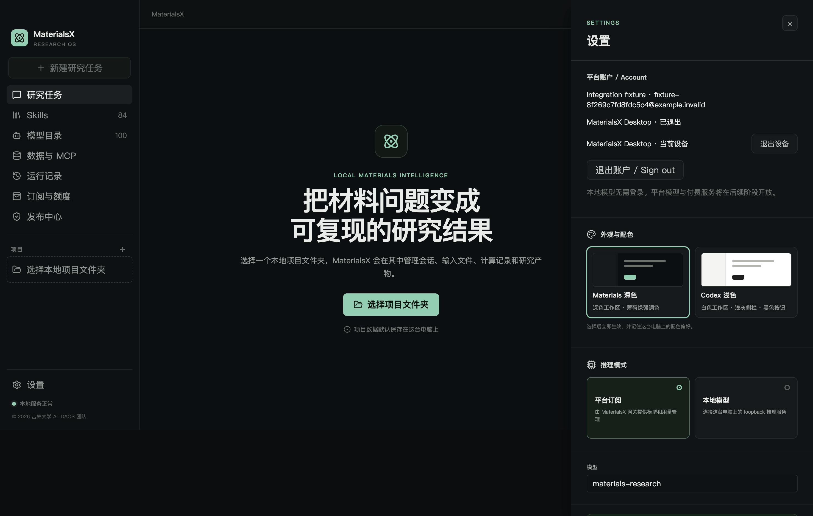

# M5.1 执行报告

日期：2026-10-01 · © 2026 吉林大学 AI-DAOS 团队

MX-502 的实现及本机验收完成。代码包含独立身份服务和显式部署工具；没有部署到公网、开放付费模型、创建真实用户或更新安装包。源码保留 M5.0 原始证据；本轮不使用 RootFlowAI Key、不发起付费生成请求。

## 交付

- `services/control-plane/cmd/identity`：独立 PG 身份 API；`cmd/identityctl`：迁移、检查、受邀开户、首位管理员初始化、最小角色授权、临时状态清理和恢复操作。
- `migrations/001_identity.sql`：账户、登录 flow、设备、会话、令牌摘要、共享限流、管理幂等结果、追加审计。迁移带校验和、事务与并发锁。
- 主进程 PKCE/state + loopback callback；浏览器密码授权页；账户及设备设置 UI；safeStorage 加密 refresh token、access token 仅内存；IPC 不返回令牌。
- 首版单管理员，强制 TOTP；普通用户不能调用管理 API。状态变更事务内重新授权，版本和幂等保护，停用即时撤销会话。
- 开发/生产配置隔离、生产 PG TLS/最小角色检查、显式可信代理规则。M3 JSON 原型拒绝生产环境、非 loopback 和隐式开发模式。
- 可执行合同更新为 `m5.1-v1`，OpenAPI 逐路径标记已实现身份/未来商业接口；Go 模块版本及原始许可通知已盘点。

## 验证结果

| 验证 | 结果 / 边界 |
| --- | --- |
| TypeScript/Vue 检查、桌面构建 | 通过；Vite 原有大包提示仍存在 |
| Node 离线回归 | 67 项通过，真实服务集成 1 项在离线命令明确 skip |
| Go 全量 PG/race 回归 | 35 个具名测试通过，PG 集成实际执行；不是 skip 计入通过 |
| 客户端真实身份链 | 临时 Go 服务 + PG16 +真实 HTML 表单/cookie/CSRF + PKCE 回调/兑换、重启刷新、设备退出通过；合成账户，无第三方身份服务 |
| Electron safeStorage | macOS arm64 / Electron 44.5.0 真正加密解密，密文不包含测试明文 |
| Electron 实际界面 | 构建后的主进程/preload/renderer，设置登录、账户设备展示、密文文件、退出通过；测试 harness 代填合成浏览器表单，无真实用户 |
| 越权与浏览器安全 | 错 verifier/state、单次 code、跨账户设备、伪造 owner、普通用户管理请求、错误 Host/Origin/CSRF、HTML 注入、开发接口隔离、可信代理与分页通过 |
| 令牌/MFA | 过期 access、旋转 refresh、并发旧令牌重放撤销、设备退出、管理员绝对过期、验证码重放、单管理员、部署恢复撤销通过 |
| PG 最小权限 | 实际受限 LOGIN 角色能运行登录/刷新，不能改账号角色、删除审计或建表；owner 不能通过生产运行角色检查 |
| 备份/恢复 | `pg_dump` → 新的临时数据库 `pg_restore` → 迁移及主体校验 → 恢复会话全部撤销；旧 access/refresh 均拒绝 |
| Windows/Linux Go 构建 | 交叉编译通过；不能替代目标系统运行或 Windows 凭据实机验收 |
| 合同、源码秘密扫描、差异检查 | 通过；截图人工核对只含合成信息，扫描不覆盖任意秘密格式/历史 |

PG16 验证使用新建的项目隔离实例 `runtime/m51/postgres`，loopback 55451；没有操作本机既有 5432 服务，也没有引入 Docker。测试创建/清理随机临时数据库；客户端联调留下专用测试库中的合成账户，所有测试服务在完成后停止，隔离 PG 实例亦在完成验收后停止。

截图来自一次性用户数据目录；测试完成后该目录和凭据均删除，没有真实邮箱、项目或研究会话。历史设备显示“已退出”，当前设备允许撤销。

## 修复的联调问题

真实 PG 用例捕获了时间表达式中 SQL 参数被推断为 interval 的错误，已显式指定 timestamptz。实际跨语言测试发现 Go 本机时间偏移与严格 UTC DTO 不一致，已统一输出 UTC。身份客户端通过队列串行刷新，避免并行使用同一 refresh 触发合法会话撤销。

## 仍需目标环境验收

1. 公网域名、反向代理、HTTPS 和 PostgreSQL verify-full TLS、秘密系统、真实 owner/runtime 部署角色及告警/备份策略。
2. Windows 安装后的 safeStorage、浏览器回调及重启/退出验证；当前 macOS 测试不推断 Windows 已通过。
3. 真实账户运营流程、邮件注册/验证与用户找回等扩展；当前由可信部署工具建立受邀账户。
4. 完整独立 Web 运营 UI。此次实现 OPS-01 服务基础，其他资金、供应商与发布页面按对应工作包继续。
5. 生产网关、usage/账本、支付/退款及双平台正式安装发行。旧开发账本和测试价格不迁移为生产交易。

复现步骤及私有配置见 [identity.md](identity.md)。结构化验收摘要见 [identity-local-validation.json](evidence/identity-local-validation.json)。
