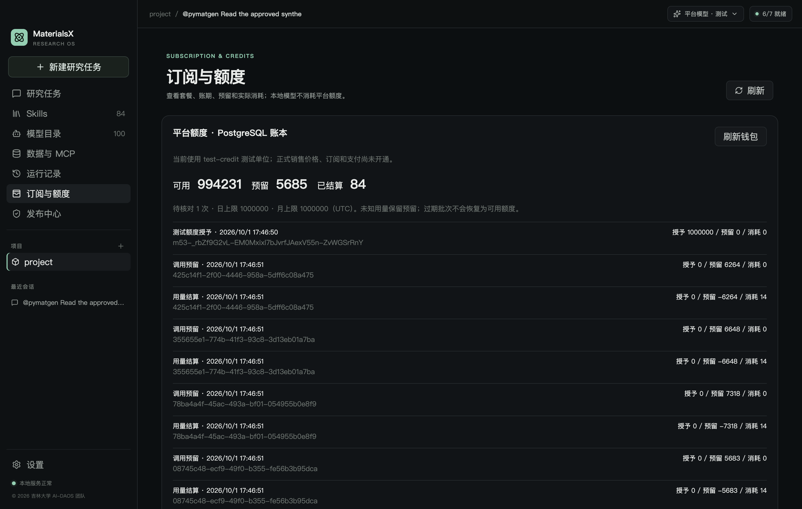

# M5.3：任务额度、事务账本与核对恢复

更新时间：2026-10-01。实现 MX-504 的本机技术 Alpha；当前单位为 **test-credit**，不代表人民币、充值或订阅购买。正式销售价格和 credits 换算尚未确定，实际采购费率与供应商隐含输入开销也未核定。因此代码拒绝 `testOnly=false` 的销售价格，正式收费保持关闭。M5.4 再接支付、权益与退款。

## 本轮交付

- PostgreSQL migration `003_metering.sql`：不可变销售/采购价格、额度批次、预留分配、追加账本、持久 outbox、人工证据和采购成本。
- 网关任务固化价格版本与 credits/请求数/输出/时间预算；每轮先预留再向供应商发请求。任务完成、费用状态、科学质量分别记录。
- 可靠 usage 结算实际 credits 并释放差额；usage 缺项、无终态或超出预留保留预留，不产生负余额。重复回执和重复核对不重复扣减。
- 独立 Go worker 恢复持久任务，不重发供应商请求；24 小时标记告警，72 小时转人工，不因超时退款。
- 桌面「订阅与额度」显示登录账户的真实 PostgreSQL 钱包、账本分页；设置可以填写每个任务的 test-credit 上限；答案下显示价格版本、预留、扣减和最近调用时间。M3 数据折叠为独立开发演示。
- 受管 `materials-literature-rpsme-json` 平台路径：本地冻结 PDF、预处理、逐页证据、有限修复、元数据与真实文件校验；模型调用共用一个任务；阶段分别为 extraction/repair/metadata。完整缓存命中不创建模型请求，不扣额度。
- `/ops` 独立用量与核对页面：管理员密码 + TOTP，短时 HttpOnly 会话、同源/CSRF 检查、队列、用量/采购未知计数、核对预览、账本重建校验。订单、支付、退款、版本发布等后台页面留对应工作包。

## 资金与预算规则

金额和 rates 用十进制整数字符串跨 JSON；服务端用 bigint 和大整数中间运算，按请求合并分子后只向上取整一次。输入总量包含缓存，推理量包含在输出里，均不重复相加。缓存费率不同且缓存 token 未知时不能结算；费率相同则不需要虚构缓存量。

销售与采购各自有版本：销售以 test-credit/百万 tokens 计；采购可用人民币分/百万 tokens，或经证据确认的供应商信用子单位及分数换算。人民币分费率只允许 1:1 换算。采购版本不向普通客户端公开；未知采购成本保持 null，不由销售价格反推。

账户行锁序列化额度事务。账户可用余额只取未到期批次的 `credits-consumed-held`；优先使用最早到期批次，同到期按创建时间和 ID。已预留批次过期后仍可结算或释放，释放后不会重新变成可用额度，也不会挪用新周期额度。

任务上限检查已结算 + 当前预留；账户 UTC 日/月上限按请求创建时间计算已结算 + 仍保留预留的请求。日/月上限不能跨余额约束超扣；到期预算、输出上限和请求次数仍由 M5.2 网关检查。额度不足、预算不足、价格不可用时整个 admission 事务回滚，供应商不会被调用。

当前预留估计为**序列化请求 UTF-8 字节数 + 测试 overhead**，输出取请求中的 `max_output_tokens`，阶梯费率取可能区间内最坏值，不预扣缓存优惠。这是测试估计，尚非已证明的供应商最大输入量。收到超出估计的 usage 时转人工并继续保留额度，不能直接扣成负数；生产收费前必须核定可保证的输入上界或替代预留策略。

账本不可 UPDATE/DELETE；价格版本也不可改。`verify-ledger` 以一致快照从账本重建授予/预留/消费，并与批次缓存及请求分配交叉核对；只读报告，不自动覆盖差异。运行角色不能改授予金额、有效期、账户额度上限或价格，也不能重写任务的固化价格/预算或请求预留金额，也不能删账本。迁移、测试授予和价格发布必须使用部署所有者连接。

## 部署与启动

先按 [M5.1 身份指南](identity.md) 配置 PostgreSQL 和身份主密钥，按 [M5.2 网关指南](gateway.md) 验证固定 RootFlowAI `gpt-5.6-sol` 路由。供应商 Key 仅在服务端私有环境；不能进入桌面、Git 或 CLI 参数。以下命令都在项目根目录执行。

```sh
npm run identity:ctl -- --command migrate
npm run identity:ctl -- --command grant-runtime --role mx_runtime
```

数据库升级前备份并验证可恢复。生产迁移不由服务启动自动执行；已应用 001/002 的 checksum 不变。003 只添加计费域和请求阶段，不导入 M3 JSON 存储的模拟余额。升级后重新授予受限 runtime 权限，再切换回该运行角色的数据库 URL。

用私有 stdin JSON 发布**测试**销售版本，例如：

```json
{
  "id": "test-sales-v1",
  "modelId": "materials-research",
  "routeVersionId": "rootflow-sol-responses-2026-10-01-v1",
  "testOnly": true,
  "unit": "test-credit",
  "tiers": [
    { "minInputTokens": 0, "inputPerMillion": "1000000", "cachedInputPerMillion": "1000000", "outputPerMillion": "1000000" }
  ],
  "inputOverheadTokens": 1000,
  "maxInputTokens": 100000,
  "inputPolicy": "utf8-byte-test-estimate-v1",
  "evidenceRef": "operator-synthetic-test-price"
}
```

```sh
npm run identity:ctl -- --command publish-sales-price < /PRIVATE_DIRECTORY/test-sales.json
```

该示例只是方便验收的虚拟价格，不是 RootFlowAI 费率或 MaterialsX 定价。重复发布相同版本/正文幂等，不同正文拒绝；要改价格必须创建新 ID。采购费率未确定时留空 `MATERIALSX_PROCUREMENT_PRICE_VERSION`；确认后用 `publish-purchase-price` 导入有效版本，采购证据必须注明账户分组、会员状态和换算。

先保留累计请求数授权 `grant-cloud`，再用 `grant-test-credits` 授予测试批次。输入结构：

```json
{
  "id": "trial-batch-1",
  "accountId": "ACCOUNT_ID",
  "eventId": "operator-trial-event-1",
  "source": "trial",
  "credits": "1000000",
  "expiresAt": "2026-10-30T00:00:00Z",
  "dailyLimit": "100000",
  "monthlyLimit": "1000000"
}
```

```sh
npm run identity:ctl -- --command grant-test-credits < /PRIVATE_DIRECTORY/test-grant.json
```

eventId 和正文完全相同的重放不会重复授予；改变金额或账户会拒绝。授予是一次性测试额度事件，不能用它冒充付款、续订或退款。

服务端私有环境设置：

```sh
export MATERIALSX_METERING_PRICE_VERSION=test-sales-v1
# 采购未知时此值为空，不能凭猜测填写费率
export MATERIALSX_PROCUREMENT_PRICE_VERSION=
```

`MATERIALSX_CLOUD_MODE=alpha` 继续控制技术测试访问，只有指定有效销售版本后才能创建 `billingMode=test-credits` 任务，此配置下不能用 alpha-test 绕过额度；未指定版本时兼容 M5.2 alpha-test 次数测试。

```sh
npm run identity:dev
# 第二个终端，使用同一身份配置及受限数据库角色
npm run billing:worker
```

worker 每 15 秒处理最多 100 条到期任务，单批有 10 秒执行边界；诊断可使用 `npm run billing:worker -- --once`。它仅读持久状态、恢复结算/待核对，不调用模型 API。服务和 worker 可分别重启；必须同时部署 worker，不能仅依靠用户再次打开桌面。

桌面通过 `MATERIALSX_IDENTITY_URL` 连接，登录后选择平台模型，在设置中填写任务额度上限（默认 10000 test-credit）。执行文献任务：

```text
@materials-literature-rpsme-json 提取 /ABSOLUTE_PATH/paper.pdf，输出带证据的 RPSME JSON、中文摘要和校验报告。
```

发送前原生对话框展示目标、问题、文件哈希、预算及逐页文本外发范围。PDF 最多 64MiB，只在本地冻结；外发的是分页文本与阶段提示，不上传原始 PDF/图像。Python 仅执行内置受管脚本，模型没有任意 bash 权限。文本审核、图表视觉核对和专家复核不能合并为模型调用成功。中断页和 run-state 保存在 `materials-output/`，同对话发送「继续」会再次确认范围、创建新任务并复用合格页；重启后也可重发完整命令。已完成的页不重复付出模型调用。

## 核对与人工处理

管理员打开身份服务同源的 `/ops`，密码 + TOTP 登录。浏览器只持有短期 HttpOnly access cookie，不持有 refresh token；注销撤销该会话设备。页面提供最近 100 条待核对请求；大量积压时需部署侧扩展筛选分页/告警通知，目前只持久标记告警时间，不发送邮件或短信。

任务执行状态为 unknown 时，仍可能已被供应商计费。没有可用的供应商账单查询接口，因此 worker 不能臆造 usage，不能凭 24/72 小时自动返还额度。管理员须归档私有证据，以安全编号 sourceRef 引用，不把 Key 或论文正文粘贴进原因字段。

处理顺序：读取队列中的 version → 输入证据 → 查看服务端预览的预留/实际扣减/释放差额与采购成本 → 确认提交。expectedVersion 防止两个管理员或窗口覆盖新状态；Idempotency-Key 固定为 requestId。

- `usage`：明确账单/供应商日志支持的规范 usage；按任务固化版本结算，持久保存 usage。不会把原 stream 的 `terminalReceived=false` 改成 true，也不会把 execution unknown 变 completed。
- `no-call`：有可信证据证明未调用或不产生用量才释放，采购记为明确的 0。
- `waiver`：平台承担这次不确定结果，用户扣减 0，采购仍未知；作为 waiver 账本与审计记录保留。

超过预留的 usage 不能通过导入制造负余额，预览/提交拒绝；当前可由平台承担，或保持待核对，不能臆造一个较小 token 数。采购成本后续账单导入、差额补偿、真实付款退款、定价审核发布等完整财务流程留 M5.4/运营工作包。

## API 与验收

已实现的 bearer API：

| API | 权限 / 用途 |
| --- | --- |
| GET `/v1/billing/wallet` | 当前登录账户余额、预留、已消耗及待核对计数 |
| GET `/v1/billing/ledger?cursor=...` | 当前账户追加记录，每页 100 条、稳定升序游标 |
| GET `/v1/admin/billing/overview` | 管理员 MFA；请求计数、已核定采购分及未知计数 |
| GET `/v1/admin/billing/pending` | 管理员 MFA；最多 100 条待核对 |
| POST `/v1/admin/billing/preview` | 管理员 MFA；只读核对金额预览 |
| POST `/v1/admin/billing/reconcile` | 管理员 MFA、预期版本及幂等 key；追加证据与审计 |
| GET `/v1/admin/billing/verify` | 管理员 MFA；只读账本重建校验 |

OpenAPI 与 Zod 位于 [合同](contracts.md)、[openapi.json](openapi.json)。`AlphaTask/AlphaRequest` 保留兼容名字，实际是 alpha-test 与 test-credits 的严格 union；付费 DTO 不代表当前支持付费。价格/usage 跨字段与资金约束由 Zod 和 Go 事务补充，JSON Schema 不能单独替代校验。

```sh
# 专用测试库，不能指向生产；tests 只创建/删除各自的临时数据库
npm run m5:identity:test
npm run m5:metering:live
npm run m5:metering:live -- --electron  # 有图形桌面的环境
npm run check
npm run test
npm run build
npm run m5:contracts:check
npm run identity:ctl -- --command verify-ledger
```

`m5:metering:live` 名字沿用本机 live 集成含义，使用合成供应商、真实 PostgreSQL/PKCE/Pi/Python；它不调用 RootFlowAI，也不上传用户论文。生成 PDF 是脚本自建样品，无第三方数据版权问题。

## 本机验收结果

- 100 个并发账本预留竞争 60 个单位额度，恰有 60 个成功，余额和预留总额一致；这是资金并发测试，正常网关仍限制同账户一条活跃请求。
- 重复授予、结算、核对不重复消费；价格版本不可变；已创建任务不会随配置改价；采购和销售数值独立。
- 日/月/任务上限、过期批次、缺失缓存量、阶梯价格、单次取整、大整数溢出、真实 usage 超预留、未分发释放、73 小时人工转交、账本不可修改与重建检查通过。
- 真实 PG + PKCE + Pi 两轮只读工具流通过；合成 PDF 一页抽取 + 元数据两次请求共用父任务，输出实际 JSON/摘要/报告；再跑缓存调用 0 次。
- 实际 Electron main/preload/Vue：拒绝外发不调用、选择文件/Skill、流式/结算/钱包显示和本地停止通过；停止约 20ms。科学状态保留 needs_review/not_evaluated。
- 本轮没有生产部署、没有重新发布安装包；实际 RootFlowAI 费率/输入边界、供应商取消与商业数据条款、生产 TLS 和 Windows UI 仍未验收。之前的真实 `gpt-5.6-sol` 协议测试证据仍见 [M5.2](gateway.md)。



机器可读记录：[集成验收](metering-validation.json)、[桌面验收](metering-desktop-validation.json)。

最终回归：TypeScript/Vue 类型检查、79项 Node 测试（78通过、1项真实身份环境专项另行集成）、Go 全套真实PG race、go vet、Windows/Linux worker交叉编译、合同漂移、桌面构建及公开候选凭据扫描通过。受限runtime角色实际预留/结算/核对通过；worker独立进程单批恢复也已执行。
