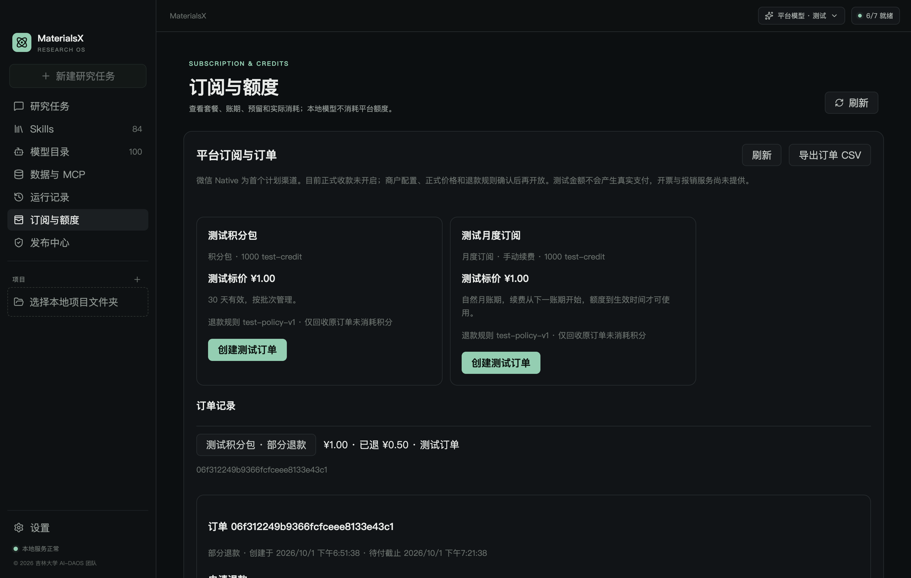

# M5.4：订单、订阅与退款实施及验收

更新时间：2026-10-01。**工程状态：测试业务闭环已实现；真实微信实付/原路退款验收待商户配置。正式销售关闭。** 首发渠道按维护者选择为微信支付 Native。不把合成渠道称为微信沙箱或真实商户，不把测试 ¥1.00 当成正式售价。

## 本轮实现

- 独立 PostgreSQL `004_payments.sql` 迁移：不可变套餐版本、订单快照、支付证据、订阅期间、退款申请、恢复队列。人民币分与 test-credit 使用不同字段，HTTP 均返回精确整数字符串。
- 创建订单绑定账户、幂等键与套餐摘要；客户端不能修改价格、积分、用户、渠道地址。每账户最多 3 个待付订单。桌面仅展示登录账户订单，50 条分页；不从旧 M3 JSON 迁移余额或现金。
- 验证支付证据与订单金额、币种、商户、AppID、交易号；到账、积分批次、账本、权益激活、队列与审计同一事务。相同回调不会再次授予，漏通知使用主动查询恢复。已关闭订单收到迟到的有效支付仍如实入账。
- 订阅仅手动续费：UTC 自然月，保留最初日期锚点，月底夹取（例如 1/31 → 2/28 或 2/29 → 3/31）。续费/更换套餐排在已付账期之后，新积分到 `available_at` 才可用；无自动扣款。暂停账户不再准入模型，但已产生的支付和退款仍可结算。
- 用户申请退款；管理员 MFA 核算预览、审批/拒绝，检查退款版本与订单版本，记录原因；后台不能手工“标记已支付”。批准时先冻结原订单积分，不能拿另一订单或试用额度补足。
- 退款审批与渠道执行分开：`requested/reviewing/approved/rejected` 与 `not_started/submitting/pending/succeeded/failed`。渠道超时保留冻结；成功追加回收，确定关闭失败才释放；多次部分退款使用各自编号。
- outbox Worker 在 POST 前持久标记提交状态。重启/超时只按原订单号/退款号查询，不重新创建；每次请求 8 秒，退避最多 1 小时，24h 标记、72h 转人工。用户查询只催动待处理任务，管理员可审计恢复人工任务；不会重置提交标记。
- 桌面套餐卡、订单详情/查询/取消、退款申请与状态、账期、真实钱包冻结/回收字段；CSV 使用主进程系统保存对话框，逐页最多 50 条，不含密钥、支付人或原始回调。公式前缀转义。
- `/ops` 财务工作台复用短期管理员 HttpOnly/SameSite cookie、Origin 与 CSRF；有订单、退款、脱敏证据、队列、核算、审批、恢复查询。汇总分开显示真实现金与合成金额，净现金不视为利润；成本未知不能推算利润。

## 支付渠道适配与边界

微信官方 [APIv3 Go SDK](https://github.com/wechatpay-apiv3/wechatpay-go) 固定 `v0.2.21`，Apache-2.0 许可已补入第三方清单。已实现 Native 下单、查单、关单、创建退款、按退款号查询，以及支付成功通知 RSA 验签 + AES-256-GCM 解密。公钥模式校验平台公钥 ID；5 分钟时间窗；64 KiB 通知上限；无重定向、无原始错误/支付人落日志。退款以签名查询为准，此阶段不注册退款回调。

`MATERIALSX_PAYMENT_MODE` 默认 `disabled`。`test` 只允许 `development` 且隔离测试数据库；如果同时开启云 Alpha，还必须配置 test-credit 销售价格版本。`wechat-native` 仅允许生产环境和完整商户配置，**这只初始化适配器，不开启正式销售**。

当前套餐校验明确要求 `testOnly:true`，创建订单只允许 `channel:test`，返回 `formalSalesEnabled:false`。正式套餐不能由改一个环境变量开放：M5.3 的输入上界/费率仍为测试政策；维护者还没有确认正式价格、单位换算和退款条款。本次没有移除这些校验、没有提供真实付款二维码，也未测试微信实付。今后完成生产计量与产品政策后须显式扩展契约、部署准入及 Native 二维码页面，验证一笔小额支付和退款。

测试通道是内存合成上游，`test://not-a-real-payment` 不提供二维码；管理员按钮明确标为模拟付款，仅测试模式注册、MFA + CSRF 保护。测试进程重启会丢失合成上游状态，数据库仍保存已到账/已退款记录；未知结果转待核对，不能拿合成状态代替微信订单。模拟通道禁止用于生产。

## 测试退款规则（不是销售条款）

规则版本 `test-policy-v1` / `unused-proportional-v1` 仅用于验收：

- 积分包：累计应回收 `ceil(原始积分 × 累计退款分 / 原始实付分)`，本次冻结为累计应回收减已回收；全额退款回收尾差。精度低时本次回收可为 0；现金总额仍不超原订单。
- 可批退款金额不超过实付减成功退款与执行中退款；首版每订单只允许一项未结束申请/执行，避免两项同时核算。
- 原批次预留/待核对时不批准；已消耗或其他退款冻结导致不足时不批准，不扣成负数。积分过期不会恢复成新可用积分。
- 测试订阅只支持未消耗、没有后续已付账期的全额退款；成功取消其期间。对已消费退款、升级降级差价、随意裁剪前序账期不自行发明销售规则。
- 单管理员审批；没有声称实现两人复核。大额权限/再次认证、正式退款期限与计费项、异常赔付、消费者条款等待正式政策，再开放真实收款。

## 启动与配置

先按 [M5.1](identity.md) 配置服务端身份环境、迁移 owner 与运行 role。升级顺序：备份 → `npm run identity:ctl -- --command migrate` → owner 执行 `grant-runtime` 重新授予列权限/指定函数 → 服务和 Worker 重启。不要修改已应用的 001–003。004 在启动时只校验，不自动迁移。

默认关闭收款仍可显示空套餐和自己的订单。仅隔离开发数据库可以启动测试模式：

```sh
export MATERIALSX_PAYMENT_MODE=test
npm run identity:dev
# 另一个终端，使用同一份服务端配置
npm run billing:worker
```

仅部署 owner 可从 stdin 发布测试套餐，不把真实密钥写入参数、文档或仓库：

```json
{
  "id":"test-pack-v1","name":"测试积分包","kind":"pack","currency":"CNY",
  "priceFen":"100","credits":"1000","validDays":30,
  "refundPolicyVersion":"test-policy-v1","refundRule":"unused-proportional-v1","testOnly":true,
  "dailyLimit":"1000000","monthlyLimit":"1000000","requestLimit":1000
}
```

将以上无密钥 JSON 通过 stdin 交给 `npm run identity:ctl -- --command publish-product`。不能修改同 ID 内容；改价格发布新 ID。`subscription` 是一个自然月，`validDays` 仅用于积分包。测试发放可用请求数仍受 Alpha 总上限 10000 限制；发放不会清零已使用计数。运行角色不能直接调整 Alpha 授权或计费上限，仅调用带已验证到账证据和一次性回执的特定激活函数。

桌面按 [M5.1](identity.md) 配置 `MATERIALSX_IDENTITY_URL`，开发启动 `npm run dev`。在「订阅与额度」创建测试订单；管理员从服务 Origin 的 `/ops` 登录、刷新订单，在输入框填订单号并使用「仅测试：模拟收到付款」。用户退款申请 → 后台填退款号 → 核算预览 → 填审批原因 → 批准 → Worker 查询执行 → 用户刷新状态。批量历史 CSV 导出逐页保存，不表示已提供发票。

商户参数仅服务端配置，全部占位名见 `.env.example`：商户号、绑定 AppID、商户证书序列号、私钥绝对路径、平台公钥 ID/文件路径、32 字节 APIv3 密钥。不得把文件或密钥交给 renderer、安装包、GitHub、支付二维码生成服务。公钥轮换是部署操作，当前不自动获取/轮换证书；应保留新旧公钥迁移/恢复演练项。公网 Origin 和通知路径须在微信商户平台登记并实际验证，当前本机 localhost 不能用作真实回调。

2026-10-01 已按维护者选择复用现有微信服务的本机商户 YAML/PEM，保持官方 SDK 直接接入；新增私有配置读取和离线预检，实际商户资料及 SDK 初始化检查通过。公钥 ID 已提供，MaterialsX 公网入口仍待定，正式销售与实付验收未开放。启动方法、来源隔离和脱敏结果见 [商户配置指南](wechat-merchant-setup.md)。

同日已在额外授权下通过 ngrok 独立探针完成 **¥0.01 真实下单、用户付款、微信成功通知验签解密及签名查单**，随后关闭隧道。该探针未发放积分/订阅、未执行退款；完整平台生产收退款和正式商业政策验收仍待完成。详见 [一分实付记录](wechat-ngrok-probe.md)。

## 复现与验收证据

```sh
npm run check
npm run test
npm run m5:contracts:check
# 配置专用 MATERIALSX_IDENTITY_TEST_DATABASE_URL 后：
npm run m5:identity:test
npm run build
npm run control-plane:test
```

原 M5.4 桌面验收脚本依赖已退役的订阅组件，现已移除。当前桌面购买与退款入口是 MX 点数面板；后端支付回归由 Go 测试覆盖。隔离 PostgreSQL 测试库不可指向生产数据库。

实际完成的验证：

| 项目 | 结果 |
| --- | --- |
| PG 事务/并发重复支付/多次退款/额度守恒 | 通过 |
| 退款预留冲突、冻结阻止模型准入 | 通过 |
| 退款提交超时→替换 Worker→原退款号查询 | 通过，仅一次退款 POST |
| 漏支付通知查询、关单后迟到支付 | 通过 |
| 未来续费积分不可提前使用、月底日期锚点 | 通过 |
| 管理员 MFA、对象越权、受限运行角色、审计回执 | 通过 |
| 微信 SDK 请求签名、应答签名、通知解密、坏签名/错误公钥/过时/篡改拒绝 | 通过，生成的临时 RSA 夹具，无微信网络请求 |
| 实际 macOS 桌面创建订单/退款/CSV/状态与账本重建 | 通过，测试分 100 → 退款分 50；积分 1000 → 回收 500 / 可用 500 |
| 微信真实商户下单、可扫二维码、实付与原路退款 | 独立 ngrok 探针 ¥0.01 下单/付款/通知/查单已通过；**完整平台业务及原路退款未验收** |
| 正式售价、生产输入上界、正式退款条款、生产 TLS、公钥轮换、Windows GUI | **待完成** |

脱敏运行结果见 [payments-validation.json](payments-validation.json)，画面为合成订单：



本轮未更新安装包，未部署公网，未提交或推送 Git。MX-505/MX-OPS-03 不能按“小额实付 + 原路退款”标准关闭，待商户配置和正式计量/产品政策补齐后继续验收。
