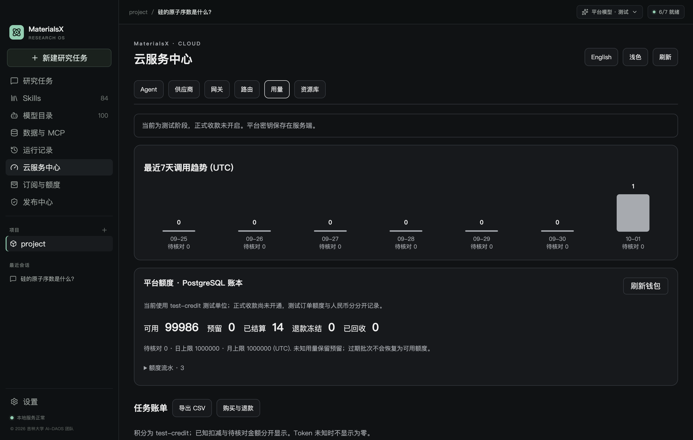
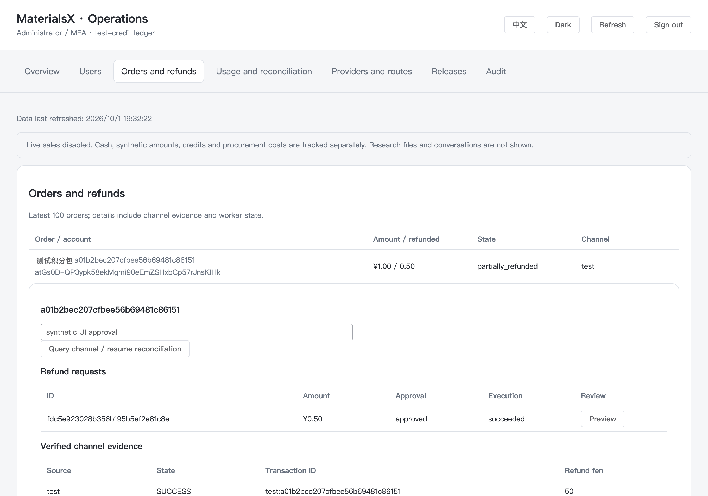

# M5.5：桌面云服务中心与运营后台

更新时间：2026-10-01。MX-506 已实现桌面六项导航、独立 Vue 运营中心和版本目录的技术闭环，本机 macOS / PostgreSQL / Electron 验收通过。正式收款、公开部署、Windows 实机安装和正式发行证据仍未验收；M5.6 Beta 尚未开始。

## 桌面入口与功能

启动开发版 `npm run desktop:start`，点击左侧 **云服务中心**。顶部中英文按钮切换语言。配色统一由 **设置 → 外观与配色** 管理：Materials 深色与 Codex 浅色同时应用到研究工作台、云服务中心及其钱包/购买页面，立即生效并保存本机偏好；云服务中心不再提供独立颜色开关。

| 页面 | 已实现行为 |
|---|---|
| Agent | 当前推理模式、平台路由、单次输出与任务预算；账户/设备登录退出；开始研究任务、模型设置、套餐/订单/退款与版本下载 |
| 供应商 / Providers | 搜索、RootFlowAI 卡片与详情、服务端固定 `gpt-5.6-sol`、Streaming/Tools 能力状态；本地 LM Studio 设置入口 |
| 网关 / Gateway | 配置、账户、协议和任务限额；上游健康/延迟如实显示未测量 |
| 路由 / Routes | `materials-research → RootFlowAI / gpt-5.6-sol`、固定路由与价格版本、账户可用请求数 |
| 用量 / Usage | 真实 test-credit 钱包、冻结/回收、账本分页；独立查询最近 7 个 UTC 日的账户调用趋势；任务账单分页、请求/阶段明细与 CSV |
| 资源库 / Resources | 内置 84 Skills 和 100 条材料模型目录，分类/名称/中英文搜索、详情与例子填入研究输入框；不把模型目录称为权重已安装 |

云服务中心与「订阅与额度」已统一采用 Skills / 模型目录的页面标题、1120px 内容宽度、分类标签、搜索框、9px 圆角卡片与按钮样式。资源库复用目录卡片；钱包用统一指标卡展示余额，订单与退款明细使用同一组面板样式。

云端数据须先登录并配置 M5 身份服务。未连接时显示明确状态，本地资源仍可浏览。本轮未接入 BYOK，也未把供应商密钥交给桌面。旧「订阅与额度」入口与新中心复用同一个支付/钱包实现。

`npm run desktop:start` 仅启动客户端，**不会启动身份服务或 PostgreSQL，也不会自动创建账户**。开发版默认连接 `http://127.0.0.1:8788`；若点击登录立即失败，先检查身份服务的 `/health` 是否可访问，再按下方启动配置运行服务。界面会说明连接失败，避免将内部 IPC 异常作为登录提示。首次登录须先创建受邀账户；不能用 LM Studio 的 API 地址或供应商 Key 登录 MaterialsX 账户。

若只需在本机开发，可直接执行 `npm run identity:local` 创建独立、持久的开发身份环境；登录资料和停止方式见 [本机账户服务](identity-local.md)。此入口禁用云生成和支付。

账单取自当前账户的 PG 任务与请求，分页每次最多 50 个任务，明细每任务最多 16 个请求。输入/输出总量只有所有请求的对应字段均已知时才给出；否则 `null` /「未知」。已知积分扣减、当前预留、待核对请求数分别显示，执行成功不代表科学验收通过。CSV 每页由系统保存对话框确认，未知 tokens 输出 `unknown`，使用公式前缀转义，不含论文、提示词、原始响应、采购成本或凭据。

## 独立运营后台

源码 `apps/admin/`，Vue 3 + TypeScript + Vite + Element Plus；Go 服务同源提供静态资源与 `/ops/api`。打开身份服务的 `/ops`，用既有管理员密码 + TOTP 登录。未配置新版静态目录时保留旧 M5.3/4 运维页面作为兼容入口，不声称自动加载了新版。

页面包括总览、用户、订单与退款、用量与核对、供应商与路由、版本发布、审计。用户/审计分页；订单界面明确为最近 100 笔。退款先核算、人工确认、检查原订单和退款版本，然后由现有 Worker 查询/执行原路退款。只有显式测试服务才出现「模拟付款」。真实现金、测试金额、已确认采购成本与成本未知数量分开，净现金不当利润。

沿用短期 HttpOnly cookie，生产 Secure / SameSite=Strict；会话不自动续期，到期重新 MFA。GET 也校验管理员主体，写入校验准确 Origin、CSRF、角色、对象、版本与幂等键；控制/发布事务再次检查存活的管理员会话。前端没有存储 access/refresh token。退出/失效清除页面数据。管理接口不接受用户提交的 accountId 来替代身份主体，不提供任意改价/发积分/执行脚本功能。

新建订单与新云请求有独立、持久的暂停开关。保存需要原因、版本、幂等键并写审计。**暂停只影响准入**：已经发出的请求仍可停止和结算，原订单仍可查单/到账/退款，未知 usage 不会因此释放。浏览器开关不能开放正式销售。中文/英文公告只作为文本显示。

## 构建、迁移和启动

先完成 [身份配置](identity.md)、[网关配置](gateway.md)、[test-credit 与 Worker](metering.md)、[支付配置](payments.md)。旧 `.env` 的主密钥保持原值，不因升级重新生成；owner 与 runtime 使用不同连接。

```sh
npm run check
npm run build:admin
# 以 migration owner 的既有环境，先备份再升级
npm run identity:ctl -- --command migrate
npm run identity:ctl -- --command grant-runtime --role <现有运行角色>
```

新增 **005_workspace_ops.sql**，不改 001–004 已应用迁移。服务启动只检查迁移校验和；005 新列权限必须重新 grant-runtime。设置服务端环境：

```sh
export MATERIALSX_ADMIN_ASSET_DIR="/Users/user/Code/MaterialsX/dist/apps/admin"
# 可不设置此项；没有审核文件时发布目录操作会被拒绝
export MATERIALSX_RELEASE_APPROVALS_FILE="/absolute/private/path/release-approvals.json"
npm run identity:dev
# 另一个终端，同一份服务端配置
npm run billing:worker
```

开发后台地址默认为 `http://127.0.0.1:8788/ops`，生产使用配置的 HTTPS origin。前端不另开跨域 Vite 服务，不配置 CORS 来绕过鉴权。构建目录路径必须绝对，Go `os.Root` 限制静态文件读取，拒绝目录浏览与逃逸 symlink。后台静态目录由部署人员管理，不放研究文件、私钥或 `.env`。

`npm run build` 同时构建桌面与后台，但运营后台只部署在身份服务器。桌面打包排除 `dist/apps/admin`；后台 JS 没有密钥，服务器配置仍不得放入安装包。

## 版本目录与门禁

本轮采用 **人工在 GitHub 上传/发布 → 后台核验 → 发布下载目录** 的方式。没有自动 GitHub 上传、GitHub 写令牌、自动更新 feed、Skills 热更新或 M6 权重下发。目录「发布」只改变 MaterialsX 的推荐下载元数据，不代表替维护者创建 GitHub Release。

1. 从 [占位版本清单](release-manifest.example.json) 替换真实版本、tag/commit、源码地址、两类资源清单 SHA256、协议/迁移、双语说明及各安装文件的名称/大小/SHA256/URL/签名状态。草稿清单不可修改；检查好后登记，误填版本通过新版本修正。
2. 按 M4 完成许可、源码、secret scan、示例权利、资源一致性、协议/数据库兼容与每个目标平台安装验收。stable 必须同时包含 macOS arm64 / Windows x64、有效签名及 macOS notarization；beta 可以显式标为 unsigned，但其他门禁仍须通过。
3. 由部署人员生成绑定清单的规范摘要：

   ```sh
   npm run identity:ctl -- --command release-manifest-hash < /absolute/path/release-manifest.json
   ```

   这个纯摘要命令无需数据库或身份主密钥。不能用原始 JSON 文本的哈希替代：字段顺序/规范化由 Go wire manifest 决定。
4. 复制 [审批文件占位示例](release-approvals.example.json) 到服务器私有位置，将上一步摘要及实际审核的 `checks` / `evidenceRefs` 写入。所有示例 gate 默认 false；网页没有「勾选通过」接口。此文件是部署人员的审核声明和证据引用，并非软件替代人工签名/许可审核。运行角色无权写它。
5. GitHub 的 `materialsx-jlu/MaterialsX` 已公开发布 **immutable Release** 后，后台点击「核验并发布目录」，填写原因并确认。服务只读检查 Release/tag、非草稿、stable/beta、一致的 commit、上传完成的 assets、大小/URL与 `sha256:` digest；超时/无 digest/不匹配/证据不足均拒绝目录发布。只使用 GitHub 公开 API，不使用供应商 Key。接口依据 [GitHub Releases 官方文档](https://docs.github.com/en/rest/releases/releases#get-a-release-by-tag-name)。
6. 公共 `/v1/releases` 仅返回 published 清单；草稿和 withdrawn 不暴露。撤回有版本与审计，保留历史、不删除安装文件、不撤销已安装用户版本。成功操作重复提交返回原结果，即使后来撤回或 GitHub 暂不可用。桌面下载前主进程再查当前目录，仅允许该仓库已登记的 URL，并显示 SHA256/未签名提示。

目前实际签名、Windows 安装和论文示例权利等证据尚未补齐，因此真实 stable 发布门禁保持关闭。单元测试的虚构 Release 和临时审批文件不代表真实发行许可。

## 验收与证据

详细结果见 [本机验收报告](workspace-execution-report.md)。执行：

```sh
npm run check
npm run test
npm run build
npm run m5:contracts:check
# 使用隔离测试 PostgreSQL，不能使用生产数据库
npm run m5:identity:test
npm run m5:workspace:live
```

最后两个脚本要求 `MATERIALSX_IDENTITY_TEST_DATABASE_URL`。Go 测试自动创建/清理自己的唯一数据库；UI fixture 创建独立数据库、临时凭据、测试套餐与本地 SSE 合成模型，结束撤销会话、清理临时数据；没有真实支付、供应商生成调用或公开发布。截图包含合成元数据。




