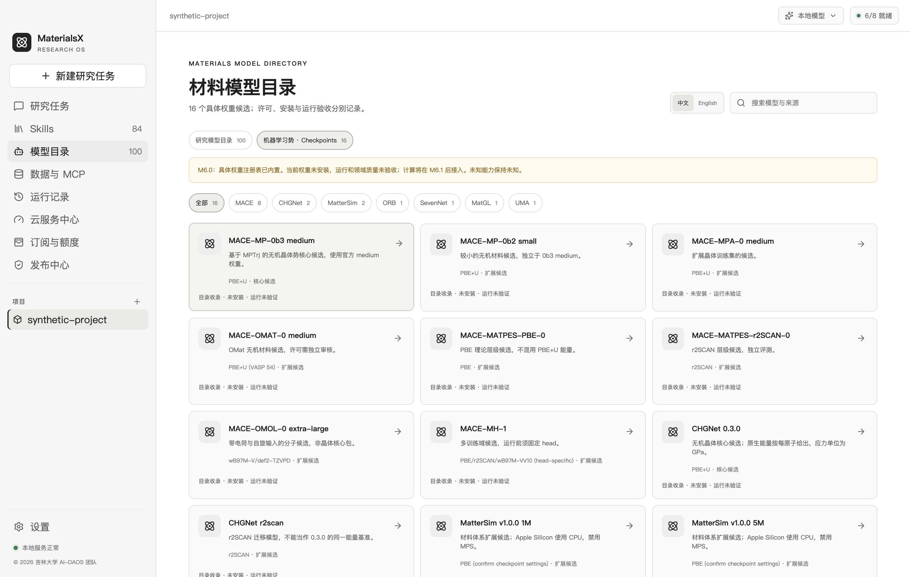
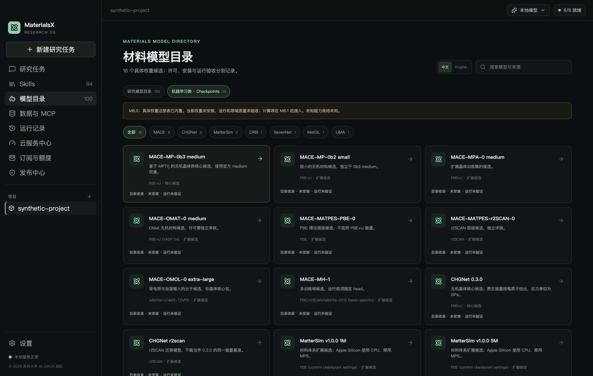

# M6.0 工程验收记录

日期：2026-10-01。环境：本机 macOS arm64、Node 24.7.0、Electron 44.5.0、开发 Python 3.12.11、ASE 3.29.0。这里是合同/样本测试环境，**不是 `environment-targets.json` 的 MLIP 运行环境**。

| 验收项 | 实际结果 | 证据/复现 |
| --- | --- | --- |
| 具体候选 | 7 家族、16 checkpoint；2 核心候选 | `models/potentials/registry.json`；`npm run m6:audit` |
| 核心文件身份 | 官方文件真实 SHA-256 / bytes 已核实，合计 84,336,173 bytes；未反序列化/执行/安装 | `source-lock.json`；`m6:source-check -- --weights` 可复验 |
| 固定源码来源 | 15 份固定 revision 的上游证据重新读取后摘要匹配 | 本轮 `npm run m6:source-check` 通过 |
| JSON 合同 | 10 份导出文件与实现匹配；Python draft-2020-12 校验通过 | `m6:contracts:check`；Python Schema 测试 |
| M6 TS 规则 | 7 组通过，含伪造状态/证据、未知模型、非有限值、cell 溢出/奇异、预算、任意脚本/穿越、虚假完成/质量 | `packages/atomistic/src/registry.test.ts` |
| M6 样本 | 9 项 ASE/Schema 测试通过：7 例 round-trip、1 组反例原始条件、1 组 Schema 检查 | `python/tests/test_atomistic_samples.py` |
| 现有 Python 回归 | 12 通过；ASE/NumPy 现有弃用提醒 1 项，不影响通过 | `uv run --project python --frozen pytest python/tests` |
| TS/桌面/后台类型 | 全通过 | `npm run check` |
| 整体 TS 回归 | 93 项：92 通过、1 跳过（真实 PG identity 的 opt-in 用例） | `npm run test`；包含既有 Pi、积分/支付合同和材料抽取回归 |
| 构建 | core、Electron renderer/main、admin 构建通过；既有 Vite 大 chunk 提醒仍在 | `npm run build`；最终 UI 修改后 `m6:ui` 重建桌面通过 |
| 真实 Electron | 实际 main/preload/Vue，16 卡片、家族筛选、中英详情、固定来源 IPC、示例填入 composer、深浅主题/重启保持通过 | `npm run m6:ui`；本机 `runtime/m6/ui/acceptance.json` |
| 原资源回归 | 100 研究目录、84 启用 Skills 保留；新七个任务名称未提前启用 | Electron bootstrap 与旧目录/Skill 测试 |
| 冻结与双平台换行 | 离线输入哈希核验通过；仅 M6 冻结文本固定 LF，PNG 自动二进制处理 | `release-lock.json`、`.gitattributes`；CI 增加 schema/audit |
| 秘密/格式检查 | 公共候选/索引文本扫描及 diff 格式检查通过 | `scripts/check-public-secrets.py`；`git diff --check` |

桌面测试使用临时 userData 和团队合成项目，退出后删除测试数据。来源打开由测试截获核验固定 URL，未发送研究数据。**本轮没有真实模型调用、MLIP 计算、支付/退款、邮件发送，也没有修改 M5 PostgreSQL 数据或计费逻辑。** 原有 M5 工作区改动予以保留。测试得到的目录/合同通过不能作为模型科学质量通过。

Python 回归命令现在明确限定 `python/tests`。在仓库根目录只执行 `uv run --project python pytest` 不会自动切换 cwd，会误收集 vendor 与本地两平台运行时的第三方测试；verify/CI/贡献说明已改用准确测试路径，未通过安装第三方测试依赖来掩盖这个问题。

## 界面截图

以下均为隔离合成项目，无真实账户或科研数据。

## 仍未验收的能力

- Windows x64 实机/CI 结果，本机不能代表另一平台已通过。
- 两核心隔离环境依赖锁、模型实际加载、能量/力/应力归一化、有限差分等数值门槛（M6.1）。
- 最终安装包新增资源存在性、体积、离线运行与许可完整性；本轮未重制发行安装包。
- 独立且理论基准匹配的 DFT 保留集标签/训练重叠审查：当前 references 为空、领域 gate 被阻断，不能标任何任务为 task_validated。
- 科学输入解析后 occupancy/近距/PBC 校验、项目/artifact realpath/ownership、实际磁盘哈希、进程与取消规则。M6.0 只有合同和测试样本，尚无执行器。
- 3D、真实优化、MD 轨迹、智能选势和七个任务 Skill 执行。按 M6.2–M6.6 分阶段交付。

M6.0 工程清单可交接后续开发，科学/运行 gate 仍按真实证据放行；没有把“目录内置”写成“默认权重已安装”。
