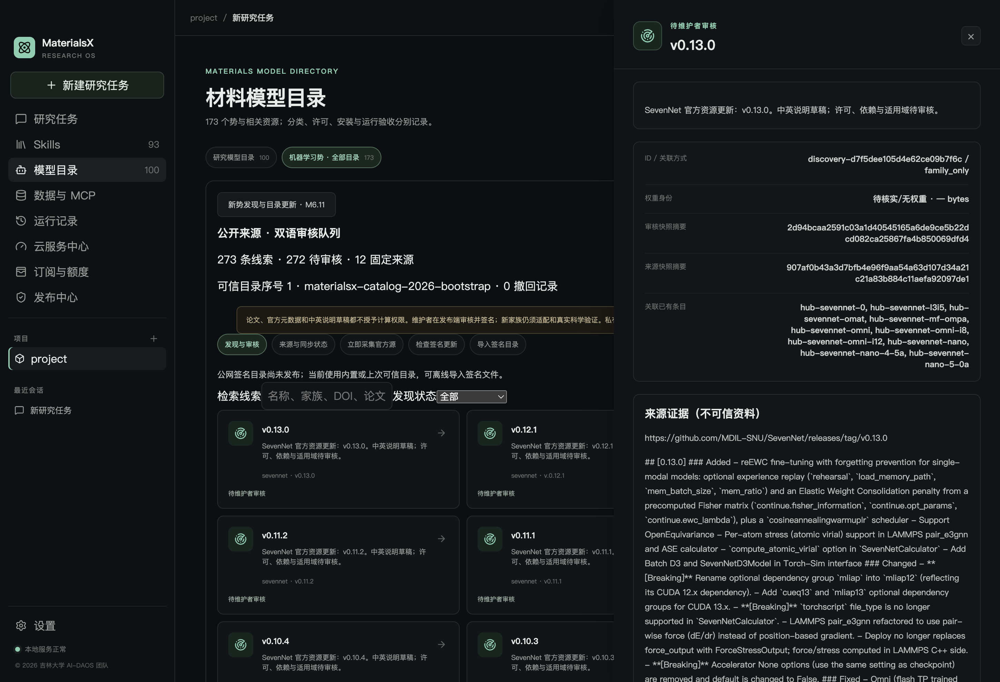
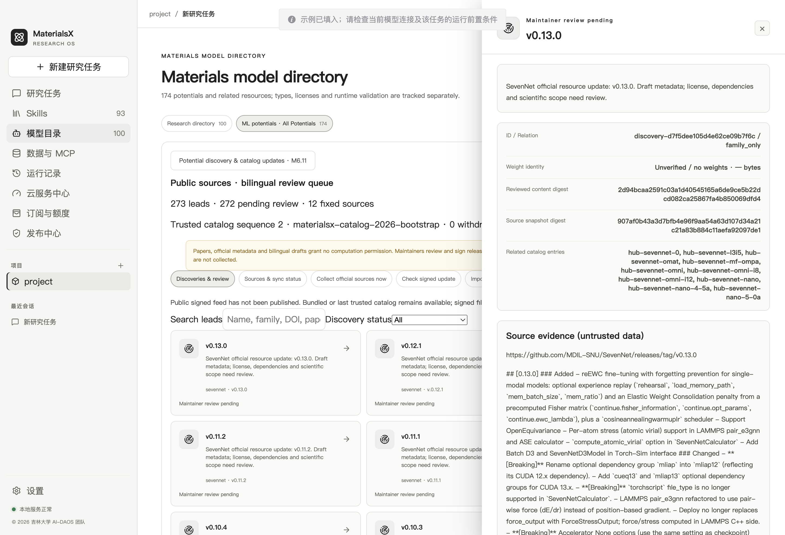

# M6.11 新势发现、审核与签名目录更新

日期：2026-10-02。已实现并通过 macOS arm64 本机工程验收。版权：© 2026 吉林大学 AI-DAOS 团队。

本阶段让公开的新权重、论文和仓库更新进入可检索的双语候选队列，再由维护者审核、签名发布。计算仍使用经过适配的固定 checkpoint：发现、目录审核、接口可运行和科学精度验证分别记录。当前可信基础目录仍有 **173 条资源、6 个计算接口**，发现队列的数量不计入可运行势数量。

## 桌面使用

在项目根目录运行 `npm run dev`，重启已有开发版以加载新主进程。进入 **模型目录 → 机器学习势 · 全部目录 → 新势发现与目录更新 · M6.11**。入口置于完整目录之前，沿用 Skills 卡片、右侧详情、中英文切换与全局主题；不增加单独配色设置。

- “立即采集官方源”更新预定义公开来源；可取消，逐源错误和最近成功时间可查看。
- 搜索名称、来源、家族或 DOI，筛选待审核、已审核、未通过、撤回和仅论文。
- 点击线索查看版本、资源身份、证据摘要、关联方式、历史及两条中英文例子；例子可复制到聊天输入框，不自动发送。
- “检查签名更新”读取已配置的公开发行源；“导入签名目录”通过本机文件选择器导入 JSON，立即更新页面，无需安装权重或重启。
- 公网目录源目前尚未发布，`discovery-trust.json` 的 `updateUrl` 为 `null`，页面明确显示待配置。内置或最后可信目录可离线浏览，签名文件可离线导入。





默认增加 `@materials-potential-discovery`，内置 Skills 总数由 92 增至 **93**。本地 Pi 的 `potential_discover` 提供 `search`、`read`、`status`、`sync`；检索最多返回 10 条，证据读取仅接受已登记 ID。`potential_search` 检索可信目录，真实计算继续走 `materials_science` 的结构、范围授权与固定计划流程。此次未扩展 M5 付费网关的工具合同。

示例：

```text
@materials-potential-discovery 查看 SevenNet 最近官方发布与待审核权重，读取来源证据，列出哪些已经接入 MaterialsX。
@materials-potential-discovery Search recent interatomic-potential papers and distinguish paper-only leads from public model repositories.
```

## 来源与实际覆盖

配置见 `models/potentials/discovery-sources.json`，本次真实联网采集 12 个来源、**273 条线索**：33 个资产候选、28 篇论文、141 条代码发布/变更、71 个仓库/入口。没有下载新权重，没有调用模型供应商或支付接口。各来源的时戳和统计见 [采集证据](evidence/m611-discovery.json)。

| 来源 | 采集方式和当前窗口 | 本次线索 |
| --- | --- | ---: |
| SevenNet | 最新 30 条 GitHub release，上传资产及代码发布 | 27 |
| MACE foundations | 同上 | 24 |
| CHGNet | 同上；权重也可能随代码包提供 | 19 |
| MatGL | 当前官方 GitHub release | 30 |
| MatGL model repositories | Hugging Face 固定作者 `materialyze`，最多 30 个模型仓库 | 20 |
| NequIP | 最新 30 条 GitHub release | 30 |
| GPUMD / NEP | 最新 30 条 GitHub release，代码不等于预训练 NEP 文件 | 30 |
| GAP | 固定官方仓库最近 3 条 commit | 3 |
| SchNetPack | 最新 30 条 GitHub release | 11 |
| arXiv MLIP | 固定标题检索，最近更新的 30 条结果，再做相关性过滤 | 28 |
| OpenKIM | 公共模型对象查询，当前窗口 50 条 | 50 |
| NIST IPR | 仓库主页快照；可解析页内模型入口 | 1 |

这些是有界来源窗口，尚非各仓库全历史或全网穷尽索引。OpenKIM 当前窗口未做全库分页，也不承诺捕获每次新增；NIST 本次只取得主页索引，其更新页返回访问限制，不能据此声称已发现所有具体模型。扩展分页、精确经典势/ML 分类、作者权重链接、历史补齐继续列入后续工作。

本次核实 [MatGL 官方仓库](https://github.com/materialyzeai/matgl) 已迁移，并接入其 README 指向的 [官方模型空间](https://huggingface.co/materialyze)。仓库 commit SHA 标识仓库版本，不等于每个权重文件的 SHA；多文件模型、性质预测器和需要许可访问的仓库保持候选身份。

来源协议参考 [GitHub Releases API](https://docs.github.com/en/rest/releases/releases?apiVersion=2022-11-28)、[arXiv API](https://info.arxiv.org/help/api/user-manual.html)、[Hugging Face Hub API](https://huggingface.co/docs/hub/api)、[OpenKIM Query](https://query.openkim.org/)、[NIST IPR](https://www.ctcms.nist.gov/potentials/)。

## 增量、关联与审查

应用打开时每小时检查到期来源，官方源每日、论文每七日采集。发现/同步状态通知与可信目录变更通知分离，公开元数据更新不触发已安装权重的重复扫描校验。手动按钮可强制刷新；Pi 的 `sync` 遵循到期间隔，避免模型反复采集。`MATERIALSX_DISCOVERY_AUTOSYNC=0` 可关闭应用自动采集。关闭应用后由仓库的 `m611-catalog-discovery.yml` 定时流程承担独立公开元数据采集；该 GitHub workflow 需推送后在 Actions 启用，本轮未在远端执行。

GitHub 使用稳定 asset ID，资产改名仍是同一条记录；arXiv 使用去版本号的论文 ID；同一 DOI 可关联跨来源记录。精确官方资产链接或已登记论文证据可以建立强关联，其余保留 `family_only` 或 `unlinked`，不把家族相近解释为同一权重。模板生成中文/英文介绍及两条例子；原英文标题和来源摘要保留原文，不声称已完成 LLM 翻译或科学审阅。

内容摘要用于幂等和审核绑定，快照摘要用于证据校验。重复同步/ETag 重用不新增重复记录。版本、名称、许可观察或来源撤回变化会重置为待审核。只有在**本次实际读取到的 release 内资产消失**时才标记来源撤回；最新窗口未包含某个旧 release 不构成撤回。源码许可单独从 GitHub `/license` 观察并带 blob SHA，不代替权重、训练数据、商用或再分发许可审核。

原始来源只作为不可信资料，采集器不评估代码、不读取私人结构或项目论文，不接受模型提供的任意 URL。请求仅允许固定 HTTPS 主机，限制重定向、单响应 4 MiB、30 秒超时；许可失败、限流和坏响应显示真实状态，不覆盖已取得的可信目录。

## 维护者审核与签名

客户端和 Pi 发现接口不提供审核、签名或适配器注册操作。发布者在独立状态目录使用 CLI，审核决策必须绑定当前内容摘要。默认发现状态在忽略目录 `runtime/m6/discovery-publisher`；详细快照不提交为公开文档。

```bash
npm run m611:sync
npm run m611:sync -- --sources sevennet,matgl,matgl-models --force
```

审核前读取快照和官方资料，确认来源身份、实体类型、关联方式、许可与未知字段。把当前记录 ID 和摘要填入本机 review JSON；不要将下列占位值直接作为真实审核结论。

```json
{
  "id": "discovery-000000000000000000000000",
  "sha256": "0000000000000000000000000000000000000000000000000000000000000000",
  "decision": "approved",
  "reviewer": "维护者姓名",
  "note": {"zh": "记录实际核对范围与尚未知事项", "en": "Record actual checks and remaining unknowns"}
}
```

```bash
npm run m611:publisher -- review --file runtime/m6/review.json
npm run m611:publisher -- publish
```

`publish` 只转换当前审核通过的记录，保留未知能力和待适配状态，写入审核来源、执行身份固定值、序号和有效期，再用 Ed25519 签名。默认输出 `runtime/m6/catalog-publisher/catalog-release.json`。终端会明确打印 `remotePublished:false`：本地生成不会自动上传 GitHub。

本阶段已生成 `models/potentials/discovery-trust.json` 的公开信任根和序号 1 的签名基础版本。开发引导私钥只保存在被忽略的 `runtime/m6/catalog-publisher/signing-key.pem`，不进入安装包、公开日志或资源清单。正式发行前将发布私钥迁入隔离的维护者发布环境并保留恢复备份；现有普通本地用户权限不能被描述为硬件级密钥隔离。`init` 仅适用于首次初始化，会拒绝覆盖现有信任根。

发布文件经审阅后可作为 GitHub Release 的静态 JSON 资产上传。建议使用稳定 tag `potential-catalog-stable` 和资产名 `catalog-release.json`，确认文件实际可获取后再配置 `updateUrl`；当前传输允许 GitHub 及其资产重定向主机，自定义域名须显式增加允许配置与对应测试。更新文件不是应用安装包，不改变 M4/Apple/Windows 安装程序签名。

## 客户端信任、回退和密钥轮换

客户端校验 schema、规范化内容 SHA、Ed25519 签名、有效期、单调序号及六个执行身份的权重/依赖锁/源码 revision。元数据更新不能覆盖冻结的执行 ID，也不能授予 adapter、profile、平台通过证据或任务通过证据。坏签名、旧版本重放和身份变化会拒绝并保留原目录；网络不可用和目录过期时保留已验证的离线内容，同时显示状态。

回退必须是新的更高序号签名发行，并指向已知历史版本。CLI 验证历史文件与本地已验签历史一致，拒绝被修改的旧文件。

```bash
npm run m611:publisher -- rollback --previous models/potentials/catalog-release.json
```

每个新签名快照都携带完整的既有撤回列表，普通版本跳过后也可取得撤回；客户端拒绝新版本删去已知撤回，目录回退不能清除撤回。签名撤回到达后，新选择、下载、导入、启用和计算会检查撤回状态；已开始的固定计算继续使用其固定身份完成，历史报告和 3D 产物仍可读。单个 checkpoint 撤回不使共享环境内的其他权重自动失效。

密钥轮换由当前可信密钥签名新公钥，可在后续版本中退休旧密钥；重新启动仍重放完整已验证历史。

```bash
umask 077
openssl genpkey -algorithm ED25519 -out runtime/m6/catalog-next.private.pem
openssl pkey -in runtime/m6/catalog-next.private.pem -pubout -out runtime/m6/catalog-next.public.pem
npm run m611:publisher -- rotate --previous runtime/m6/catalog-publisher/catalog-release.json --next-key-id materialsx-catalog-next --next-public-key runtime/m6/catalog-next.public.pem
# 确认客户端已收到轮换发行后，再使用新私钥和 key-id 发布。
npm run m611:publisher -- publish --previous runtime/m6/catalog-publisher/catalog-release.json --key runtime/m6/catalog-next.private.pem --key-id materialsx-catalog-next
```

`rotate` 可追加 `--retire-key-id`，但正式退休前需安排应用信任根升级和轮换版本保留。当前静态 feed 是单个签名版本：跳过轮换发行的离线老客户端不能直接验证仅由新密钥签名的最新版本，应按序导入保留的轮换版本或更新应用。自动补齐跨版本轮换链列入 M6.12 分发验收，不伪装成已部署功能。

缓存分别存于用户数据的 `potential-discovery/` 与 `potential-catalog/`，无需新增数据库。损坏的发现缓存隔离后可重新采集；损坏的可信签名历史阻止新计算，防止丢失撤回状态，需恢复完整可信备份，请勿删除历史来清除撤回。当前本地缓存不抵御同一操作系统用户有意删除全部应用数据或改写程序；正式撤回列表还需纳入新发行目录与安装包。当前上限为发现记录 5,000 条、签名历史 256 版/32 MiB；完整历史归档和空间清理继续进入后续验收。

## 验收证据与边界

```bash
npm run m611:verify
npm run skills:accept:materialsx
# 以下依赖本机采集快照、维护者开发签名文件；运行环境测试还依赖已有 SevenNet 缓存和 CPU 环境。
npm run m611:publisher:test
npm run m611:ui
npm run m611:runtime:test
```

本机验证包括：类型检查和前端构建、153 项测试中 152 通过/1 项既有跳过、固定来源事件重放、重复同步、许可变化、仅论文、改名/撤回、ETag、坏签名、单调序号、到期、执行身份保护、离线缓存、密钥轮换、可信历史篡改、固定公共网络边界与 Pi 实际工具调用。M6.7/M6.8/M6.10 冻结合同和目录审计保持通过，团队 Skills 11/11 验收通过。

- [汇总验收](evidence/m611-verification.json)：合同/类型/回归、默认 Skills 及本机能力范围。
- [真实公开元数据采集](evidence/m611-discovery.json)：12 来源、273 线索，无新权重下载。
- [真实发布 CLI](evidence/m611-publisher.json)：过时审核拒绝、签名发布、轮换、换钥发布、伪造历史回退拒绝和合法回退；全程隔离状态，未远端发布。
- [原生 Electron](evidence/m611-ui.json)：中英详情/两例子、签名文件原生选择器、坏签名拒绝、可信目录实时更新、93 Skills、6 接口不变、深浅主题及 850px 宽度检查。隔离测试导入一条元数据后显示 174，不改变正式基础目录的 173 条。
- [真实 CPU 计算](evidence/m611-runtime.json)：已有 SevenNet 权重真实单点和扰动 Si 的固定晶胞 FIRE；计算期间签名撤回阻断新任务，但当前任务 66 步收敛，结果、3D、回退及重启可核验。仍为 `needs_review`，不构成新领域科学精度验证。

Windows 实机、GPU、正式签名安装包、公网发行源、Actions 实际执行、供应商 LLM 的发现/选择质量尚未验收。后续 M6.12 负责分发与集中回归、来源历史补齐、长期缓存策略及轮换链分发；新势可运行资格继续通过独立适配和科学验证建立。

M6.12 已补齐 `catalog-bundle.json` 轮换链分发、离线迁移、空间保护及集中回归，见 [操作与验收](distribution-release.md)。默认公网源仍未部署；长期历史上限和来源全历史解析保持明确限制。
