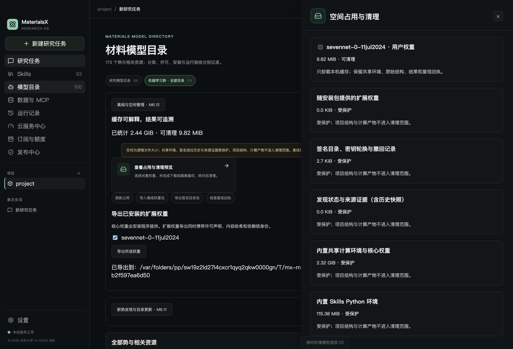
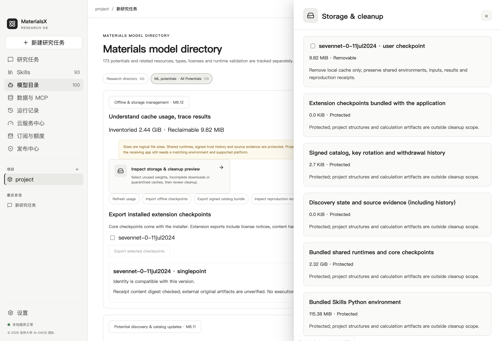

# M6.12 离线分发、空间管理与发布验收

实现日期：2026-10-02。自研代码版权：© 2026 吉林大学 AI-DAOS 团队。

本阶段把 M6.7–M6.11 的目录、安装、选势、计算和增量发现串成可离线迁移、解释占用和保存计算谱系的产品功能。正式双平台签名发布仍有外部门槛，不能把 macOS 工程验收当作 Windows 安装验收或科学精度认证。

## 用户入口

“模型目录 → 机器学习势 · 全部目录 → 离线与空间管理”。页面沿用 Skills 的卡片、详情抽屉和全局主题；中英文随目录语言切换。没有新增独立颜色设置。

| 功能 | 操作与边界 |
| --- | --- |
| 查看占用 | 列出用户权重、下载中间文件、损坏缓存隔离副本、受保护的内置环境和证据。采用异步目录扫描，展示逻辑文件大小；不是 APFS 独占块或系统可用空间统计。 |
| 清理预览 | 选择闲置权重、未完成下载或隔离副本；原生确认框显示名称与大小。确认前后核对同一预览摘要；变更或正在使用时拒绝操作。取消不删除数据。 |
| 离线权重导出 | 选择已安装的审核扩展权重，选择目标文件夹；生成唯一命名的 `MaterialsX-checkpoints-*` 文件夹。带有 `collection.json`、真实权重、许可声明、权重哈希、依赖锁和源版本。 |
| 离线权重导入 | 选择上述整个文件夹。全部文件、声明、哈希和版本兼容性通过后才挂载。接收端仍需要安装程序提供匹配的隔离环境与平台支持。 |
| 签名目录导出/导入 | 导出 `m6.12-v1` 包，携带基础目录和历次签名、撤回、密钥轮换。导入端从预置公钥验证整条历史，可跨错过的密钥轮换更新。M6.11 单份签名 JSON 仍兼容。 |
| 复现回执 | 完成的真实单点、FIRE、MD 结果卡支持导出 JSON。空间管理页可检查回执摘要和当前版本兼容性；不会隐式执行计算。 |

核心 MACE-MP-0b3 medium / CHGNet 0.3.0 由安装包提供。离线迁移首版覆盖审核的 CHGNet r2scan、MACE-MP-0b2 small、MACE-MPA-0 medium、SevenNet-0 四项扩展权重。目录收录的其他家族不能借离线导入获取运行权限。

新目录更新仅改变审核元数据和撤回状态，不改变固定的六项执行接口、权重摘要、依赖锁、代码来源或平台资格。公网 feed 应发布完整 `catalog-bundle.json`，而不是仅发布换钥后的最后一份 release；维护者 CLI 会同时生成旧单文件与新包。

## 保护与失败恢复

- 共享 Python/科学依赖、安装包内权重、当前可信目录与密钥历史、撤回记录、发现证据及历史快照都不可在此页面删除。结构、论文、项目输出、计算记录与复现回执不属于清理范围。
- 下载、运行、排队或自动工作流使用的权重不能卸载。旧 M6.6 与新包管理器共同阻止冲突操作。
- 多权重离线包在导入前完整检查；每项权重原子提交。磁盘不足、外部文件变化或撤回发生在提交途中时，错误列明已提交 ID，可以恢复后重试；不宣称跨所有权重的文件系统事务。
- 新包的哈希或通知不符、未知 ID、依赖版本不符、额外脚本、目录穿越和符号链接均拒绝。第三方运行脚本和新的安装命令不会从离线目录执行。
- 单项卸载保留共享环境。卸载后历史报告、3D 与回执仍可读；重新运行需要相同权重及匹配环境。
- 错误目录签名或被替换的签名历史不改变上次可信缓存；中间签名可过期，但最终更新必须有效。损坏的可信缓存保持阻断，不能通过删除撤回记录恢复运行权限。应保留原件并交维护者核对，不能随意重新初始化。
- 当前签名历史最多 256 份、32 MiB；达到上限明确拒绝，尚无长期归档/检查点裁剪。历史证据没有可靠完整引用索引，首版保守保留所有快照。全历史源回溯、OpenKIM 分页与 NIST 逐条解析仍是后续扩展，不应以删审计证据节省空间。

清理操作逐项执行。如果系统或磁盘在执行中失败，会报告已经清理的 ID；刷新占用后再选择剩余项。页面不在后台自动删除科研数据。

## 回执语义

`m6.12-v1` 回执保存规范化结构、冻结计划、权重身份、依赖锁、实际环境版本与代码版本、任务选项（包括 MD 随机种子）、真实结果、产物路径与 SHA256，以及 `needs_review` 标记。导出前再次核对真实项目产物。

回执是内容摘要与谱系记录，不是数字签名、DFT 精度证据或重新计算的权限。导入检查仅核对回执自身摘要和当前受审模型身份，**不表示外部原始产物已验证**。跨硬件、线程和依赖版本不保证逐位一致。旧任务缺少源代码版本或平台时标注未知；旧单点任务的 `environment.json` 未注册为哈希产物，会明确记录这一局限。

## 开发和验收命令

```bash
npm run m612:verify
npm run m612:runtime:test
npm run m612:ui
npm run m611:publisher:test
npm run control-plane:test

# 已有审核权重及 portable runtime 时，构建 macOS 工程测试包。
# 不下载模型；APFS 克隆复用运行环境。不是正式签名 DMG。
npm run m612:package:mac
npm run m612:offline:test

# 报告发布门槛；--strict 未全部通过时返回非零。
npm run m612:release-gate
npm run m612:release-gate -- --strict
```

`m612:packages:bundle` 仅使用固定的已核验本机缓存，缺少时明确报出模型 ID。通用打包命令生成当前 M6.12 资源 manifest，覆盖 M6.0–M6.12 合同；旧 M6.6 离线 manifest 保持可读。93 个默认 Skills 和既有模型/支付合同保持不变。

`.github/workflows/m612.yml` 已配置 macOS/Windows 合同、兼容与构建回归。它不是两平台科学运行或 Windows 安装证据；尚未在 GitHub 实际执行。

## 发布门槛与范围

实际验收证据保存在 [evidence](evidence/)；结果与摘要由本机测试产生。macOS 工程包实际启动和离线 CPU 路径与原生 UI 分开验证。

Windows 实机及 NSIS 安装、正式 Developer ID/公证和 Windows 签名、公共签名目录 feed、Actions 远端运行仍待完成。SevenNet 当前只开放已验收的 macOS CPU 体系；GPU、分子、表面和独立 DFT 精度继续按原门槛阻断。示例论文数据开源权利待确认，工程包使用团队几何夹具。正式发布没有在本轮自动上传到 GitHub。


## 本机工程验收结果

- TypeScript/Vue 检查、构建及 160 项测试：159 通过，1 项既有跳过；M6.0–M6.12 的 12 组合同检查保持通过。
- 六 checkpoint 的真实 CPU 单点、SevenNet FIRE、CHGNet 四步 NVE，以及旧导入 → 新离线包往返 → 卸载 → 重启 → 历史 3D/回执读取通过。短程 MD 明确为 `insufficient_duration`，不能证明热稳定性。
- 维护者真实发布 CLI 同时生成新链包；新客户端无需已获得中间版本即可接收换钥后的有效更新。未发布到远端。
- 原生 Electron 中英页面、两全局主题、850px 宽度、原生清理取消/确认、保护项不可选、真实结果卡回执与 `@` Skills 验收。渲染帧测量在测试窗口关闭后台节流的条件下进行，以排除窗口被其他应用遮挡造成的 rAF 暂停；不宣称所有硬件均无卡顿。
- macOS 未签名工程包实际启动、93 默认 Skills、六接口的主进程/预加载真实计算通过；两核心 worker 另通过 macOS 操作系统网络禁用验收。资源摘要检查覆盖当前合同与完整计算环境，工程包约 3.4 GiB 逻辑大小。不是 DMG 安装、公证或 Windows 验收。

| 证据 | 内容 |
| --- | --- |
| [macOS 实算与恢复](evidence/m612-macos-runtime.json) | 六接口、真实优化/MD、离线往返、卸载后及重启后的结果/回执 |
| [macOS 原生 UI](evidence/m612-macos-ui.json) | 中英、全局主题、清理确认、回执按钮、@ 提示及帧测量 |
| [macOS 离线工程包](evidence/m612-macos-offline-package.json) | 实际打包二进制、独立用户目录、93 Skills、六项 IPC 实算与资源哈希 |
| [发布门槛](evidence/m612-release-gate.json) | 工程验收与未完成的正式发布条件分开记录 |



