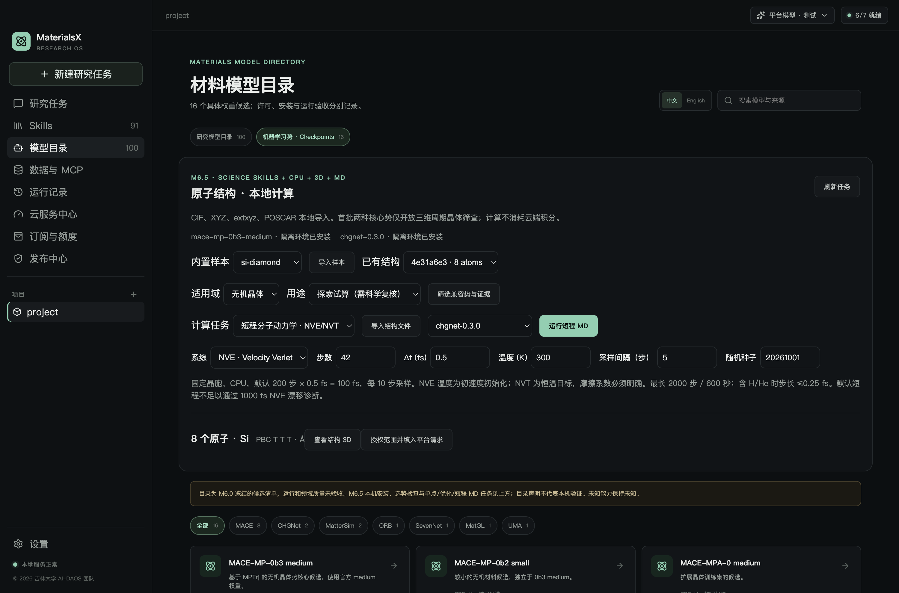
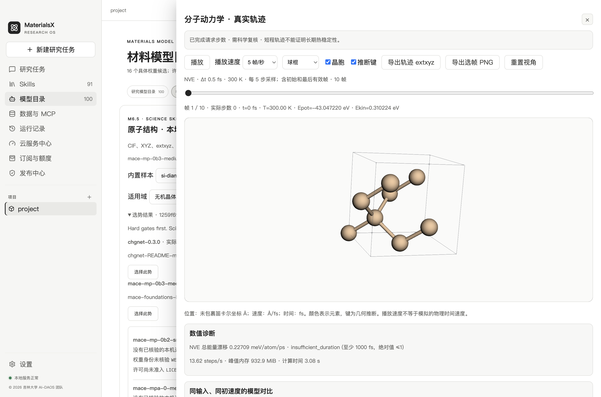
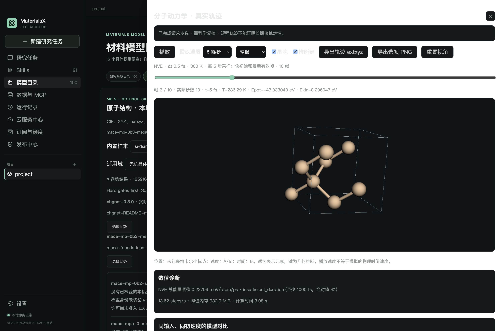

# M6.5 工程验收

2026-10-02 · macOS arm64 · © 2026 吉林大学 AI-DAOS 团队

MX-606 已在开发版接通短程 NVE/NVT、真实轨迹、诊断和受控科学调度。本轮验证工程行为与数值自洽性；没有独立 DFT 对照，科学质量仍为 `needs_review`，正式计算保持阻断。

| 验收项 | 实际方法与结果 |
| --- | --- |
| 两个真实核心势 | CHGNet 0.3.0 与 MACE-MP-0b3 medium，各对同一 8 原子 Si 输入执行 NVE 2000 步、0.5 fs、300 K 初始化，每 10 步采样；201 个真实帧，最终时间 1000 fs |
| NVE 诊断 | 每个积分步的总能量拟合斜率，CHGNet 为 −0.000208770、MACE 为 +0.000012065 meV/atom/ps；满足冻结的至少 1000 fs、绝对漂移 ≤1 工程门槛。这不是模型精度检验 |
| NVT 诊断 | 实际 CHGNet Langevin，1000 步、0.5 fs、目标 300 K、摩擦 0.01 fs⁻¹；后半程平均温度约 289.139 K，相对偏差约 3.62%。不套用 NVE 守恒结论，不宣称已平衡 |
| 单位与初始化 | 位置 Å、速度 Å/fs、时间 fs、能量 eV；随机种子/3N 自由度/COM 保留显式记录。两个 NVE 任务真实初速度 SHA 一致；初始帧坐标与不可变输入逐项核验 |
| 真实帧与文件 | 按实际字节范围读取初始/最终帧，末帧位置实际变化；非整采样倍数终步保留。完整 extxyz 导出 SHA 与登记文件一致；逐帧范围、哈希、映射和时间检查通过 |
| 取消与资源上限 | 真实子进程取消、1 秒超时和 1 MiB 输出预算均不发布成功；已验证的真实帧作为部分轨迹。氢结构 0.5 fs 在启动前拒绝；NaN/Inf、碰撞、速度/力/温度/位移护栏有解析模型测试 |
| 恢复与防篡改 | 非终态持久记录重启后为 interrupted，保留校验有效帧，不自动续算；最后几何只能新建轨迹段。同大小帧修改、外项目 ID、越界帧、缺少/修改产物被拒绝，原输入 SHA 未改变 |
| 状态发布 | 异步整理失败/取消产物期间不暴露半完成终态；只发布通过合同校验并持久化的快照。资源上限与取消复测覆盖此竞态 |
| 真实 Electron 播放器 | 两个真实模型各生成 42 步、采样 5 步的 10 帧轨迹；播放/暂停、真实时间拖动、复用单 canvas、关闭释放、浅/深主题通过；当前帧 PNG 可解码，坐标/速度表和 WebGL 丢失后的重试通过 |
| 曲线与比较 | 单任务真实逐步温度/能量曲线；两任务要求输入、参数与初速度一致。能量只比较各自初值为零的 ΔEtotal/N，多势一致不证明准确性 |
| 默认 Skill | `materials-mlip-md` 从规划改为可执行，中英介绍、两条双语例子、Pi 注册和默认资源验收通过；沿用现有 91 项 Skills、13 分类 |
| 平台桌面闭环 | 真实 PKCE 登录、临时 PostgreSQL 16、Go 网关、Pi SDK 和实际本机 MD，供应商用合成流式 Responses。原生拒绝零派发，批准后四轮请求、真实结果和用量记录通过；MD 参数冻结，退出清除范围 |
| 外发边界 | 科学工具仅传有界标量摘要、ID 和 SHA；不传坐标、完整速度/力、轨迹数组或本机路径。平台授权范围与 M5 结算约束仍生效 |
| 既有能力 | M6.2 静态 3D、M6.3 实际优化/对比/导出、M6.4 Skills/筛选/范围/主题桌面回归通过；M6.0 冻结的 43 个文件和原抽取 Skills 的 75 个文件未改变 |

完整 TypeScript 测试 118 项：117 通过、0 失败、1 项既有按需 PostgreSQL 测试跳过；本轮另外完成真实临时 PostgreSQL 桌面集成。TypeScript/Vue 检查、桌面构建、Go 测试、原子运行时 Python 32 项、几何样本 Python 9 项、自研资源验收 9/9、MD Skill 标准格式与 M6.0–M6.5 合同检查通过。构建仍有既有 3Dmol eval/包体大小提示。

首帧耗时与输入事件派发耗时以本轮 [桌面回执](evidence/dynamics-ui.json) 的实际值为准。测试仅为 8 原子 Si、10 帧、五次打开；输入事件派发不等于画面响应，不能外推为 2000 原子或大轨迹性能验收。

机器证据：[真实双核心与边界](evidence/dynamics-runtime.json)、[短段复测](evidence/dynamics-runtime-quick.json)、[桌面](evidence/dynamics-ui.json)、[平台闭环](evidence/dynamics-cloud-ui.json)、[验证汇总](evidence/dynamics-verification.json)、[当前源码摘要](evidence/dynamics-source-snapshot.json)。M6.0–M6.4 的历史证据保留原版本，本轮源码摘要单独记录。

本轮没有下载新权重或新增大型 Python 环境，没有调用真实付费供应商或支付，没有修改现有账户数据库，也没有生成或发布正式安装包。现有 macOS 安装包的 Skills 校验因旧包只有 84 项、源码为 91 项未通过；安装包需要重新构建并单独验收，不能据开发版成功宣称已发布。Windows 实机、正式包、真实供应商多步成功率、大结构性能及独立领域精度仍待验收。默认范围为受限 CPU 无机体相晶体，NPT 和精确状态续算不在本阶段。使用方法见 [短程 MD 与轨迹](dynamics.md)。
