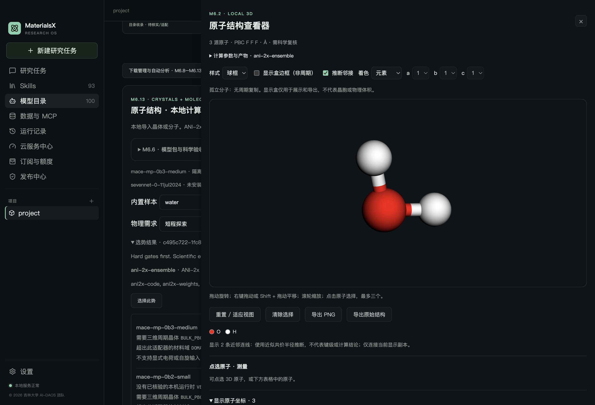
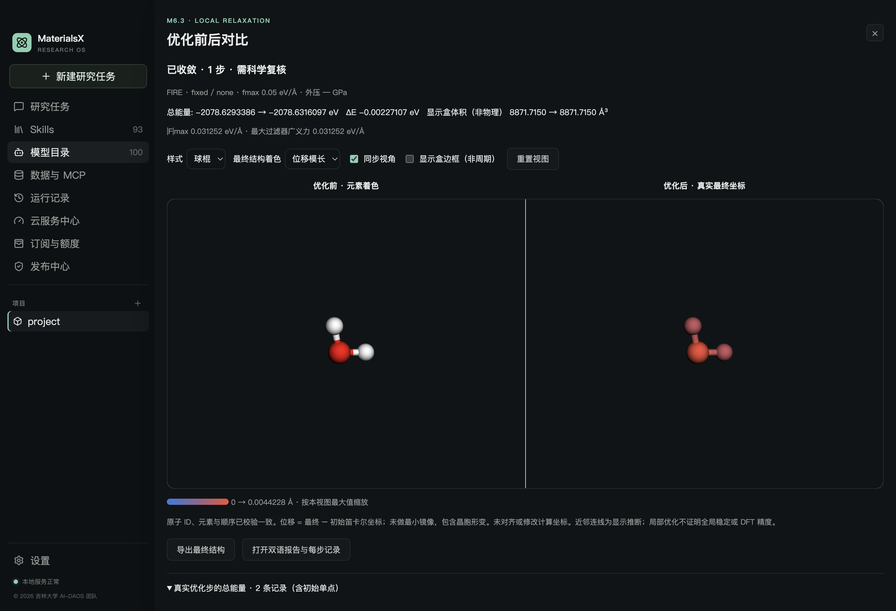
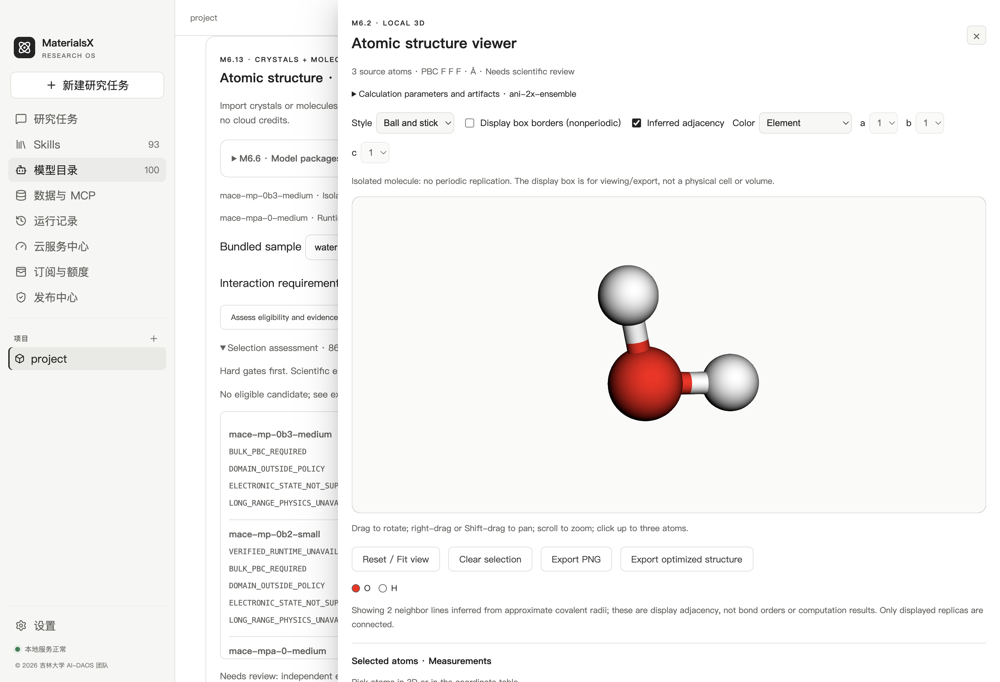

# M6.13 分子势：使用、实现与验收

更新时间：2026-10-02。首个分子家族已完成 macOS arm64 CPU 工程验收：ANI-2x 八模型平均、真实单点、固定显示盒 FIRE 优化、自动选势/分析、双语报告与 3D。当前目录 174 条资源 / 21 个具体 checkpoint，7 个计算接口，默认 93 Skills。其他分子与长程候选继续保留目录状态。

## 支持范围

| 项目 | 当前执行约束 |
| --- | --- |
| 模型 | `ani-2x-ensemble`，TorchANI 2.7.5 官方 ANI-2x 八成员平均 |
| 元素 | H、C、N、O、S、F、Cl；覆盖元素不代表覆盖所有化学环境 |
| 电子态 | 必须显式声明 charge=0、spinMultiplicity=1，并通过电子数奇偶检查；该检查不证明实际基态为单重态 |
| 边界 | PBC F F F，孤立分子；禁止周期晶体、表面周期条件 |
| 任务 | CPU 探索单点、固定非周期显示盒 FIRE，最多 128 原子 |
| 输出 | 总能量 eV、逐原子力 eV/Å、坐标 Å；分子 `stress=null` |
| 物理项 | 无显式长程静电项、未额外叠加 D3 色散；不适合需要这些项的任务 |
| 未开放 | 离子、开壳层、分子 MD、变胞/外压、GPU、Windows 分子执行、正式科学预测模式 |

ANI-2x 原始参考理论为 ωB97X/6-31G*。此处“无显式长程”指适配器没有独立的长程静电求解或附加色散项，并非声称拟合能量完全没有这些作用的贡献。官方模型/ASE 接口见 [TorchANI 模型文档](https://aiqm.github.io/torchani/api_autogen/torchani.models.html)、[ASE 示例](https://aiqm.github.io/torchani/examples_autogen/ase_interface.html)；训练范围参考 [ANI-2x 原论文](https://doi.org/10.1021/acs.jctc.0c00121)。局部 FIRE 收敛不证明全局最稳定构型。

## 桌面操作

1. 进入 **模型目录 → 机器学习势 · 全部目录**，搜索 ANI-2x。具体八成员 checkpoint 有中英介绍、两条可复制例子；原 ANI 系列条目继续作为关联元数据。
2. 在下载与挂载管理中下载审核的 `ani-2x-ensemble`，或导入同哈希的官方权重。开发机已有缓存 `runtime/m6/m613-source/checkpoint.bin`；Python 环境通过 `npm run m613:runtime` 构建。运行界面显示环境、权重和可执行条件，目录收录本身不授予执行资格。
3. 导入内置 `ethanol-neutral`，其 extxyz 已声明 charge=0 / multiplicity=1 / 非周期。内置 water 是普通 XYZ，电子态未知：在计算面板明确填写电荷/自旋并点击确认，得到新的结构 ID，原导入记录不变。
4. 单点无需显示盒。分子优化需要显式确认非周期显示盒；无盒时可勾选创建显示盒，边长为各轴坐标范围加 20 Å，原坐标不变。它只为兼容导出/查看/优化历史格式，体积不是物理分子体积，不参与能量或应力计算。
5. 选择“分子”“探索”和短程模型可接受的作用需求，筛选兼容势后运行。要求长程静电时选择“需要长程作用”；所有当前缺少对应项的接口会被排除。
6. 打开真实结果的 3D、优化前后对比和双语报告。非周期结构默认隐藏盒边框、禁用周期复制。复现回执、离线集合导入/导出和空间管理沿用 M6.12。





## AI 与默认 Skills

更新既有结构检查、选势、单点、优化和 3D 五项默认 Skill 的分子范围；选势/单点/优化各保留两个中英可复制例子，总 Skills 数仍为 93。`@materials-mlip-singlepoint` 可使用：

> 用已安装的 ANI-2x 对本项目导入的 ethanol-neutral 做探索单点，报告总能量、逐原子力和 stress=null，输出真实产物与 3D。

> Run an exploratory ANI-2x single point on this project's imported ethanol-neutral. Return actual energy, per-atom forces, null stress, artifacts and 3D.

本地 Pi 科学工具及授权自动分析可以选择和执行 ANI。匹配依据为结构、实际权重、锁定环境、元素、电子态、边界、任务和作用需求硬门槛，没有编造精度排名。自动分析在冻结计划前保留 `interaction`，含长程/静电要求的提示也会保守排除缺少显式长程的模型。关键词检查可能过度排除，应调整任务说明后重新评估，不可静默降级。平台冻结范围中的长程要求优先于模型提交的参数。本机 CPU 不消耗云积分。

实际本地工具分子单点和冻结自动分析已验收；没有调用付费 LLM 来评估自主选势成功率，也没有真实供应商或支付请求。

## 固定身份、安装与分发

- 审核清单：`models/potentials/molecules-m613.json`；现行合同：`schemas/m613/`。旧 M6–M6.12 合同保持冻结。
- 代码来源：TorchANI 2.7.5，tag revision `9ea5bc29cf635f89b3f593e590e5ab47e54c06d4`。安装 PyPI wheel 及依赖 SHA 固定在 `atomistic/environments/ani/uv.lock`；本机核对其 `models.py` 与该 revision 一致。
- 官方权重仓库：[roitberg-group/ani2x](https://huggingface.co/roitberg-group/ani2x)，revision `019ca2cfc20b749cba91dfdbffac2ce2aafa4a43`。单一 state dict 54,982,957 字节（约 52.44 MiB），SHA-256 `ad5c45c9722d32d07fe19894d931bc1e4c64dacaeb4090129e4363614ba98bf9`。
- 独立 Python 3.12.10 / Torch 2.8.0 / TorchANI 2.7.5 / NumPy 2.2.6 / ASE 3.26.0，CPU float64 / 纯 PyTorch AEV；不升级已有晶体环境。当前可搬移环境逻辑大小约 931 MiB，另有开发环境/下载缓存；APFS 共享块情况下逻辑大小不等于新增物理占用。
- 加载只接受本机审核权重，使用 `weights_only=True` 严格加载；实际 worker 禁止网络，不调用模型默认自动下载。下载管理仅接受固定官方 URL 及受限 Hugging Face CDN 重定向。
- M6.11 已签名基线仍锁定原六个执行身份；ANI 由本版本本地审核清单授权，远端目录不能改写或新增其执行身份。新清单随安装资源分发，不能用旧签名目录冒充新增运行许可。
- 标准构建脚本已接入 ANI 环境和第五项扩展权重，M6.13 离线 manifest 包含新合同。Windows 构建不捆绑尚未验收的 ANI 环境，相关执行保持阻断。**本轮未重建完整安装器，也未完成签名/公证；旧 M6.12 工程安装包没有本轮代码。**

## 验收证据与复现

```bash
npm run m613:runtime
npm run m613:contracts:check
npm run m613:runtime:test
# 可选：重新从官方固定 URL 冷下载约 52.44 MiB，再运行同一实算验收
npm run m613:runtime:test -- --download
npm run m613:ui
npm run m612:packages:bundle
npm run m613:offline:manifest
```

运行测试需固定官方权重缓存；依赖构建需要 uv 和网络，计算本身离线。证据分别为：

- [真实 CPU 计算与工作流](evidence/m613-molecular-cpu.json)：water/ethanol 单点、water FIRE 实际收敛和步数上限未收敛、状态导出/恢复、注册产物/复现回执、篡改拒读、硬门槛、本地科学工具、冻结自动分析、54,982,957 字节权重集合离线导入/导出。
- [原有六晶体接口回归](evidence/m613-crystal-regression.json)：六项真实单点/回执、SevenNet 优化、CHGNet 短程 MD、离线权重往返、卸载/重启后报告与 3D、篡改拒读通过。
- [数值一致性](evidence/m613-molecular-consistency.json)：水、乙醇、HF、H₂S，与官方 factory 读取同一权重的能量/力一致；有限差分力最大偏差约 3.06×10⁻⁷ eV/Å，平移能量与净力检查通过。它验证实现/单位，没有独立 DFT 标签，不代表预测误差。
- [原生 Electron 界面](evidence/m613-ui.json)：真实单点/FIRE、3D/对比、电子态确认、长程排除、中英文、全局深浅主题与 93 默认 Skills。
- [离线资源 manifest](evidence/m613-offline-manifest.json)：121,840 个文件，计算环境逻辑大小约 3235 MiB；仅为资源清单生成，不代表完整安装器已构建或验收。
- [环境依赖与许可摘要](evidence/ani-dependencies.json)，原始文本保存在运行环境 `licenses/dependencies/`。

类型检查、完整构建及 163 项 Node 测试完成（162 通过、1 既有跳过），团队默认 Skills 11/11 验收通过。当前候选文本与 Git index 密钥扫描无发现；它不覆盖 Git 历史、任意凭据格式或外部日志。历史合同检查与几何样本审计保持通过。

水单点总能量约 -2078.6293386 eV；FIRE 1 步达到 fmax<0.05 eV/Å，最终约 -2078.6316097 eV。能量含模型原子参考项，不能拿它与 CHGNet/MACE 的绝对能量直接排名。当前结果统一为 `needs_review`。

## 后续扩展

已完成“扩展电子态/边界合同 + 一个分子家族真实单点/优化”的 M6.13 首个交付。AIMNet2 带电/开壳层、MACE-OFF/OMOL、POLAR、OrbMol、SO3LR、BAMBOO、FeNNix 仍逐包审核许可、代码、权重、电子态与物理项，再分别适配和验收。没有把它们标为已安装或实测；当前不能执行长程、离子或开壳层计算。独立 DFT、其他平台、复杂分子/规模稳定性和长程适配属于后续工作。
