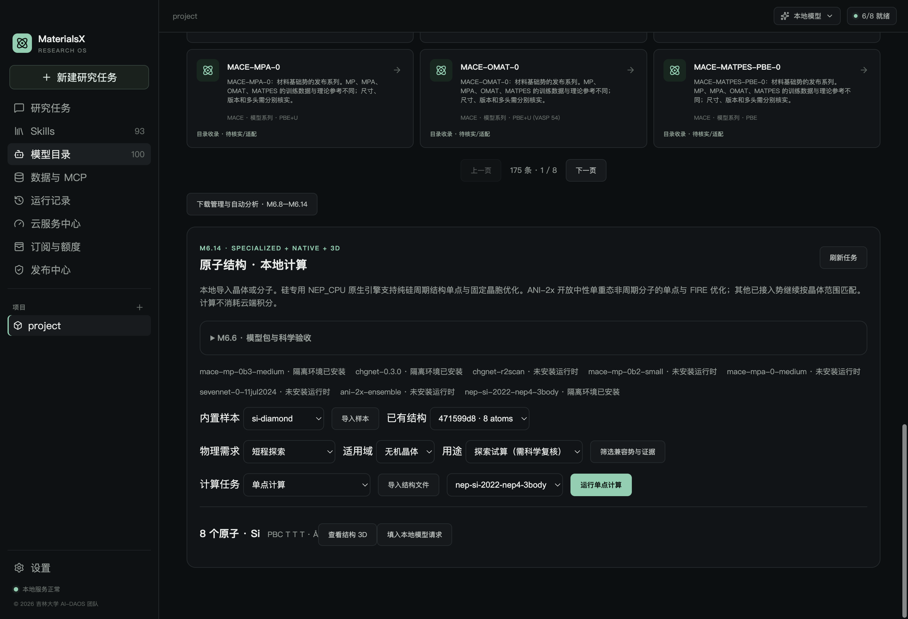
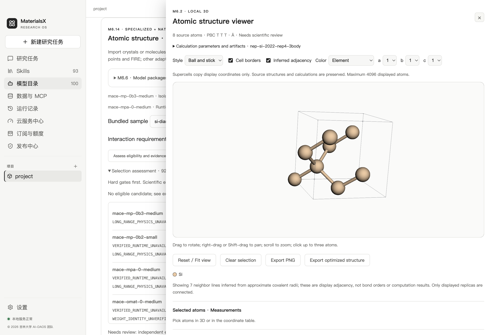
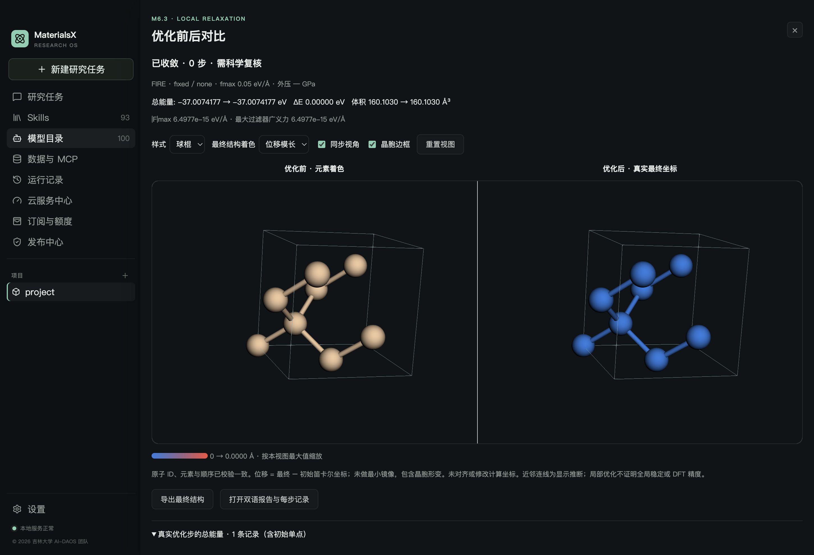

# M6.14 专用势与原生引擎：使用、实现与验收

更新时间：2026-10-02。首个接入是纯硅 NEP4 三体示例权重 + NEP_CPU 1.4 原生 C++ 引擎，已通过 macOS arm64 CPU 工程验收。当前有效目录为 **175 条资源、22 个具体 checkpoint、8 个计算接口**，默认 **93 Skills**。其他原生势继续保留候选状态；本阶段不代表 GAP/QUIP、ACE、MTP、SNAP 已全部可执行。

## 当前能力

| 项目 | 当前执行范围 |
| --- | --- |
| 精确模型 | `nep-si-2022-nep4-3body`，`Si_2022_NEP4_3body.txt` |
| 原生引擎 | NEP_CPU 1.4，独立 C++ CPU 可执行文件；并非完整 GPUMD GPU 模拟器 |
| 结构 | 纯 Si、三维周期、最多 256 原子；晶胞最小奇异值 ≥4 Å、最大 ≤200 Å、体积/原子 ≥5 ų、晶胞行列式为正 |
| 元素映射 | 文件头必须为 `nep4 1 Si`；Si 固定映射为原生 type 0 |
| 任务 | 探索单点，ASE FIRE 固定晶胞优化 |
| 输出 | 总能量 eV、逐原子力 eV/Å、ASE 拉伸为正的六分量应力 eV/ų；真实文件、双语报告、3D、优化前后对比 |
| 物理项 | 本接入无显式长程求解，未调用额外 D3；源码中存在相关模块不代表本计算启用这些模块 |
| 未开放 | 其他元素、分子/表面边界、显式电荷/自旋、变胞、MD、GPU、Windows、正式科学预测模式 |

结构范围是本产品的工程门槛，不是训练分布保证。当前质量标记为 `needs_review`；尚未完成独立 DFT、训练重叠、缺陷/高温/高压或大体系精度验证。单点能量不能直接与其他势的零点比较；局部优化收敛不证明全局稳定性。

## 桌面操作与 AI

1. 打开 **模型目录 → 机器学习势 · 全部目录**，搜索 `Si NEP CPU` 或“硅专用势”。新 checkpoint 复用 Skills 卡片、双语详情、两条可复制例子和全局主题。
2. 在下载与挂载管理中下载审核的 `nep-si-2022-nep4-3body`，或导入完全相同 SHA 的官方文件。开发机缓存路径为 `runtime/m6/m614-source/checkpoint.bin`。发行构建的扩展权重集合已包含该文件。
3. 导入内置 `si-diamond`，选择无机晶体、探索、短程可接受的作用需求，筛选并选择 NEP。界面分别显示“原生引擎 + 共享锁定 Python”、权重及环境状态。
4. 执行单点或固定晶胞 FIRE。查看真实结果的 3D、双语报告和优化前后对比；空间管理、离线集合和复现回执沿用 M6.12。

选势、结构检查、单点、优化、3D 五项已有默认 Skill 已补齐 NEP 范围，Skills 总数保持 93。例如：

> @materials-mlip-singlepoint 对本项目的 si-diamond 用硅专用 NEP 做探索单点，输出总能量、逐原子力和应力，展示真实报告和 3D。

> @materials-mlip-relaxation Run fixed-cell FIRE with the reviewed Si NEP on a perturbed pure-Si periodic structure, at fmax 0.05 eV/Å for up to 100 steps. Show actual convergence, bilingual reports and before/after 3D.

本地 Pi 科学工具和两阶段自动分析已接入。AI 可提出该势，执行器仍按实际模型身份、元素、边界、几何、任务、环境和物理项硬检查；计划冻结、授权、下载及二次复核沿用既有流程。没有用付费 LLM 评估自主选势成功率；本机 CPU 计算不消费云积分。





界面验收使用未扰动金刚石硅，初始力已低于阈值，因此优化截图合理显示 0 步。独立运行验收使用扰动结构，真实进行了 30 步，证据见下文。

## 源码、模型身份和安装

- 本地审核清单：`models/potentials/native-m614.json`；新合同：`schemas/m614/`。历史合同及 M6.11 六身份执行签名基线保持冻结；本地审核扩展不意味着已更新公开发行签名源。
- [NEP_CPU 官方源码](https://github.com/brucefan1983/NEP_CPU)：v1.4，revision `43b2ee64dd03e7e880cd343582b0de31b715c222`。所用上游文件未经修改，置于 `vendor/nep-cpu/`；团队 C++ 包装器为 `atomistic/nep_runner.cpp`。所有编译输入 SHA 随审核清单保存。
- [固定硅参数文件](https://github.com/brucefan1983/GPUMD/blob/87c1cf22401ac8c791adda0879e0af704dd5f981/potentials/nep/Si_2022_NEP4_3body.txt)：GPUMD revision `87c1cf22401ac8c791adda0879e0af704dd5f981`，50,446 bytes，SHA-256 `ad5c2c273a95684d2b19b5b26295b2914e6412a2fe2c377e09ece399b7fa22ca`。当前文件头为 NEP4，径向/角向截断均为 5 Å。
- [该 revision 的上游说明](https://github.com/brucefan1983/GPUMD/blob/87c1cf22401ac8c791adda0879e0af704dd5f981/potentials/nep/readme.md)仍使用较早 NEP3 文件名；不能直接把旧说明中的模型精度当作此 NEP4 文件的已验证精度。目录明确保留这一差异。文件格式参考 [GPUMD NEP 参数说明](https://gpumd.org/dev/nep/output_files/nep_txt.html)。
- 通过现有锁定 CHGNet 环境中的 Python/ASE 调用原生子进程，NEP 分支不加载 CHGNet 神经网络；不创建或升级重型 Python 环境。开发版需要已构建的 CHGNet 环境，可先运行 `npm run m6:runtime`，再执行 `npm run m614:runtime`。原生编译需要 macOS arm64 的 `clang++`。
- 本机编译器为 Apple clang 17.0.0，C++17/O2；二进制 1,059,648 bytes，未使用 OpenMP。原生环境存放 `runtime/native-engines/macos-arm64/nep-cpu/`，发行资源映射为 `native-engines/nep-cpu/`；RUNTIME 回执包含二进制 SHA、源码身份、编译器和共享依赖锁。
- 原生二进制、源码、依赖锁和权重身份在挂载/运行前校验。无需也不允许根据模型文本执行任意编译命令、引擎路径或下载 URL。构建脚本仅编译仓库内审核的固定文件。

总新增资源约为：1.01 MiB 原生二进制、49.3 KiB 参数文件，以及约 1.4 MiB 上游源码和许可文件；共享 Python 环境已存在时无需再次增加大型依赖。空间随既有运行环境是否已安装而变化。`loadedMemoryMiB=900` 是保守调度估计，不是大体系性能保证。

## 输出转换与验收证据

原生接口使用列排列晶胞和分量连续坐标；包装器把 ASE 行向量晶胞/逐原子 xyz 转为原生格式，再恢复逐原子力。原生输出为逐原子 virial tensor（eV），应力为 `-sym(sum(virial))/V`，按 `xx,yy,zz,yz,xz,xy` 输出、拉伸为正。不是把 virial 直接当作应力。

| 验收 | 实际结果与证据 |
| --- | --- |
| 官方冷下载 | 精确大小、固定 SHA 与模型头读取通过；[运行证据](evidence/m614-native-cpu.json) |
| 扰动硅单点/FIRE | 8 原子，初始 -36.8180245116 eV，30 步达到 fmax <0.05 eV/Å，最终 -37.0067599943 eV；一步上限正确显示未收敛 |
| 原生转换一致性 | 三轴力导数误差最大 6.44e-10 eV/Å，六应力分量导数误差最大 2.79e-11 eV/ų；旋转能量/力协变检查通过；[数值与篡改检查](evidence/m614-native-consistency.json) |
| 生命周期 | 真实本地科学工具、冻结自动分析、真实离线权重往返、报告/回执/重启/3D 恢复及报告篡改拒读通过 |
| 离线发行资源 | 隔离资源树 121,865 文件验真、默认权重挂载和真实原生单点通过，计算未生成源码缓存，二进制篡改拒绝；[资源证据](evidence/m614-offline-resources.json)，不是完整安装包验收 |
| 原生 GUI | 中文深色、英文 Codex 浅色、真实单点/固定 FIRE、3D/对比、长程排除、93 默认 Skills；[界面证据](evidence/m614-ui.json) |

原生二进制与源码篡改的拒绝检查使用隔离副本，未修改正在使用的引擎。共享 Python 启动器显式使用 `-I -B`：隔离模式会忽略 `PYTHONDONTWRITEBYTECODE` 环境变量，必须通过 `-B` 避免运行后在安装资源中生成额外字节码缓存。首次官方冷下载成功；后续联网复跑遇到连接超时，改用已验真缓存导入复跑，另存 [缓存复跑证据](evidence/m614-native-cpu-cached.json)，保留首次冷下载证据。数值导数检查证明接口自洽，不证明与真实材料/独立 DFT 的误差。

类型检查、构建、165 项测试中 164 通过/1 既有跳过、团队 Skills 11/11 和冻结历史合同检查通过；ANI 分子与此前六晶体接口、SevenNet FIRE、CHGNet 短程 MD 回归通过。现行资源闭包通过，不代表完整 DMG/NSIS、签名或独立 DFT 验收。

复核命令：

```bash
npm run m614:runtime
npm run m614:contracts:check
npm run m614:runtime:test                     # 官方冷下载 + 实算
npm run m614:runtime:test -- --cached         # 已验真缓存 + 实算
runtime/atomistic/macos-arm64/chgnet/bin/python3.12 atomistic/native_nep_probe.py "$PWD" runtime/m6/m614-source/checkpoint.bin
npm run m614:ui
npm run m614:offline:manifest
npm run m614:offline:test                     # 隔离资源树，不是安装包验收
```

## 分发、许可与后续边界

NEP_CPU 源码头声明 GPL-3.0-or-later；GPUMD 参数文件依据该 revision 的根许可按 GPL-3.0-only 保留，许可证据分别记录，不把引擎许可替代为权重许可。训练数据未分发，独立数据许可仍未知；不推导更宽松的权重授权。团队包装器随项目采用 AGPL-3.0-only。许可与源码位于 `vendor/nep-cpu/`、`docs/m6/licenses/`，详细清单见 [第三方许可](../../THIRD_PARTY_LICENSES.md)。公开发行仍须基于最终包满足对应源码和通知义务。

打包脚本和 M6.14 离线清单已纳入审核合同、原生源码/包装器及权重；已验收的 macOS 引擎单独随 macOS 资源提供。Windows 原生后端未编译验收，仍阻断执行；本轮没有重建完整 DMG/NSIS、签名、公证或发布 GitHub Release。正式签名若改变二进制，须在最终签名后重新记录 RUNTIME 二进制身份与离线清单，不能直接沿用开发构建哈希。既有付费服务不变，未发起供应商或支付调用。

后续逐包推进 GAP/QUIP、ACE/MTP/SNAP 和其他 NEP 参数文件；每个参数文件需独立核对许可、元素映射、平台、任务与数值，不按“支持 NEP”泛化到所有 NEP 文件。M6.15 长程、组合势和高级物理尚未启动。
