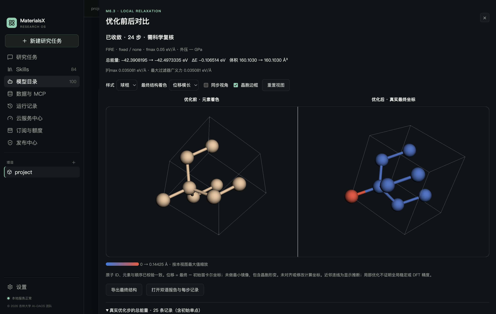
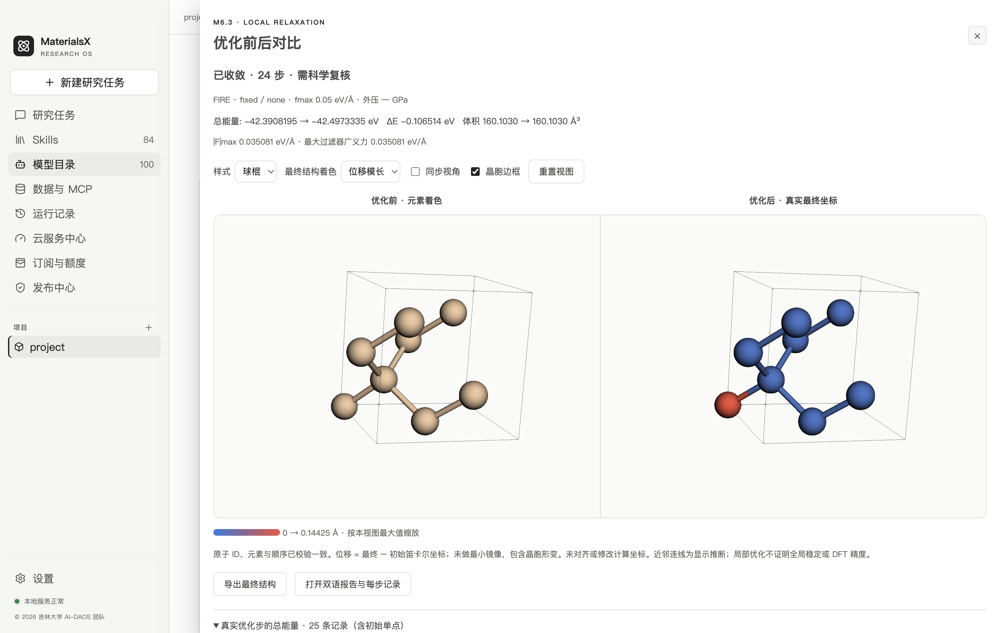

# M6.3 工程验收

2026-10-02 · macOS arm64 · © 2026 吉林大学 AI-DAOS 团队

MX-604 的本地优化与前后对比已实现。此记录覆盖 macOS 开发版工程/数值流程；Windows、正式安装包、独立 DFT 和材料领域质量仍待验收，结果保持 `needs_review`。

| 验收项 | 实际方法与证据 |
| --- | --- |
| 两个真实核心势 | 扰动 8 原子 Si：第一个原子移动 [0.15, −0.06, 0.04] Å，非零初始力；CHGNet 0.3.0 与 MACE-MP-0b3 medium 各执行固定晶胞 FIRE，fmax=0.03 eV/Å |
| 真正收敛 | CHGNet 25 步：−42.39081955 → −42.49740982 eV，最终最大力 0.01372191 eV/Å；MACE 29 步：−42.89555336 → −43.04710299 eV，最终最大力 0.02550555 eV/Å；固定晶胞逐项不变 |
| 受控晶胞优化 | CHGNet 实际测试各向同性与全形状约束，显式 +1 GPa、2 步、fmax=0.001；晶胞真实改变，E+pV 单位与目标逐步核对，两项均为 max_steps / 未收敛 |
| 最大力判据 | Python 分量 0.03 的力向量模长超过 0.05 时不得提前停止；实际原子力小但晶胞梯度大时也不得收敛；负压/正压符号与目标检查 |
| 真实文件与复现 | final.json / extxyz、全部实际步、CSV、双语报告、plan / settings / environment 与摘要登记；最终导出 SHA 和新输入几何一致，原始文件摘要不变 |
| 失败与取消 | 排队/实际运行取消、真实 1 秒超时；无成功结果，只有完整真实检查点登记 partial；恢复时 active 改 interrupted，保留最后有效几何；新任务有新 ID，未恢复 FIRE 内部状态 |
| 实际桌面 | Electron 44.5.0 + 本地 3Dmol 2.5.5，真实 CHGNet 的收敛、1 步未收敛、显式变胞 2 步未收敛三项任务 |
| 双 3D | 原生鼠标旋转并检查左右 canvas 像素；同步开启时两侧变化，关闭后只变化一侧；元素、实际位移、最终力着色，中英文及全局深/浅主题 |
| 降级与生命周期 | WebGL context loss 显示坐标/报告/导出入口，可重试；关闭移除 frame；两个视图均释放 GPU/context；窗口变化重新计算视口 |
| 文件与 IPC 边界 | 只接受项目/任务/登记产物 ID；拒绝多余 path 与跨项目请求；短位移数组/映射/PBC 错误拒绝且不崩溃；最终文件修改后立即拒读，重启记录改 failed |
| 资源监测竞态 | 临时文件原子替换和已退出子进程允许消失；PermissionError 等真实异常仍失败；Python 独立反例测试 |
| 兼容性 | M6.0 冻结审计与 M6.1/M6.2 合同不变；原单点数值/资源/恢复和原静态查看器回归验证 |

机器证据：[真实优化回执](evidence/relaxation-runtime.json)、[实际桌面回执](evidence/relaxation-ui.json)、[验证汇总](evidence/relaxation-verification.json)、[当前源码/依赖快照](evidence/relaxation-source-snapshot.json)。旧 M6.1/M6.2 快照保持历史版本，不覆盖或重写。

运行时测试把真实输出副本留在本机 `runtime/m6/acceptance/m63/<potential-id>/`（忽略目录，含输入、环境、末态和报告），便于进一步复核。公共回执只保留相对文件名、指标、摘要和受控 ID，不包含研究文件路径或凭据。

复验、收敛定义、资源上限、笛卡尔位移/晶胞形变约定和 extxyz 写出精度见 [使用文档](relaxation.md)。本轮未调用付费 LLM 或支付，未改变 M5 数据库/积分，也未构建或发布正式安装包。
