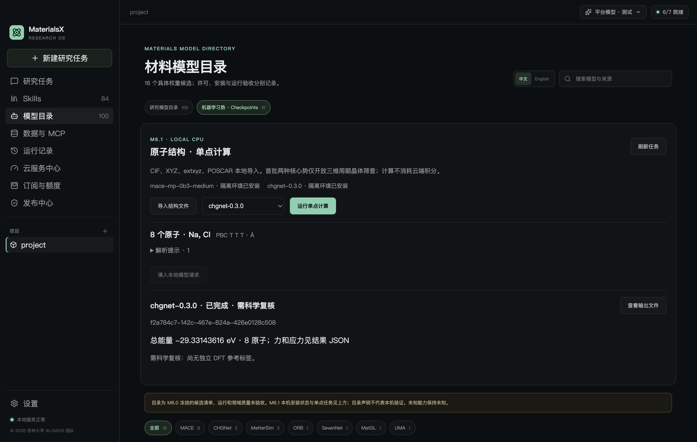
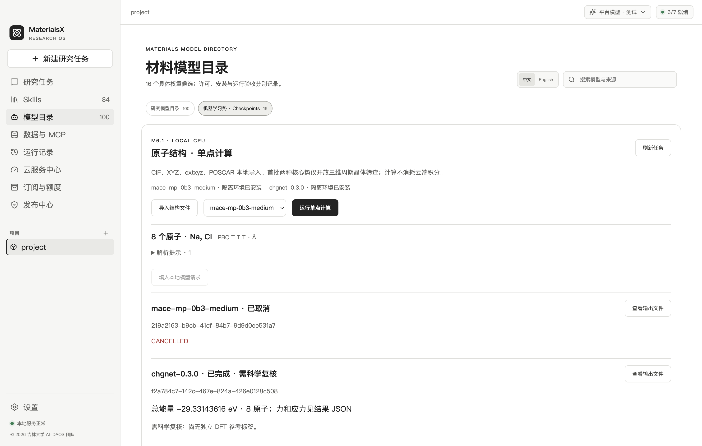

# M6.1 工程验收记录

日期：2026-10-01 · macOS arm64 · © 2026 吉林大学 AI-DAOS 团队

**结论：M6.1 核心运行时代码和 macOS 本机真实验收已完成；完整的双平台工作包仍待 Windows 实机/CI 通过及正式安装包验证。** 科学质量保持 `needs_review`，没有独立 DFT 标签，不声明模型在材料领域的预测精度已通过。

## 已完成

| 检查 | 实测结果 | 证据 |
| --- | --- | --- |
| 两核心真实推理 | CHGNet 0.3.0、MACE-MP-0b3 medium CPU 都生成真实能量、N×3 力、6 项应力与磁盘产物 | [执行器记录](evidence/desktop-runtime.json) |
| CHGNet 数值检查 | Si / NaCl / Cu vacancy 三组受扰动几何全部通过；最大力梯度差约 0.00137 eV/Å，门槛 0.02 | [CHGNet 记录](evidence/chgnet-numerical.json) |
| MACE 数值检查 | 同三组全部通过；有限差分、平移/旋转能量、力协变及应力单位/符号检查通过 | [MACE 记录](evidence/mace-numerical.json) |
| 四种真实格式 | CIF / XYZ / extxyz / POSCAR 导入；周期性、占据率、未知元素、NaN、重叠、退化晶胞、多帧反例检查 | `atomistic/tests`：14 项通过 |
| 生命周期与资源 | 同时只运行一个重模型，排队/运行中取消、真实低内存/超时失败、持久化恢复；删除真实结果后恢复为失败 | [执行器记录](evidence/desktop-runtime.json) |
| 桌面操作 | 原生选择器导入 CIF、CHGNet 单点、真实输出定位、MACE 取消、共享主题、中英文、严格 IPC | [Electron 记录](evidence/desktop-ui.json) |
| Pi 工具注册 | 实际 Pi SDK 注册五个项目内科学工具；无模型请求，外项目/未知结构无法访问 | `packages/pi-adapter/src/atomistic-tools.test.ts` |
| 可移植环境 | 两家族复制的独立 Python，在移至另一目录后导入通过；总内容 1,666,132,040 bytes（约 1,588.95 MiB），低于 6,144 MiB 上限 | [迁移/体积记录](evidence/portability.json) |
| 回归 | 类型检查/桌面构建通过；98 项 TS 测试，97 通过、1 个真实 PostgreSQL 测试按既有条件跳过；M6.0 九项 Python 基线及冻结审计通过 | 复现命令见 [运行时](runtime.md) |

M6.0 预冻结的 `quality-policy.json` 未因测试结果调整。应力有限差分补充采用明确的 0.001 eV/ų 门槛。模型实际元素嵌入覆盖与原生单位记录在各数值证据中；“嵌入支持”不代表每个元素的精度已验收。记录中的内存为探针结束时 RSS，不能当作大结构峰值或最低硬件要求。

依赖版本、源/平台下载摘要锁于两份 `uv.lock`；实际分发包与许可文件索引分别见 [MACE](evidence/mace-dependencies.json)、[CHGNet](evidence/chgnet-dependencies.json)。许可原文随构建运行时保留。默认 84 项 Skills 和原 100 项研究目录保留；测试没有云端生成、支付、退款或积分消耗。

## 仍需完成的门槛

- **Windows x64 实机**：已经配置 `.github/workflows/m61.yml` 构建独立 CPU 运行时并执行相同真实双核心/解析/取消/迁移测试，当前没有运行回执，保持待验收。
- **完整安装包**：尚未重新构建/安装/卸载 DMG 或 NSIS；签名、干净 Windows 运行库、离线安装、最终许可/内嵌库通知审核仍须实际验证。开发机空间受限，采用明确的开发构建路径制作并测量可移植运行时；正式构建的 8 GiB 空间门槛未降低。
- **科学质量**：独立 DFT 参考集及数据权利仍缺失；不开放 `passed` 科学标签。合成几何只验证工程与数值一致性。
- **后续范围**：GPU、原子/分子 3D viewer（M6.2）、优化（M6.3）、自动选势和七个任务 Skills（M6.4）、短程 MD（M6.5）另行实施。

## 界面

以下截图来自临时隔离账户及团队合成 NaCl 几何，不包含真实账户、论文或支付数据。

