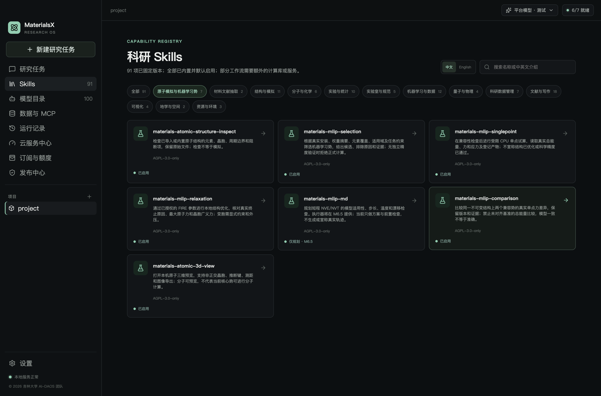
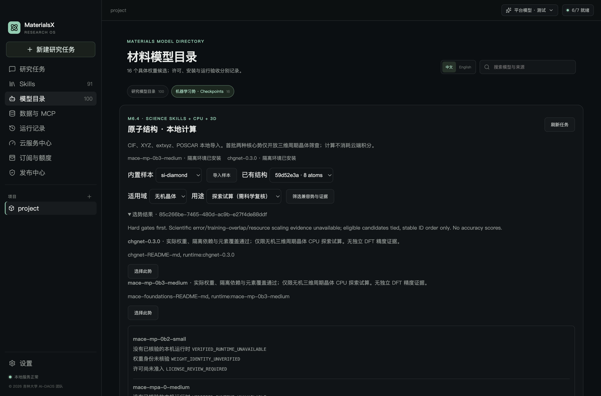
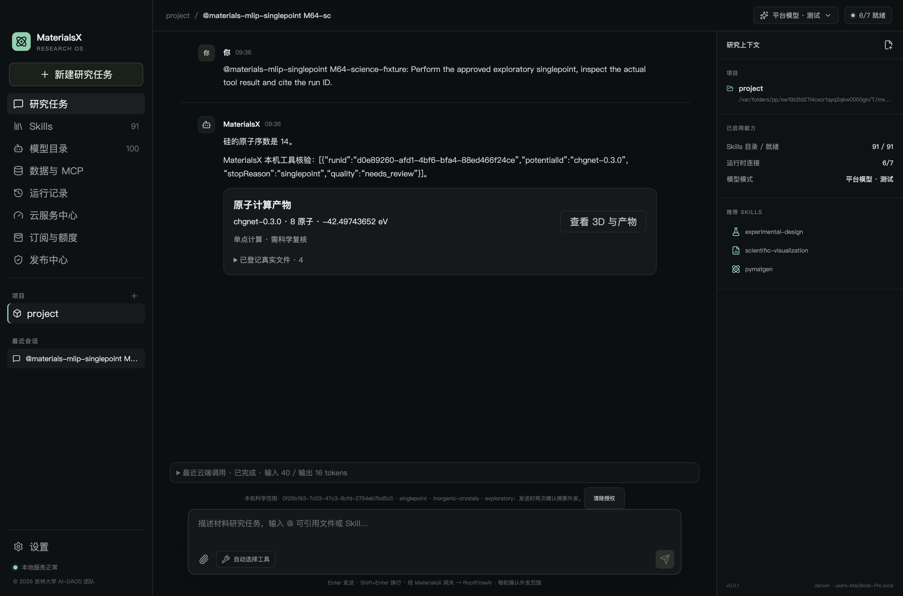

# M6.4 工程验收

2026-10-02 · macOS arm64 · © 2026 吉林大学 AI-DAOS 团队

MX-605 的可解释选势、七项默认任务 Skills 与本地/平台科学工具已实现。此验收覆盖开发版工程流程和真实本机计算，科学质量保持 `needs_review`；正式计算因缺少独立 DFT 参考仍被阻断。

| 验收项 | 实际方法与结果 |
| --- | --- |
| 真实能力回执 | 隔离运行时加载已核验的 CHGNet 0.3.0 与 MACE-MP-0b3 medium 权重，提取实际元素覆盖、观测加载 RSS、权重/依赖锁 SHA；同大小篡改权重在反序列化前被拒绝，真实安装权重未修改 |
| 硬性筛选与证据 | 正式模式无合格候选；探索模式检查元素、域、三维周期边界、占据、电子态、输出、许可和资源。候选并列，稳定 ID 顺序不表示精度排名；非候选、虚构证据、跨项目与陈旧评估被拒绝 |
| 真实执行与追溯 | 两个核心势在同一不可变 8 原子 Si 结构执行 CPU 单点，登记并校验 `selection.json`；结果读取和重启核验真实文件，篡改选择记录后拒读 |
| 两势比较 | 实际力差 RMS 为 0.0000030408160817885326 eV/Å，最大值为 0.000004342937234496292 eV/Å。未对齐能量参考，禁止总能量比较/平均；一致性不代表准确性 |
| 七项默认 Skills | 总数 91、13 分类；新增七项各有中英介绍和两条双语示例。Pi 实际发现、资源哈希、`@`、复制到输入框和势目录跳转通过；MD 明确为规划/前置检查，未宣称执行 |
| 本地工具 | 实际 Pi SDK 注册七个受控科学工具；运行工具要求真实 assessment 和候选证据。统一工具执行真实任务、读取结果与打开本机 3D；未执行、未完成或未比较不能冒充执行型 Skill 成功 |
| 平台工具与网关 | 合成 Responses 流经过真实 Pi SDK 和 Go 请求合同验证，仅加入精确 allowlist/schema 的科学工具；已有计费字段不变。未知用量或未结算时不继续本机工具/模型调用 |
| 完整平台桌面闭环 | 独立 Electron userData、新建 loopback PostgreSQL、真实 PKCE 登录与网关、四轮合成供应商响应及真实 CPU 计算。原生拒绝时零派发，接受后生成实际结果、确认回执和用量记录；退出清除科学范围，临时数据库/服务清理 |
| 授权与外发边界 | 结构、域、用途和任务范围冻结；拒绝外项目结构、外任务读取/取消、平台导入、范围修改及额外路径字段。科学工具外发摘要不含坐标、完整原子力数组或本机路径；用户批准的问题/附件/历史独立遵循 M5 外发范围 |
| 取消与恢复 | 取消受控工具停止自己启动的真实子任务；取消不能生成成功总结。登记文件摘要、实际产物与恢复状态检查通过 |
| 实际桌面与主题 | 生产拦截、探索筛选、真实单点卡片、范围设置/清除、双语 Skills 与全局浅/深主题通过实际 Electron 验收 |
| 既有能力回归 | M6.1 两势真实单点/数值探针/资源/取消/恢复和 M6.3 三项实际优化/双 3D/导出/主题回归通过；M6.0–M6.4 合同检查通过 |

最终 TypeScript/Vue 检查、完整构建、Go 测试通过；TypeScript 测试 114 项，113 通过，1 项既有按需 PostgreSQL 测试跳过，M6.4 单独的真实 PostgreSQL 桌面闭环已通过。原子运行时 Python 22 项与几何样本 9 项通过，自研资源验收 9/9、七项新 Skill 的标准格式校验通过。M6.0 release-lock 的 43 个文件和原两项抽取 Skill 的 75 个文件条目未改变。

机器证据：[真实计算与边界](evidence/selection-runtime.json)、[桌面与 Skills](evidence/selection-ui.json)、[平台桌面闭环](evidence/selection-cloud-ui.json)、[验证汇总](evidence/selection-verification.json)、[本轮源码摘要](evidence/selection-source-snapshot.json)。历史 M6.0–M6.3 快照保留其原版本；本轮摘要记录当前代码，避免把旧快照当作当前实现。

上图平台供应商文字和 token 用量来自测试 fixture，任务结果卡片来自真实 CHGNet CPU 计算。它验证了受控调度和结算链路，不证明真实外部 LLM 的多步科学推理成功率。

本轮未调用付费供应商或支付，未修改已有开发/生产账户数据库，也未构建或发布正式安装包。Windows 实机、正式包、真实供应商多步推理和独立 DFT 领域验证仍待各自验收；MD/轨迹执行属于 M6.5。使用方法与复验命令见 [选势文档](selection.md)。
