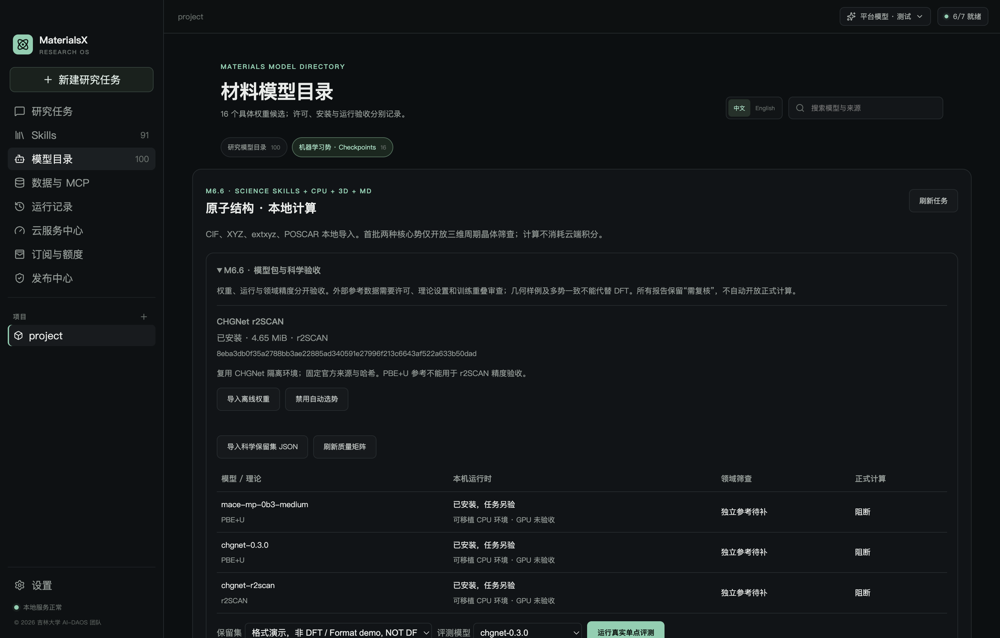
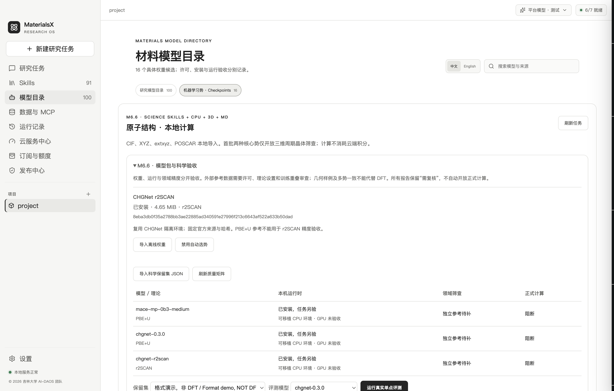
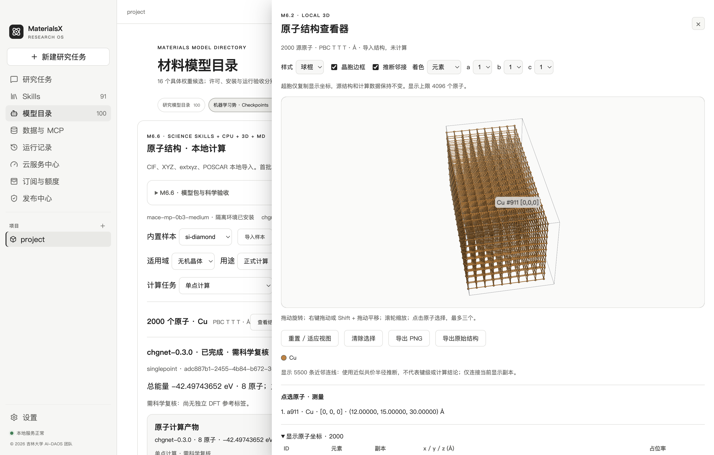

# M6.6 工程验收与发布门槛

2026-10-02 · macOS arm64 · © 2026 吉林大学 AI-DAOS 团队

MX-607 的模型包、科学评测和离线交付工程已实现；macOS 未签名 unpacked app 已实际启动并运行默认模型。本轮没有独立 DFT 保留集，不能宣布科学精度合格；Windows 实机、完整安装器、正式签名/公证及科学人工复核仍待验收，完整 M6.6 发布门槛尚未满足。

| 验收项 | 实际结果及证据边界 |
| --- | --- |
| 首个扩展包 | 官方固定 revision 的 CHGNet r2SCAN，4,872,387 bytes；校验权重 SHA、源码和许可通知，复用已有 CHGNet 环境，未增加大型 Python 环境 |
| 管理与故障 | 实际本机文件导入/禁用/启用；受控 HTTP fixture 覆盖暂停、Range 续传、错误范围、大小和摘要；路径逃逸/符号链接拒绝。网络 fixture 不冒充官方服务器续传测试 |
| 三个模型实算 | 两核心及 r2SCAN 均以真实本机 CPU 运行单点；r2SCAN 另完成真实短程 NVE 与三组数值导数探针。数值自洽不证明对 DFT 准确 |
| 真实科学工具链 | 合成标签数据从本机导入，经真实模型单点生成真实预测/中英报告；报告必须 blocked。取消真实子进程、防篡改和恢复重算通过，没有模拟成功文件 |
| 误差合同 | 单元测试验证单位、几何/模型身份、逐结构能量 MAE、逐分量力 RMSE、理论/重叠/许可/领域数量门槛、误差超限、禁止偏置拟合；测试造数只证明算法行为 |
| 质量矩阵 | 安装状态、运行可用性与领域科学质量分别显示；三个可运行模型仍 needs_review、生产批准 false，其余候选继续受准入阻断 |
| 离线资源 | 清单登记 59,524 个实际文件；双核心权重约 80.43 MiB，两环境展开约 1589.47 MiB；校验 SHA、大小、路径、受管树未登记文件与冻结容量上限 |
| 打包后闭环 | 独立约 2.5 GiB macOS 测试 app 实际启动；91 默认 Skills、三个可移植模型，经打包的 main/preload IPC 实算；不依赖全局 Python，不覆盖现有 release 或 Applications |
| 断网边界 | 所有 worker 禁止 Python 出站 socket API；两个核心还在 macOS OS 网络拒绝下实算。渲染器 HTTP 被阻断。未签名 app 测试不等于 DMG/NSIS 新安装 |
| 磁盘故障 | 注入 ENOSPC，验证最后有效原子 JSON 不被覆盖；实际资源大小和剩余空间预检查。没有故意填满用户磁盘，也未验证完整安装器的低空间行为 |
| 桌面使用 | 原生文件选择/模型管理/真实评测/导出、中英文信息、统一浅深主题与关闭清理通过；面板默认折叠，避免遮挡既有运行入口 |
| 2000 原子视图 | 真实 Electron/WebGL、2000 Cu 原子、原生 100 次鼠标事件；首帧约 261 ms，场景渲染约 54 次/秒，画面确实变化并正确释放。是本机场景渲染调用实测，不等于 GPU 显示延迟、输入框同时输入延迟或指定 16 GiB 设备验收 |
| 回归与 CI | 当前合同 M6.0–M6.6、类型检查、完整 TS/Go/Python 测试及默认 Skills 验收；既有核心 MD 短段、取消/资源/恢复回归。macOS/Windows 实际目标 CI 已配置，尚未运行，不作为 Windows 通过证据 |

完整 TypeScript 测试 126 项：125 通过、0 失败、1 项既有按需 PostgreSQL 测试跳过；原子 Python 34 项、几何样本 9 项、自研 Skills 9/9 通过。当前源码及最终复验结果以 [验证汇总](evidence/validation-verification.json) 和 [源码摘要](evidence/validation-source-snapshot.json) 为准。既有构建仍有 3Dmol eval/包体大小提示；测试 app 未签名。

机器证据：[扩展真实运行](evidence/validation-runtime.json)、[数值探针](evidence/validation-numerical.json)、[实际桌面](evidence/validation-ui.json)、[打包与断网](evidence/validation-offline-package.json)、[既有 MD 回归](evidence/validation-md-regression.json)。历史 M6.0–M6.5 证据保持原样。

本轮只下载一个约 4.65 MiB 的官方扩展权重；没有调用真实付费供应商或支付，没有修改现有账户数据库或发布 GitHub Release。正式发布仍需获授权且理论设置匹配的独立 DFT 数据、各领域质量与任务级审查、Windows 实机断网新安装及正式签名/公证证据。单点筛查通过也不会自动批准优化、MD、表面/缺陷或分子/聚合物生产使用。操作步骤见 [模型包与科学验收](validation.md)。
