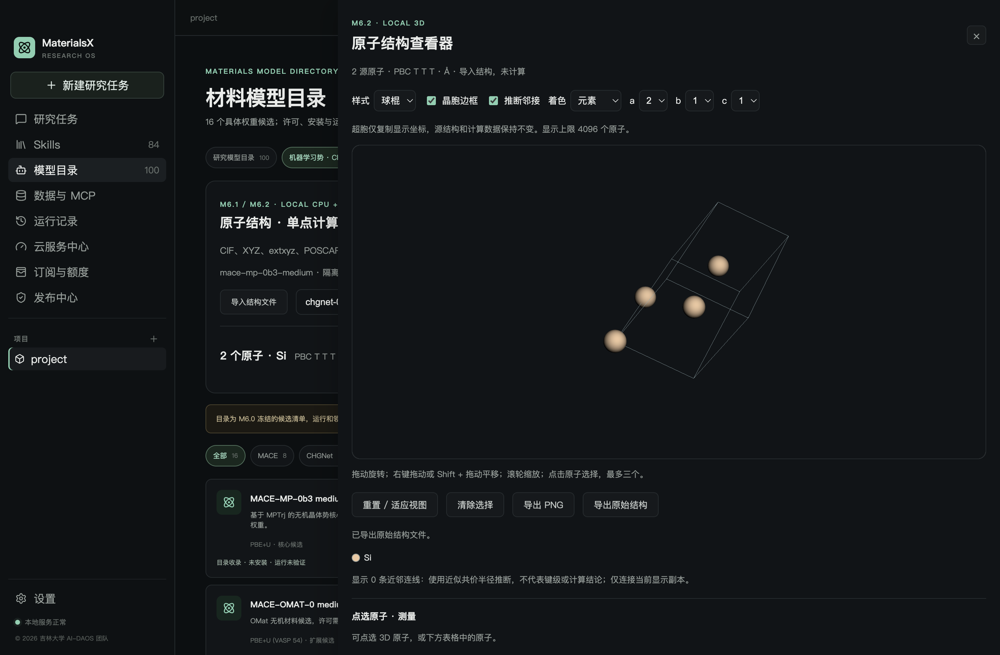
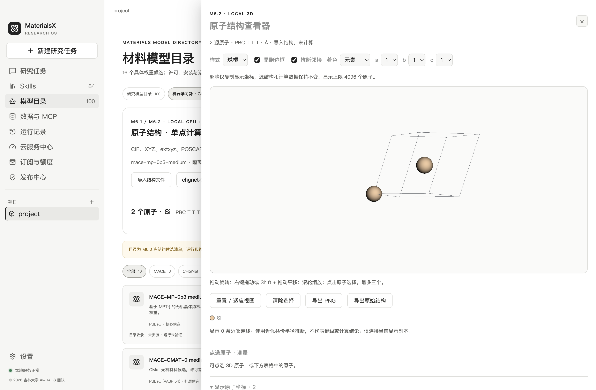
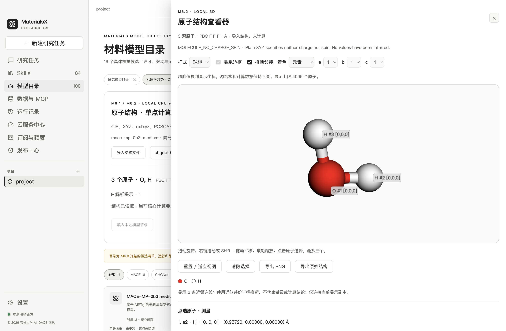

# M6.2 工程验收

2026-10-02 · macOS arm64 · © 2026 吉林大学 AI-DAOS 团队

M6.2 静态 3D 代码及 macOS 本机验收完成。双平台正式交付还需 Windows 实机/CI、完整安装包及显卡驱动覆盖。科学质量保持 `needs_review`。

| 验收项 | 方法与证据 |
| --- | --- |
| 真实桌面渲染 | Electron 44.5.0 + 本地 3Dmol 2.5.5；旋转使用原生鼠标事件且验证像素变化，原子选择验证真实 canvas picking |
| 文件与晶胞 | 7 个团队几何经原生导入：CIF / XYZ / extxyz / POSCAR、三斜晶胞、slab、分子、缺陷；显示上限不改变源文件 |
| 几何测量 | 三斜结构源两点距离 4.147665005759265 Å；分子 H—O—H 角度；单位/顶点及退化情况有独立几何测试 |
| 三种样式与主题 | 球棍、球、棒及 Materials 深色 / Codex 浅色；中文/英文共用系统设置 |
| 真实产物 | CHGNet 0.3.0 对两原子三斜 Si 单点；按登记 ID 复核真实磁盘文件，力模长着色可用 |
| 聊天卡片 | 测试消息引用真实计算 ID；未知产物 ID 不创建卡片，模型 HTML 不执行；没有 LLM 调用 |
| 导出 | PNG 经过主进程校验及重新编码；原始 extxyz 导出 SHA-256 与原文件一致 |
| 生命周期 | 至少 3 次关闭/打开，关闭后 frame 移除；context lost 降级保留坐标并可重试 |
| 读取安全 | 跨项目、任意 path/url/html/script、错误类型、力数不匹配、超尺寸、文件改动和目录/文件 symlink 反例测试 |
| 兼容回归 | M6.0 冻结审计与 M6.1 schema 不变；两核心真实 CPU/数值/资源/取消/恢复测试复验通过 |

机器记录：[桌面验收](evidence/viewer-ui.json)。源码与构建依赖：[本次快照](evidence/viewer-source-snapshot.json)。团队几何不是 DFT 科学参考，界面与数值测试不证明势在任意材料上的准确性。

复验命令、输入/输出限制及剩余范围见 [使用文档](viewer.md)。本轮未改变 M5 数据库、余额、价格、订单或退款，未构建/发布正式安装包。
